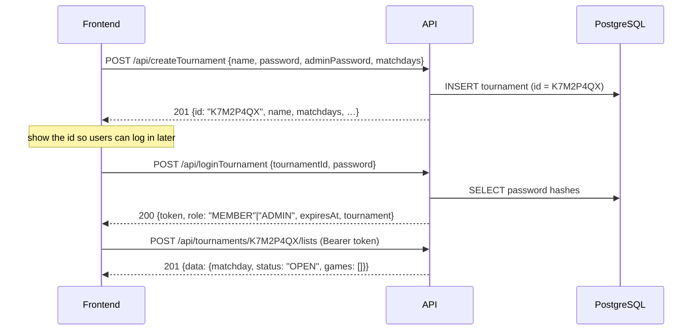

# Skatis – Backend

REST API for the Skatis tournament manager.

A **tournament** is created with a name, a normal password, an admin password and
the weekdays on which it takes place. The API answers with a short
**tournament id** which is shown in the frontend and used for every following
request. Inside a tournament there is one **list** per matchday and each list
holds the **games**. There are no user accounts – access is granted by the normal
or the admin password together with the tournament id.

## Stack

| Concern    | Choice                                      |
| ---------- | ------------------------------------------- |
| Runtime    | Node.js ≥ 22 (ESM, TypeScript)              |
| HTTP       | Express 5                                   |
| Database   | PostgreSQL via Prisma ORM                   |
| Validation | Zod                                         |
| Auth       | Password login → JWT bearer token (HS256)   |
| Passwords  | scrypt (`node:crypto`), salted per password |
| Logging    | Pino (pretty in development, JSON in prod)  |
| Tests      | Vitest + Supertest                          |

## Requirements

- Node.js ≥ 22.12
- A PostgreSQL 14+ database you can reach with a connection string

## Setup

```bash
cd backend
npm install                       # also runs `prisma generate`

cp .env.example .env              # then edit the values
# DATABASE_URL must point at YOUR PostgreSQL instance,
# JWT_SECRET must be a random string of at least 32 characters

npm run db:migrate -- --name init # creates the tables
npm run dev                       # http://localhost:3000/api
```

Generate a proper secret with:

```bash
node -e "console.log(require('crypto').randomBytes(48).toString('base64url'))"
```

Everything is installed locally – no global packages and no root privileges are
required.

## Scripts

| Script                  | Purpose                                        |
| ----------------------- | ---------------------------------------------- |
| `npm run dev`           | Watch mode via `tsx`                           |
| `npm run build`         | Compile to `dist/`                             |
| `npm start`             | Run the compiled server                        |
| `npm test`              | Vitest (unit + HTTP tests, no database needed) |
| `npm run test:coverage` | Coverage report in `coverage/`                 |
| `npm run typecheck`     | `tsc --noEmit`                                 |
| `npm run lint`          | ESLint                                         |
| `npm run format`        | Prettier                                       |
| `npm run db:migrate`    | Create/apply a migration (development)         |
| `npm run db:deploy`     | Apply existing migrations (production)         |
| `npm run db:studio`     | Prisma Studio                                  |

## How it works



### Passwords and roles

A tournament has two passwords:

- **normal password** → role `MEMBER`. May create the list of the _current_
  matchday, enter games and submit that list. Nothing else, and only on matchdays
  of the tournament.
- **admin password** → role `ADMIN`. May change matchdays, rename the tournament,
  reset the normal password, and modify or delete lists – at any time, including
  past matchdays.

Which password was used decides the role inside the returned token. Both
passwords are stored as scrypt hashes; a password can never be read back.

### Tournament id

The id is generated by the API: **8 characters**, digits and upper case letters
without the easily confused ones (`0`, `1`, `I`, `L`, `O`), e.g. `K7M2P4QX`. It is
**case insensitive** on input and is returned by `createTournament` so that the
frontend can display it right away. Only the id identifies a tournament – names
are allowed to be ambiguous.

Together with one of the two passwords the id is the only thing needed to log in,
so it should be treated like a shared secret: every read of tournament data
requires a token, and no endpoint reveals which tournaments exist.

### Tokens

`loginTournament` returns a JWT that is valid for `JWT_EXPIRES_IN` (default 12 h)
and is bound to exactly one tournament. Send it with every protected request:

```http
Authorization: Bearer <token>
```

A token used against another tournament id is rejected with `403`. Whether a
stored token is still valid can be checked with
`GET /api/tournaments/:tournamentId/session`.

### Domain rules

- `matchdays` are ISO weekdays (`1` = Monday … `7` = Sunday). A list only exists
  for a matchday of its tournament.
- There is **at most one list per matchday** (unique constraint).
- A `MEMBER` may only create or change the list of _today's_ matchday ("today" is
  decided by the `TZ` environment variable) and only if that weekday is a
  matchday. An `ADMIN` may also create and correct lists of past or future days.
- Reading lists and games is allowed for both roles on any day.
- Submitting a list freezes it for members. An admin may keep editing it; with
  `reopen` an admin hands it back to the members.
- Deleting a tournament deletes its lists and games (cascade).

## Endpoints

Base URL: `http://localhost:3000/api`

Legend: **–** = no token required, **any** = token of any role, **ADMIN** = admin
token required. `:tournamentId` is the id returned by `createTournament`;
`:matchday` is always a date in the format `YYYY-MM-DD`.

### Setup and login

| Method | Path                | Auth | Description                                                    |
| ------ | ------------------- | ---- | -------------------------------------------------------------- |
| POST   | `/createTournament` | –    | Creates a tournament and returns the generated `id`            |
| POST   | `/loginTournament`  | –    | Logs in with `tournamentId` + password, returns token + `role` |

`POST /createTournament`

```json
{
  "name": "Mittwochsrunde",
  "password": "member-secret",
  "adminPassword": "admin-secret",
  "matchdays": [3]
}
```

→ `201`

```json
{
  "data": {
    "id": "K7M2P4QX",
    "name": "Mittwochsrunde",
    "matchdays": [3],
    "listCount": 0,
    "createdAt": "2026-09-18T15:00:00.000Z",
    "updatedAt": "2026-09-18T15:00:00.000Z"
  }
}
```

`POST /loginTournament`

```json
{ "tournamentId": "K7M2P4QX", "password": "member-secret" }
```

→ `200`

```json
{
  "data": {
    "tournamentId": "K7M2P4QX",
    "role": "MEMBER",
    "token": "eyJhbGciOi…",
    "expiresAt": "2026-09-19T03:00:00.000Z",
    "tournament": { "id": "K7M2P4QX", "name": "Mittwochsrunde", "matchdays": [3], "listCount": 0 }
  }
}
```

An unknown id and a wrong password both answer `401` – the endpoint does not
reveal which tournaments exist.

### Health and meta

| Method | Path            | Auth | Description                           |
| ------ | --------------- | ---- | ------------------------------------- |
| GET    | `/`             | –    | Discovery document listing all paths  |
| GET    | `/health`       | –    | Liveness; does not touch the database |
| GET    | `/health/ready` | –    | Readiness incl. DB connectivity       |

### Tournaments

| Method | Path                                 | Auth  | Description                                             |
| ------ | ------------------------------------ | ----- | ------------------------------------------------------- |
| GET    | `/tournaments`                       | any   | The token's tournament (`?search=&limit=&offset=`)      |
| GET    | `/tournaments/:tournamentId`         | any   | Tournament details                                      |
| GET    | `/tournaments/:tournamentId/session` | any   | Role behind the presented token                         |
| PATCH  | `/tournaments/:tournamentId`         | ADMIN | Change `name`, `matchdays`, `password`, `adminPassword` |
| DELETE | `/tournaments/:tournamentId`         | ADMIN | Delete incl. lists and games                            |

`GET /api/tournaments` exists so a frontend that holds a token can fetch its
tournament without knowing the id again. Because a token is bound to one
tournament, the result never contains more than that single entry – there is no
endpoint that enumerates all tournaments, and an unauthenticated caller learns
nothing about them.

### Lists

| Method | Path                                                | Auth  | Description                                               |
| ------ | --------------------------------------------------- | ----- | --------------------------------------------------------- |
| GET    | `/tournaments/:tournamentId/lists`                  | any   | `?from=&to=&status=OPEN\|SUBMITTED&limit=&offset=`        |
| POST   | `/tournaments/:tournamentId/lists`                  | any   | `{ matchday, games?: [...] }` – members only on matchdays |
| GET    | `/tournaments/:tournamentId/lists/:matchday`        | any   | List incl. its games and `totalPoints`                    |
| DELETE | `/tournaments/:tournamentId/lists/:matchday`        | ADMIN | Delete list incl. its games                               |
| POST   | `/tournaments/:tournamentId/lists/:matchday/submit` | any   | Freeze the list                                           |
| POST   | `/tournaments/:tournamentId/lists/:matchday/reopen` | ADMIN | Reopen a submitted list                                   |

### Games

| Method | Path                                                       | Auth | Description           |
| ------ | ---------------------------------------------------------- | ---- | --------------------- |
| GET    | `/tournaments/:tournamentId/lists/:matchday/games`         | any  | All games of the list |
| POST   | `/tournaments/:tournamentId/lists/:matchday/games`         | any  | Add a game            |
| PATCH  | `/tournaments/:tournamentId/lists/:matchday/games/:gameId` | any  | Change a game         |
| DELETE | `/tournaments/:tournamentId/lists/:matchday/games/:gameId` | any  | Delete a game         |

A game looks like this – `position` is appended automatically when it is omitted
and `declarer` has to be one of the `players`:

```json
{
  "position": 1,
  "players": ["Anna", "Bert", "Clara"],
  "declarer": "Anna",
  "gameType": "Grand",
  "points": 48,
  "note": "Hand game"
}
```

## Response format

Success:

```json
{ "data": {}, "meta": { "total": 12, "limit": 20, "offset": 0 } }
```

`meta` is only present on paginated collections. Errors:

```json
{
  "error": {
    "code": "VALIDATION_ERROR",
    "message": "Request validation failed",
    "details": { "issues": [{ "path": "matchday", "code": "custom", "message": "…" }] },
    "requestId": "9f0f0f0e-…"
  }
}
```

| Status | Code                  | Meaning                                      |
| ------ | --------------------- | -------------------------------------------- |
| 400    | `BAD_REQUEST`         | Malformed JSON body                          |
| 401    | `UNAUTHORIZED`        | Missing/invalid token, wrong id or password  |
| 403    | `FORBIDDEN`           | Wrong role, wrong tournament, not a matchday |
| 404    | `NOT_FOUND`           | Unknown tournament, list or game             |
| 409    | `CONFLICT`            | Duplicate matchday/position, submitted list  |
| 413    | `PAYLOAD_TOO_LARGE`   | Body larger than 100 kb                      |
| 422    | `VALIDATION_ERROR`    | Payload or path/query validation failed      |
| 500    | `INTERNAL_ERROR`      | Unexpected server error                      |
| 503    | `SERVICE_UNAVAILABLE` | Database not reachable                       |

Every response carries an `X-Request-Id` header (echoing a caller-provided
`X-Request-Id` when it is a sane value) that also appears in the logs.

## Configuration

All settings come from the environment – see `.env.example`:

| Variable         | Default            | Description                                |
| ---------------- | ------------------ | ------------------------------------------ |
| `NODE_ENV`       | `development`      | `development`, `test` or `production`      |
| `PORT` / `HOST`  | `3000` / `0.0.0.0` | HTTP bind address                          |
| `DATABASE_URL`   | –                  | PostgreSQL connection string (required)    |
| `JWT_SECRET`     | –                  | ≥ 32 characters (required)                 |
| `JWT_EXPIRES_IN` | `12h`              | Token lifetime                             |
| `LOG_LEVEL`      | `info`             | `fatal`…`trace` or `silent`                |
| `CORS_ORIGIN`    | `*`                | Comma separated origins or `*`             |
| `TZ`             | system             | Timezone that decides the current matchday |

Invalid configuration aborts startup with a list of the offending variables.

## Project structure

```
backend/
├── prisma/schema.prisma        # data model (Tournament, GameList, Game)
├── src/
│   ├── app.ts                  # express app factory
│   ├── server.ts               # bootstrap + graceful shutdown
│   ├── config/env.ts           # validated environment
│   ├── lib/                    # dates, errors, logger, passwords, prisma, tokens,
│   │                           # tournament id generation
│   ├── middleware/             # auth, cors, error handler, request context
│   ├── modules/
│   │   ├── tournaments/        # schemas, service, routes
│   │   │   ├── tournament-actions.routes.ts  # createTournament, loginTournament
│   │   │   └── tournament.routes.ts          # /tournaments/:tournamentId
│   │   ├── lists/              # lists + games, access rules, mappers
│   │   └── health/
│   └── routes/index.ts         # mounts /api
└── tests/                      # vitest + supertest
```

Layering: `routes` (HTTP, validation) → `service` (business rules, Prisma) →
`mapper` (DTOs). Exceptions are `HttpError`s that the central error handler maps
to the envelope above; Express 5 forwards rejected promises automatically.

## Tests

`npm test` runs without a database – the suite covers password hashing, token
handling, every Zod schema and the HTTP layer (routing, auth, CORS, error
envelope). Business logic that needs PostgreSQL has to be exercised against a
real instance.

## Deployment notes

- Build with `npm run build`, then run `npm start`.
- Apply migrations with `npm run db:deploy` before starting the new version.
- `SIGINT`/`SIGTERM` trigger a graceful shutdown (stop accepting requests, close
  the Prisma pool, force exit after 10 s).
- Run behind a TLS terminating proxy; tokens are sent as bearer headers.
