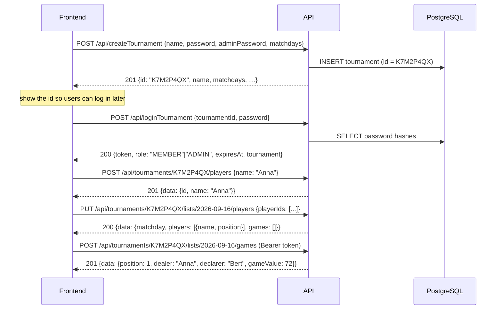

# Skatis – Backend

REST API for the Skatis tournament manager.

A **tournament** is created with a name, a normal password, an admin password and
the weekdays on which it takes place. The API answers with a short
**tournament id** which is shown in the frontend and used for every following
request. A tournament owns its **players** (just names); one **list** exists per
matchday and holds the lineup of that evening in seating order – 3, 4 or 5
players. Every **game** in the list is played by those players and follows the
four steps of the Skat rules in the [README](../README.md) of the repository.
There are no user accounts – access is granted by the normal or the admin
password together with the tournament id.

## Stack

| Concern    | Choice                                      |
| ---------- | ------------------------------------------- |
| Runtime    | Node.js ≥ 22 (ESM, TypeScript)              |
| HTTP       | Express 5                                   |
| Database   | PostgreSQL via Prisma ORM                   |
| Validation | Zod                                         |
| Auth       | Password login → JWT bearer token (HS256)   |
| Passwords  | scrypt (`node:crypto`), salted per password |
| Logging    | Pino (pretty in development, JSON in prod)  |
| Tests      | Vitest + Supertest                          |

## Requirements

- Node.js ≥ 22.12
- A PostgreSQL 14+ database you can reach with a connection string

## Setup

```bash
cd backend
npm install                       # also runs `prisma generate`

cp .env.example .env              # then edit the values
# DATABASE_URL must point at YOUR PostgreSQL instance,
# JWT_SECRET must be a random string of at least 32 characters

npm run db:migrate -- --name init # creates the tables
npm run dev                       # http://localhost:3000/api
```

Generate a proper secret with:

```bash
node -e "console.log(require('crypto').randomBytes(48).toString('base64url'))"
```

Everything is installed locally – no global packages and no root privileges are
required.

## Scripts

| Script                  | Purpose                                        |
| ----------------------- | ---------------------------------------------- |
| `npm run dev`           | Watch mode via `tsx`                           |
| `npm run build`         | Compile to `dist/`                             |
| `npm start`             | Run the compiled server                        |
| `npm test`              | Vitest (unit + HTTP tests, no database needed) |
| `npm run test:coverage` | Coverage report in `coverage/`                 |
| `npm run typecheck`     | `tsc --noEmit`                                 |
| `npm run lint`          | ESLint                                         |
| `npm run format`        | Prettier                                       |
| `npm run db:migrate`    | Create/apply a migration (development)         |
| `npm run db:deploy`     | Apply existing migrations (production)         |
| `npm run db:studio`     | Prisma Studio                                  |

## How it works



### Players and lineups

A **player** is nothing but a name inside a tournament. Players are added to the
tournament once and can then be put on a list:

- `POST /api/tournaments/:tournamentId/players` adds a player. Names are unique
  per tournament, so the same name cannot be added twice.
- `PUT /api/tournaments/:tournamentId/lists/:matchday/players` sets the lineup of
  a matchday. Only ids of players **of the same tournament** are accepted –
  anything else is rejected with `409`.
- A lineup consists of **3, 4 or 5 players** and its order matters: it is the
  seating order of the matchday. Player 1 deals in round 1, player 2 in round 2
  and so on; after the last player it starts over with player 1. The answers
  therefore contain `players` **in seating order**, each with its `position`.
- Because the lineup decides who deals in which round, it can only be changed
  while the list has **no games** yet – afterwards the request is rejected with
  `409`.
- A player can only be deleted while they are not part of any list.

### Entering a game

A game follows the four steps of README.md. The API checks every one of them:

1. **Alleinspieler or Eingepasst** – `declarer` plus `passedOut`. When the game
   was passed out (`{"passedOut": true}`) nothing else may be sent – the flow is
   over. Which players may be the Alleinspieler depends on the lineup and the
   dealer of the round:
   - 3 players – everyone may play
   - 4 players – the dealer does not play
   - 5 players – neither the dealer nor the players before and after them play
2. **Spieltyp** – exactly one of `KARO`, `HERZ`, `PIK`, `KREUZ`, `GRAND`, `NULL`,
   plus the announced levels (`hand`, `schneiderAnnounced`, `schwarzAnnounced`,
   `offen`).
   - suit and grand games: `Schneider Ang.` requires `Hand`, `Schwarz Ang.`
     requires `Schneider Ang.`, `Offen` requires `Schwarz Ang.`
   - null games: `Schneider Ang.` and `Schwarz Ang.` may not be used at all
     (`Hand` and `Offen` are fine, they are part of the fixed values)
3. **Spitzen** – `matadors: {"suit": "WITH"|"WITHOUT", "count": n}`, at most 4
   as grand and at most 11 as suit game. Skipped for a null game, which must not
   send `matadors` at all.
4. **Spielergebnis** – `schneider`, `schwarz` and `won`. `Schwarz` requires
   `Schneider`, and a null game may not be Schneider or Schwarz.

The API derives the remaining properties:

- `position` – the round, counted from 1. Games are appended.
- `dealer` – the next player of the seating order, starting with player 1.
- `players` – the lineup of the list.
- `gameValue` – the Spielwert, see below. It is never sent by a client.

#### Spielwert

(`src/modules/lists/game-rules.ts`)

- Null games have fixed values: `Null` 23, `Null Hand` 35, `Null Offen` 46,
  `Null Hand Offen` 59.
- Everything else is `(Spitzen + Gewinnstufen + 1) * Grundwert`, where
  Gewinnstufen counts the chosen levels **and** the results (`Hand`,
  `Schneider Ang.`, `Schwarz Ang.`, `Offen`, `Schneider`, `Schwarz`) and the
  Grundwert is Karo 9, Herz 10, Pik 11, Kreuz 12, Grand 24.

```json
{
  "declarer": "Bert",
  "gameType": "GRAND",
  "hand": true,
  "schneiderAnnounced": true,
  "matadors": { "suit": "WITH", "count": 2 },
  "won": true
}
```

→ `gameValue: (2 + 2 + 1) * 24 = 120`

A game is replaced as a whole (`PUT …/games/:gameId`) – a partial update would
have to satisfy the rules above in combination with the stored values. The round
and the dealer stay, everything else is taken from the request.

### Passwords and roles

A tournament has two passwords:

- **normal password** → role `MEMBER`. May create the list of the _current_
  matchday, enter games and submit that list. Nothing else, and only on matchdays
  of the tournament.
- **admin password** → role `ADMIN`. May change matchdays, rename the tournament,
  reset the normal password, and modify or delete lists – at any time, including
  past matchdays.

Which password was used decides the role inside the returned token. Both
passwords are stored as scrypt hashes; a password can never be read back.

### Tournament id

The id is generated by the API: **8 characters**, digits and upper case letters
without the easily confused ones (`0`, `1`, `I`, `L`, `O`), e.g. `K7M2P4QX`. It is
**case insensitive** on input and is returned by `createTournament` so that the
frontend can display it right away. Only the id identifies a tournament – names
are allowed to be ambiguous.

Together with one of the two passwords the id is the only thing needed to log in,
so it should be treated like a shared secret: every read of tournament data
requires a token, and no endpoint reveals which tournaments exist.

### Tokens

`loginTournament` returns a JWT that is valid for `JWT_EXPIRES_IN` (default 12 h)
and is bound to exactly one tournament. Send it with every protected request:

```http
Authorization: Bearer <token>
```

A token used against another tournament id is rejected with `403`. Whether a
stored token is still valid can be checked with
`GET /api/tournaments/:tournamentId/session`.

### Domain rules

- `matchdays` are ISO weekdays (`1` = Monday … `7` = Sunday). A list only exists
  for a matchday of its tournament.
- There is **at most one list per matchday** (unique constraint).
- A `MEMBER` may only create or change the list of _today's_ matchday ("today" is
  decided by the `TZ` environment variable) and only if that weekday is a
  matchday. An `ADMIN` may also create and correct lists of past or future days.
- Reading lists, players and games is allowed for both roles on any day.
- Both roles may manage the players of their tournament at any time – a
  tournament's roster is not tied to a matchday.
- Submitting a list freezes it for members. An admin may keep editing it; with
  `reopen` an admin hands it back to the members.
- A list can only be played by the players of its lineup, so a game is only
  accepted once the lineup is complete (3, 4 or 5 players).
- Games can only be entered for players of the list: the Alleinspieler has to be
  part of the lineup and has to be allowed to play the round (see above).
- Deleting a tournament deletes its players, lists and games (cascade).

### Locked lists

A list is **locked** for the session that asks for it when it may not be changed
any more. Two things lock a list:

- **submitted** – once a list has been handed in (by either role) it can only be
  changed by an admin, who may `reopen` it to give it back to the members:
  `POST /api/tournaments/:tournamentId/lists/:matchday/submit` and `…/reopen`.
- **another day** – a member may only work on the list of the current matchday.
  Lists of other days are read-only for them; an admin may also create and
  correct lists of past or future matchdays.

An admin is never locked out – that is what the admin password is for. Every list
tells the frontend where it stands, so it does not have to re-derive the rules:

```json
{
  "matchday": "2026-09-16",
  "status": "SUBMITTED",
  "submittedAt": "2026-09-16T19:42:11.000Z",
  "locked": true,
  "lockReasons": ["SUBMITTED"],
  "players": [{ "id": "…", "name": "Anna", "position": 1 }],
  "gameCount": 24,
  "totalGameValue": 811,
  "games": []
}
```

`lockReasons` is empty while `locked` is false and may otherwise contain
`SUBMITTED`, `NOT_CURRENT_MATCHDAY` and `NOT_A_MATCHDAY` – the last one when the
matchdays of the tournament were changed after the list was created. Reading is
always allowed: only changing a locked list is refused, with `409` for a
submitted list and `403` for another day.

## Quickstart

One Skat evening from an empty database to a submitted list. `BASE` is the API
root; `jq` is only used to pick values out of the answers.

```bash
BASE=http://localhost:3000/api
TODAY=$(date +%F)

# 1. create the tournament – note the id from the answer
curl -s -X POST $BASE/createTournament -H 'Content-Type: application/json' -d '{
  "name": "Mittwochsrunde",
  "password": "member-secret",
  "adminPassword": "admin-secret",
  "matchdays": [3]
}'
# => {"data":{"id":"K7M2P4QX","name":"Mittwochsrunde", …}}

# 2. log in as a member
TOKEN=$(curl -s -X POST $BASE/loginTournament -H 'Content-Type: application/json' \
  -d '{"tournamentId":"K7M2P4QX","password":"member-secret"}' | jq -r .data.token)

# 3. add the players of the tournament
for NAME in Anna Bert Clara Dora; do
  curl -s -X POST $BASE/tournaments/K7M2P4QX/players \
    -H "Authorization: Bearer $TOKEN" -H 'Content-Type: application/json' \
    -d "{\"name\":\"$NAME\"}" > /dev/null
done

# their ids – the order of this array is the seating order
PLAYERS=$(curl -s $BASE/tournaments/K7M2P4QX/players -H "Authorization: Bearer $TOKEN" \
  | jq -c '[.data[].id]')

# 4. create the list of the matchday and set the lineup
curl -s -X POST $BASE/tournaments/K7M2P4QX/lists \
  -H "Authorization: Bearer $TOKEN" -H 'Content-Type: application/json' \
  -d "{\"matchday\":\"$TODAY\",\"playerIds\":$PLAYERS}"

# 5. enter the first game: Anna deals, so Bert may play a grand with 2 Spitzen
curl -s -X POST $BASE/tournaments/K7M2P4QX/lists/$TODAY/games \
  -H "Authorization: Bearer $TOKEN" -H 'Content-Type: application/json' -d '{
    "passedOut": false,
    "declarer": "Bert",
    "gameType": "GRAND",
    "hand": true,
    "schneiderAnnounced": true,
    "matadors": {"suit": "WITH", "count": 2},
    "won": true
  }'
# => {"data":{"position":1,"dealer":"Anna","gameValue":120, …}}

# 6. hand the list in – from now on members can only read it
curl -s -X POST $BASE/tournaments/K7M2P4QX/lists/$TODAY/submit \
  -H "Authorization: Bearer $TOKEN"

# 7. correct something afterwards, as an admin
ADMIN=$(curl -s -X POST $BASE/loginTournament -H 'Content-Type: application/json' \
  -d '{"tournamentId":"K7M2P4QX","password":"admin-secret"}' | jq -r .data.token)
curl -s -X POST $BASE/tournaments/K7M2P4QX/lists/$TODAY/reopen -H "Authorization: Bearer $ADMIN"
```

`date +%F` is only today from the API's point of view when both run in the same
timezone – the server decides the current matchday by its own `TZ`.

## Endpoints

Base URL: `http://localhost:3000/api`

Legend: **–** = no token required, **any** = token of any role, **ADMIN** = admin
token required. `:tournamentId` is the id returned by `createTournament`;
`:matchday` is always a date in the format `YYYY-MM-DD`.

### Setup and login

| Method | Path                | Auth | Description                                                    |
| ------ | ------------------- | ---- | -------------------------------------------------------------- |
| POST   | `/createTournament` | –    | Creates a tournament and returns the generated `id`            |
| POST   | `/loginTournament`  | –    | Logs in with `tournamentId` + password, returns token + `role` |

Both need no token, so both are [rate limited](#rate-limits) per caller address.

`POST /createTournament`

| Field           | Type     | Rules                                                |
| --------------- | -------- | ---------------------------------------------------- |
| `name`          | string   | 3–64 characters: letters, digits, spaces and `. _ -` |
| `password`      | string   | 8–128 characters – the normal password               |
| `adminPassword` | string   | 8–128 characters – the admin password                |
| `matchdays`     | number[] | 1–7 unique ISO weekdays, `1` = Monday … `7` = Sunday |

```json
{
  "name": "Mittwochsrunde",
  "password": "member-secret",
  "adminPassword": "admin-secret",
  "matchdays": [3]
}
```

→ `201` with the new [tournament object](#tournament). **Show the `id` to the
user** – it is the only handle for the tournament from now on, and together with
a password the only thing needed to log in. Names may repeat, so the id is what
counts.

Errors: `422` invalid payload, `429` too many requests.

`POST /loginTournament`

| Field          | Type   | Rules                                      |
| -------------- | ------ | ------------------------------------------ |
| `tournamentId` | string | the id of the tournament, case insensitive |
| `password`     | string | the normal **or** the admin password       |

```json
{ "tournamentId": "K7M2P4QX", "password": "member-secret" }
```

→ `200`

```json
{
  "data": {
    "tournamentId": "K7M2P4QX",
    "role": "MEMBER",
    "token": "eyJhbGciOi…",
    "expiresAt": "2026-09-19T03:00:00.000Z",
    "tournament": { "id": "K7M2P4QX", "name": "Mittwochsrunde", "matchdays": [3], "listCount": 0 }
  }
}
```

`role` is `ADMIN` when the admin password was used and `MEMBER` for the normal
one – that is the only difference between the two roles. Keep the `token` and
send it with every further request as `Authorization: Bearer <token>`.

Errors: `401` for an unknown id **and** for a wrong password (the endpoint does
not reveal which tournaments exist), `422` invalid payload, `429` too many
requests.

### Health and meta

| Method | Path            | Auth | Description                           |
| ------ | --------------- | ---- | ------------------------------------- |
| GET    | `/`             | –    | Discovery document listing all paths  |
| GET    | `/health`       | –    | Liveness; does not touch the database |
| GET    | `/health/ready` | –    | Readiness incl. DB connectivity       |

### Tournaments

| Method | Path                                 | Auth  | Description                                             |
| ------ | ------------------------------------ | ----- | ------------------------------------------------------- |
| GET    | `/tournaments`                       | any   | The token's tournament                                  |
| GET    | `/tournaments/:tournamentId`         | any   | Tournament details                                      |
| GET    | `/tournaments/:tournamentId/session` | any   | Role behind the presented token                         |
| PATCH  | `/tournaments/:tournamentId`         | ADMIN | Change `name`, `matchdays`, `password`, `adminPassword` |
| DELETE | `/tournaments/:tournamentId`         | ADMIN | Delete incl. players, lists and games                   |

`GET /tournaments` takes `?search=` (name contains), `?limit=` (1–100, default 20) and `?offset=` (default 0) and answers with `{ data, meta: { total, limit,
offset } }`.

It exists so a frontend that holds a token can fetch its tournament without
knowing the id again. Because a token is bound to one tournament the result never
contains more than that single entry – no endpoint enumerates all tournaments,
and an unauthenticated caller learns nothing about them.

`GET /tournaments/:tournamentId/session` answers `{ "data": { "tournamentId", "role" } }`
and is the cheapest way for a frontend to check a token it has in storage: `401`
means “log in again”.

`PATCH /tournaments/:tournamentId` – every field is optional, at least one is
required:

| Field           | Type     | Rules                                   |
| --------------- | -------- | --------------------------------------- |
| `name`          | string   | same rules as on creation               |
| `matchdays`     | number[] | 1–7 unique weekdays                     |
| `password`      | string   | 8–128 characters, sets a new normal one |
| `adminPassword` | string   | 8–128 characters, sets a new admin one  |

Tokens that are already out there stay valid until they expire, also after a
password was changed – see [Security notes](#security-notes).

`DELETE /tournaments/:tournamentId` → `204` and removes the tournament together
with its players, lists and games.

### Players

| Method | Path                                           | Auth | Description                                                |
| ------ | ---------------------------------------------- | ---- | ---------------------------------------------------------- |
| GET    | `/tournaments/:tournamentId/players`           | any  | All players of the tournament, sorted by name              |
| POST   | `/tournaments/:tournamentId/players`           | any  | `{ name }` – 1–64 characters, unique inside the tournament |
| DELETE | `/tournaments/:tournamentId/players/:playerId` | any  | Remove a player (only while not on any list)               |

```json
{ "id": "9f1c2a…", "name": "Anna" }
```

Players are the roster of the tournament: they are created once and then put on
a list, which is what makes a game possible at all.

Errors: `409` the name already exists, `409` the player is part of a list and
cannot be deleted, `404` unknown player.

### Lists

`:matchday` is a `YYYY-MM-DD` date. A list carries the lineup of that matchday in
seating order, and every game in it is played by exactly those players.

| Method | Path                                                 | Auth  | Description                                      |
| ------ | ---------------------------------------------------- | ----- | ------------------------------------------------ |
| GET    | `/tournaments/:tournamentId/lists`                   | any   | All lists of the tournament                      |
| POST   | `/tournaments/:tournamentId/lists`                   | any   | Create the list of a matchday                    |
| GET    | `/tournaments/:tournamentId/lists/:matchday`         | any   | One list incl. lineup and games                  |
| PUT    | `/tournaments/:tournamentId/lists/:matchday/players` | any   | Replace the lineup                               |
| DELETE | `/tournaments/:tournamentId/lists/:matchday`         | ADMIN | Delete the list incl. its games                  |
| POST   | `/tournaments/:tournamentId/lists/:matchday/submit`  | any   | Hand the list in – it becomes locked for members |
| POST   | `/tournaments/:tournamentId/lists/:matchday/reopen`  | ADMIN | Give a submitted list back to the members        |

`GET …/lists` takes `?from=`, `?to=` (dates), `?status=OPEN|SUBMITTED`,
`?limit=` (1–100, default 20) and `?offset=` (default 0); it answers with
`{ data: [list], meta: { total, limit, offset } }`, newest matchday first.

`POST …/lists`

| Field       | Type     | Rules                                                                |
| ----------- | -------- | -------------------------------------------------------------------- |
| `matchday`  | string   | `YYYY-MM-DD`, a matchday of the tournament, at most one list per day |
| `playerIds` | string[] | optional: 3–5 ids of this tournament **in seating order**            |
| `games`     | game[]   | optional: entered in order, they become rounds 1…n                   |

`PUT …/lists/:matchday/players` – `{ "playerIds": ["…", "…", "…"] }` with 3–5
ids of this tournament in seating order; `playerIds[0]` deals in round 1. The
request is rejected once the list contains games, because the lineup decides who
deals in which round.

`GET …/lists/:matchday` → `200`

```json
{
  "data": {
    "id": "3b6f…",
    "tournamentId": "K7M2P4QX",
    "matchday": "2026-09-16",
    "status": "SUBMITTED",
    "submittedAt": "2026-09-16T19:42:11.000Z",
    "locked": true,
    "lockReasons": ["SUBMITTED"],
    "players": [
      { "id": "9f1c2a…", "name": "Anna", "position": 1 },
      { "id": "77ab31…", "name": "Bert", "position": 2 }
    ],
    "gameCount": 24,
    "totalGameValue": 811,
    "games": [],
    "createdAt": "2026-09-16T18:00:00.000Z",
    "updatedAt": "2026-09-16T19:42:11.000Z"
  }
}
```

`locked` and `lockReasons` describe the **requesting** role – see
[Locked lists](#locked-lists).

Errors: `403` another matchday (members only), `409` a list for that day already
exists, `409` the list is locked (submitted), `409` the lineup can no longer be
changed, `409` already submitted, `404` unknown list.

### Games

| Method | Path                                                       | Auth | Description                 |
| ------ | ---------------------------------------------------------- | ---- | --------------------------- |
| GET    | `/tournaments/:tournamentId/lists/:matchday/games`         | any  | All games, ordered by round |
| POST   | `/tournaments/:tournamentId/lists/:matchday/games`         | any  | Enter a game                |
| PUT    | `/tournaments/:tournamentId/lists/:matchday/games/:gameId` | any  | Replace a game              |
| DELETE | `/tournaments/:tournamentId/lists/:matchday/games/:gameId` | any  | Delete a game               |

Send exactly the fields of the four steps – the rules are described under
[Entering a game](#entering-a-game), the fields under
[Game](#game). Games are appended: `position` (the round), `dealer`, `players`
and `gameValue` are answered by the API and never sent by a client.

A game that was played (`POST` or `PUT`):

```json
{
  "passedOut": false,
  "declarer": "Bert",
  "gameType": "GRAND",
  "hand": true,
  "schneiderAnnounced": true,
  "schwarzAnnounced": false,
  "offen": false,
  "matadors": { "suit": "WITH", "count": 2 },
  "schneider": false,
  "schwarz": false,
  "won": true,
  "note": null
}
```

A game that was passed out needs nothing else – the flow ends after step 1:

```json
{ "passedOut": true }
```

`PUT …/games/:gameId` replaces the game completely (the round and the dealer
stay), which is why there is no `PATCH` – a partial update would have to satisfy
all the rules in combination with the stored values. The answer of a `GET` can be
sent back as it is: fields the API derives itself are ignored.

Errors: `422` a property is missing or contradicts another one – `details.issues`
names the field; `409` a rule that depends on the list (the lineup is incomplete,
or the declarer may not play this round because of the dealer); `409` the list is
locked; `403` another matchday (members only); `404` unknown game.

## Response format

Success:

```json
{ "data": {}, "meta": { "total": 12, "limit": 20, "offset": 0 } }
```

`meta` is only present on paginated collections. Errors:

```json
{
  "error": {
    "code": "VALIDATION_ERROR",
    "message": "Request validation failed",
    "details": { "issues": [{ "path": "matchday", "code": "custom", "message": "…" }] },
    "requestId": "9f0f0f0e-…"
  }
}
```

| Status | Code                  | Meaning                                                                              |
| ------ | --------------------- | ------------------------------------------------------------------------------------ |
| 400    | `BAD_REQUEST`         | Malformed JSON body                                                                  |
| 401    | `UNAUTHORIZED`        | Missing/invalid token, wrong id or password                                          |
| 403    | `FORBIDDEN`           | Wrong role, wrong tournament, not a matchday                                         |
| 404    | `NOT_FOUND`           | Unknown tournament, list or game                                                     |
| 409    | `CONFLICT`            | Duplicate matchday, frozen list, unknown player, a game that violates the Skat rules |
| 413    | `PAYLOAD_TOO_LARGE`   | Body larger than 100 kb                                                              |
| 422    | `VALIDATION_ERROR`    | Payload or path/query validation failed                                              |
| 429    | `TOO_MANY_REQUESTS`   | Rate limit of the endpoints without a token                                          |
| 500    | `INTERNAL_ERROR`      | Unexpected server error                                                              |
| 503    | `SERVICE_UNAVAILABLE` | Database not reachable                                                               |

Every response carries an `X-Request-Id` header (echoing a caller-provided
`X-Request-Id` when it is a sane value) that also appears in the logs. Quote it
when you report a problem.

## Object reference

### Tournament

| Field                    | Type     | Notes                                     |
| ------------------------ | -------- | ----------------------------------------- |
| `id`                     | string   | 8 characters, the public identifier       |
| `name`                   | string   | display name, not unique                  |
| `matchdays`              | number[] | ISO weekdays, `1` = Monday … `7` = Sunday |
| `listCount`              | number   | how many lists exist                      |
| `createdAt`, `updatedAt` | string   | ISO 8601                                  |

### Player

| Field  | Type   | Notes                             |
| ------ | ------ | --------------------------------- |
| `id`   | string | uuid, used as reference on a list |
| `name` | string | unique inside the tournament      |

### List

| Field                    | Type                  | Notes                                                   |
| ------------------------ | --------------------- | ------------------------------------------------------- |
| `id`                     | string                | uuid                                                    |
| `tournamentId`           | string                |                                                         |
| `matchday`               | string                | `YYYY-MM-DD`                                            |
| `status`                 | `OPEN` \| `SUBMITTED` |                                                         |
| `submittedAt`            | string \| null        |                                                         |
| `locked`                 | boolean               | relative to the requesting role                         |
| `lockReasons`            | string[]              | empty while unlocked, see [Locked lists](#locked-lists) |
| `players`                | object[]              | `{ id, name, position }` in seating order               |
| `gameCount`              | number                |                                                         |
| `totalGameValue`         | number                | sum of the `gameValue` of all its games                 |
| `games`                  | Game[]                | only on the detail endpoint                             |
| `createdAt`, `updatedAt` | string                | ISO 8601                                                |

### Game

| Field                                                     | Type                                                              | Who sets it                              |
| --------------------------------------------------------- | ----------------------------------------------------------------- | ---------------------------------------- |
| `id`                                                      | string                                                            | API                                      |
| `position`                                                | number                                                            | API – the round, counted from 1          |
| `dealer`                                                  | string                                                            | API – follows the seating order          |
| `players`                                                 | string[]                                                          | API – the lineup of the list             |
| `passedOut`                                               | boolean                                                           | client – step 1                          |
| `declarer`                                                | string \| null                                                    | client – step 1, `null` when passed out  |
| `gameType`                                                | `KARO` \| `HERZ` \| `PIK` \| `KREUZ` \| `GRAND` \| `NULL` \| null | client – step 2, `null` when passed out  |
| `hand`, `schneiderAnnounced`, `schwarzAnnounced`, `offen` | boolean                                                           | client – step 2                          |
| `matadors`                                                | `{ suit: WITH \| WITHOUT, count }` \| null                        | client – step 3                          |
| `schneider`, `schwarz`                                    | boolean                                                           | client – step 4                          |
| `won`                                                     | boolean \| null                                                   | client – step 4, `null` when passed out  |
| `gameValue`                                               | number                                                            | API – the Spielwert, `0` when passed out |
| `note`                                                    | string \| null                                                    | client, free text, max 500 characters    |

`dealer`, `position`, `players` and `gameValue` are not part of a request –
sending them is ignored, so the answer of a `GET` can be sent back unchanged. A
game that was passed out is a complete record with `declarer: null` and nothing
else.

## Rate limits

The two endpoints that need no token are limited per caller address:

| Setting                | Default | Meaning                                     |
| ---------------------- | ------- | ------------------------------------------- |
| `RATE_LIMIT_MAX`       | `20`    | requests per window, `0` disables the limit |
| `RATE_LIMIT_WINDOW_MS` | `60000` | length of the window in milliseconds        |

Exceeding it answers `429` with `Retry-After` (in seconds) and the usual error
envelope. The counter lives in the process, so with several instances the
effective limit is multiplied by their number.

Authenticated endpoints are not rate limited – they require a token, and the only
way to get one is the login endpoint, which is limited.

## Security notes

What the API already does:

- Passwords are stored as salted scrypt hashes, are never logged and never appear
  in a response.
- Sessions are JWTs signed with `HS256`; the algorithm is pinned while verifying,
  so a token can never be accepted with `alg: none` or any other algorithm.
- A token is bound to one tournament: using it against another id answers `403`.
- An unknown id and a wrong password both answer `401`, so login does not reveal
  which tournaments exist.
- The endpoints without a token are rate limited, which slows password guessing.
- No endpoint enumerates tournaments and every read requires a token.
- `x-powered-by` is disabled and request bodies are capped at 100 kb.

What you have to do:

- Serve the API over **HTTPS** – tokens and passwords travel inside the request.
  Terminating TLS at a reverse proxy is fine, the API trusts `loopback`.
- Keep `JWT_SECRET` secret and random (at least 32 characters): whoever knows it
  can mint tokens for any tournament.
- Send the token only to your own API and keep it out of URLs, Referer headers
  and logs.

Known limitations:

- Tokens stay valid until they expire (`JWT_EXPIRES_IN`, default 12 h) – also
  after a password was changed, and deleting a tournament does not revoke them.
  Shorten the lifetime if that matters; revoking needs a token version that is
  checked against the tournament on every request.
- The rate limiter counts per process, not across instances.
- The tournament id is not a secret: it is shown in the frontend and acts as the
  user name. The passwords are what protects a tournament.
- `CORS_ORIGIN` defaults to `*`, which is fine for a browser app that sends a
  bearer token (no cookies). Set it to your own origin in production.
- Any role may add and remove players as long as they are not on a list. Say so
  if roster changes should be an admin-only action.

## Troubleshooting

| Symptom                                                            | Cause                                                        |
| ------------------------------------------------------------------ | ------------------------------------------------------------ |
| `401 Missing bearer token`                                         | header missing or not `Authorization: Bearer <token>`        |
| `401 Invalid or expired session token`                             | the token expired (`JWT_EXPIRES_IN`) – log in again          |
| `403 The session token does not grant access to this tournament`   | the token belongs to another tournament id                   |
| `403 … is not a matchday of …`                                     | the weekday of that date is not in `matchdays`               |
| `403 Lists can only be created or changed on the current matchday` | members may only touch today's list – use the admin password |
| `409 This list has already been submitted`                         | reopen it as an admin before changing or submitting it again |
| `409 The players of the matchday cannot be changed any more`       | the list already contains games                              |
| `409 … does not play this round because … deals`                   | step 1: that player sits out – check `dealer`                |
| `422` with `details.issues[].path`                                 | the field named in `path` is wrong                           |
| `429 Too many requests`                                            | wait for `Retry-After` seconds                               |
| `503 Database is unavailable`                                      | check `DATABASE_URL` and `GET /api/health/ready`             |

## Configuration

All settings come from the environment – see `.env.example`:

| Variable               | Default            | Description                                                            |
| ---------------------- | ------------------ | ---------------------------------------------------------------------- |
| `NODE_ENV`             | `development`      | `development`, `test` or `production`                                  |
| `PORT` / `HOST`        | `3000` / `0.0.0.0` | HTTP bind address                                                      |
| `DATABASE_URL`         | –                  | PostgreSQL connection string (required)                                |
| `JWT_SECRET`           | –                  | ≥ 32 characters (required)                                             |
| `JWT_EXPIRES_IN`       | `12h`              | Token lifetime                                                         |
| `LOG_LEVEL`            | `info`             | `fatal`…`trace` or `silent`                                            |
| `CORS_ORIGIN`          | `*`                | Comma separated origins or `*`                                         |
| `RATE_LIMIT_MAX`       | `20`               | Requests per window for the endpoints without a token, `0` disables it |
| `RATE_LIMIT_WINDOW_MS` | `60000`            | Length of that window in milliseconds                                  |
| `TZ`                   | system             | Timezone that decides the current matchday                             |

Invalid configuration aborts startup with a list of the offending variables.

## Project structure

```
backend/
├── prisma/schema.prisma        # data model (Tournament, Player, GameList, Game)
├── src/
│   ├── app.ts                  # express app factory
│   ├── server.ts               # bootstrap + graceful shutdown
│   ├── config/env.ts           # validated environment
│   ├── lib/                    # dates, errors, logger, passwords, prisma, tokens,
│   │                           # tournament id generation
│   ├── middleware/             # auth, cors, error handler, request context
│   ├── modules/
│   │   ├── tournaments/        # schemas, service, routes
│   │   │   ├── tournament-actions.routes.ts  # createTournament, loginTournament
│   │   │   └── tournament.routes.ts          # /tournaments/:tournamentId
│   │   ├── players/            # players of a tournament
│   │   ├── lists/              # lists + games
│   │   │   ├── game-rules.ts     # pure Skat rules: dealer, Spielwert, Spitzen
│   │   │   ├── game-entry.ts     # rules of the entry flow that need a list
│   │   │   ├── game.schemas.ts   # the properties of a game
│   │   │   └── game.mapper.ts    # request -> stored game -> DTO
│   │   └── health/
│   └── routes/index.ts         # mounts /api
└── tests/                      # vitest + supertest
```

Layering: `routes` (HTTP, validation) → `service` (business rules, Prisma) →
`mapper` (DTOs). Exceptions are `HttpError`s that the central error handler maps
to the envelope above; Express 5 forwards rejected promises automatically.

## Tests

`npm test` runs without a database – the suite covers password hashing, token
handling, every Zod schema and the HTTP layer (routing, auth, CORS, error
envelope). Business logic that needs PostgreSQL has to be exercised against a
real instance.

## Deployment notes

- Build with `npm run build`, then run `npm start`.
- Apply migrations with `npm run db:deploy` before starting the new version.
- `SIGINT`/`SIGTERM` trigger a graceful shutdown (stop accepting requests, close
  the Prisma pool, force exit after 10 s).
- Run behind a TLS terminating proxy; tokens are sent as bearer headers.
