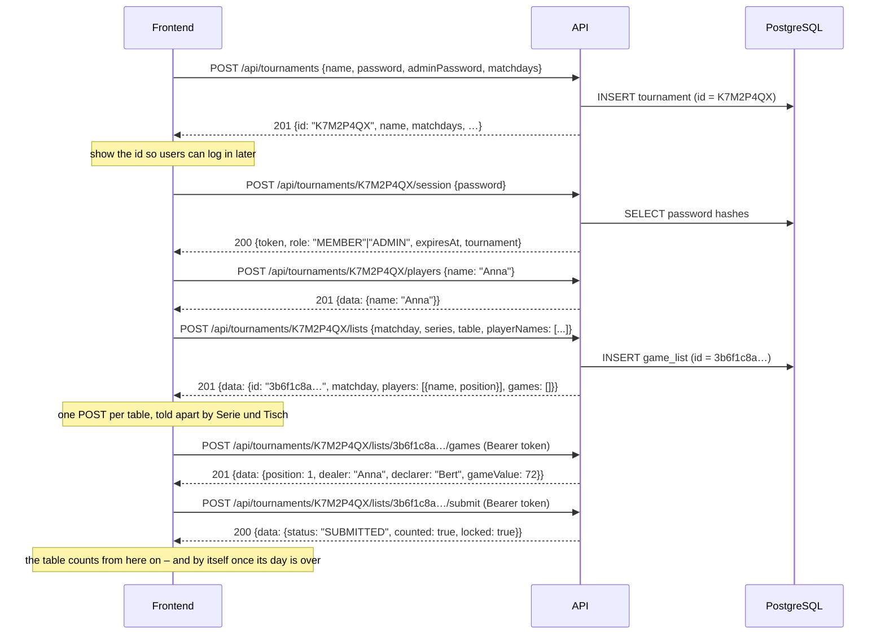

# Skatis – Backend

REST API for the Skatis tournament manager.

A **tournament** is created with a name, a normal password, an admin password and
the weekdays on which it takes place. The API answers with a short
**tournament id** which is shown in the frontend and used for every following
request. A tournament owns its **players** (just names); a **list** exists per
table and matchday and holds the lineup of that table in seating order – 3, 4 or 5
players. An evening can be played at several tables, so one matchday can have
several lists. A list belongs to exactly one day and is part of the tournament
standing as soon as that day is over, whether or not somebody handed it in – a
tournament is played over months, so the standing collects all those evenings.
Every game of a list is played by three of those players – who
sits out follows the Geber rule – and follows the four steps of the Skat rules in
the [README](../README.md) of the repository. From the games the API derives the
**result table** of the list: what every player won, lost and is credited with,
including the final result. There are no
user accounts – access is granted by the normal or the admin password together
with the tournament id.

## Stack

| Concern    | Choice                                      |
| ---------- | ------------------------------------------- |
| Runtime    | Node.js ≥ 22 (ESM, TypeScript)              |
| HTTP       | Express 5                                   |
| Database   | PostgreSQL via Prisma ORM                   |
| Validation | Zod                                         |
| Auth       | Password login → JWT bearer token (HS256)   |
| Passwords  | scrypt (`node:crypto`), salted per password |
| Logging    | Pino (pretty in development, JSON in prod)  |
| Tests      | Vitest + Supertest                          |

## Requirements

- Node.js ≥ 22.12
- A PostgreSQL 14+ database you can reach with a connection string

## Setup

```bash
cd backend
npm install                       # also runs `prisma generate`

cp .env.example .env              # then edit the values
# DATABASE_URL must point at YOUR PostgreSQL instance,
# JWT_SECRET must be a random string of at least 32 characters

npm run dev                       # migrates the database, then http://localhost:3000/api
```

Generate a proper secret with:

```bash
node -e "console.log(require('crypto').randomBytes(48).toString('base64url'))"
```

Everything is installed locally – no global packages and no root privileges are
required.

### Database migrations

The server **applies pending migrations by itself on startup**: before it starts
listening, it runs `prisma migrate deploy` against `DATABASE_URL`. A fresh
database therefore needs no manual step, and a deployment that ships new
migrations upgrades without a separate job.

- It is retried up to **3 times** (2 s apart) and gives up after **60 s** per
  attempt, because a database in Kubernetes may not be reachable at the very
  first moment.
- If it still fails, the process logs `startup aborted – the database schema
could not be prepared` and exits with code `1` instead of serving requests
  against an incomplete schema.
- Set `AUTO_MIGRATE=false` to skip it, e.g. when migrations are applied by a
  separate pipeline step or the database user is not allowed to change the
  schema. The server then starts against whatever schema it finds.

For manual work the scripts below stay available – `npm run db:migrate -- --name x`
while developing a schema change, `npm run db:deploy` to apply migrations by hand.

## Scripts

| Script                  | Purpose                                        |
| ----------------------- | ---------------------------------------------- |
| `npm run dev`           | Watch mode via `tsx`                           |
| `npm run build`         | Compile to `dist/`                             |
| `npm start`             | Run the compiled server                        |
| `npm test`              | Vitest (unit + HTTP tests, no database needed) |
| `npm run test:watch`    | Vitest in watch mode                           |
| `npm run test:coverage` | Coverage report in `coverage/`                 |
| `npm run typecheck`     | `tsc --noEmit`                                 |
| `npm run lint`          | ESLint                                         |
| `npm run lint:fix`      | ESLint with `--fix`                            |
| `npm run format`        | Prettier                                       |
| `npm run format:check`  | Prettier in check mode                         |
| `npm run db:generate`   | Regenerate the Prisma Client                   |
| `npm run db:migrate`    | Create/apply a migration (development)         |
| `npm run db:deploy`     | Apply existing migrations (production)         |
| `npm run db:reset`      | Drop the schema, migrate it and seed nothing   |
| `npm run db:studio`     | Prisma Studio                                  |

## How it works



### Players and lineups

A **player** is nothing but a name inside a tournament. Players are added to the
tournament once and can then be put on a list:

- `POST /api/tournaments/:tournamentId/players` adds a player. Names are unique
  per tournament, so the same name cannot be added twice.
- A player is addressed **by their name** in every other endpoint – there is no
  player id in the API. The name is the handle, and it is compared **exactly**
  (surrounding whitespace is trimmed, `anna` and `Anna` are different players).
- `PUT /api/tournaments/:tournamentId/lists/:listId/players` sets the lineup of
  a list. Only names of players **of the same tournament** are accepted –
  anything else is rejected with `409` (`unknownPlayers` lists the names).
- A lineup consists of **3, 4 or 5 players** and its order matters: it is the
  seating order of the table. Player 1 deals in round 1, player 2 in round 2
  and so on; after the last player it starts over with player 1. The answers
  therefore contain `players` **in seating order**, each with its `position`.
- Because the lineup decides who deals in which round, it can only be changed
  while the list has **no games** yet – afterwards the request is rejected with
  `409`.
- A player can only be deleted while they are not part of any list.
- `PATCH …/players/:playerName` corrects a name. That is the only way to fix a
  typo, because a player who plays in a list cannot be deleted. The names recorded
  in already entered games are rewritten as well. Adding, renaming and removing a
  player all need the admin password – the roster belongs to the admin.

### Entering a game

A game follows the four steps of README.md. The API checks every one of them:

1. **Alleinspieler or Eingepasst** – `declarer` plus `passedOut`. When the game
   was passed out (`{"passedOut": true}`) nothing else may be sent – the flow is
   over.

   Skat is played by three people, so a bigger lineup always leaves players at
   the side. Which players sit out a round follows the Geber ("Geber-Regel"):

   | Players on the list | Sit out                               |
   | ------------------- | ------------------------------------- |
   | 3                   | nobody – everyone plays               |
   | 4                   | the Geber                             |
   | 5                   | the player before and after the Geber |

   With five players the Geber **does** play, and only the two seats around them
   sit out – that is the only way to end up with three players, and it is what
   the README of the repository says ("Bei 5 Spielern kann der Spieler vor und
   der Spieler nach dem Geber nicht ausgewählt werden").

   Which players these are for the next round of a list is answered by
   [`GET …/lists/:listId/next-round`](#get-tournamentstournamentidlistslistidnext-round)
   – a frontend asks instead of reproducing the rule.

2. **Spieltyp** – exactly one of `KARO`, `HERZ`, `PIK`, `KREUZ`, `GRAND`, `NULL`,
   plus the announced levels (`hand`, `schneiderAnnounced`, `schwarzAnnounced`,
   `offen`).
   - suit and grand games: `Schneider Ang.` requires `Hand`, `Schwarz Ang.`
     requires `Schneider Ang.`, `Offen` requires `Schwarz Ang.`
   - null games: `Schneider Ang.` and `Schwarz Ang.` may not be used at all
     (`Hand` and `Offen` are fine, they are part of the fixed values)
3. **Spitzen** – `matadors: {"suit": "WITH"|"WITHOUT", "count": n}`, at most 4
   as grand and at most 11 as suit game. Skipped for a null game, which must not
   send `matadors` at all.
4. **Spielergebnis** – `schneider`, `schwarz` and `won`. `Schwarz` requires
   `Schneider`, and a null game may not be Schneider or Schwarz.

The API derives the remaining properties:

- `position` – the round, counted from 1. Games are appended.
- `dealer` – the next player of the seating order, starting with player 1.
- `players` – the three players of the round: the lineup minus the ones who sit
  out according to the table above. These are exactly the players who may be the
  Alleinspieler, and exactly the players who take part in the round – also in a
  game that was Eingepasst, where nobody actually played.
- `gameValue` – the Spielwert, see below. It is never sent by a client.

#### Spielwert

(`src/modules/lists/game-rules.ts`, readable as data through [`GET /rules`](#get-rules))

- Null games have fixed values: `Null` 23, `Null Hand` 35, `Null Offen` 46,
  `Null Hand Offen` 59.
- Everything else is `(Spitzen + Gewinnstufen + 1) * Grundwert`, where
  Gewinnstufen counts the chosen levels **and** the results (`Hand`,
  `Schneider Ang.`, `Schwarz Ang.`, `Offen`, `Schneider`, `Schwarz`) and the
  Grundwert is Karo 9, Herz 10, Pik 11, Kreuz 12, Grand 24.

```json
{
  "declarer": "Bert",
  "gameType": "GRAND",
  "hand": true,
  "schneiderAnnounced": true,
  "matadors": { "suit": "WITH", "count": 2 },
  "won": true
}
```

→ `gameValue: (2 + 2 + 1) * 24 = 120`

A game is replaced as a whole (`PUT …/games/:gameId`) – a partial update would
have to satisfy the rules above in combination with the stored values. The round
and the dealer stay, everything else is taken from the request.

### Results (Ergebnistabelle)

(`src/modules/lists/scoring.ts`)

This is the table of **one list** – the sheet of one table. Its `total` is the
final result of that evening for every player, and it is exactly what the list
contributes to the tournament: the flat bonuses and the bonus for the lost
Alleinspiele of the others included. How the tournament adds the sheets up is
described under [Tournament standings](#tournament-standings).

Every game is credited to its Alleinspieler, starting from an account of 0:

- a **won** Alleinspiel credits the Spielwert → `positiveGameValue`
- a **lost** Alleinspiel debits **twice** the Spielwert → `negativeGameValue`
- an Eingepasst game changes nothing; it only increments `passedOutCount`

The final result (`total`) adds two more parts to that account:

| Part            | Rule                                                                                                |
| --------------- | --------------------------------------------------------------------------------------------------- |
| `wonBonus`      | `+50` per won Alleinspiel (`Gew`)                                                                   |
| `lossPenalty`   | `-50` per lost Alleinspiel (`Verl`)                                                                 |
| `opponentBonus` | `+40` / `+30` / `+24` per lost Alleinspiel **of another player**, for a lineup of 3 / 4 / 5 players |

So `total = points + wonBonus + lossPenalty + opponentBonus`, where
`points = wonGameValue - lostGameValue`. Each part is reported separately, so a
frontend can show where a result comes from instead of only the sum.

Worked example – 4 players, four rounds, three of them played:

| Round | Dealer | Declarer | Game                                   | Spielwert | Effect               |
| ----- | ------ | -------- | -------------------------------------- | --------- | -------------------- |
| 1     | Anna   | Bert     | Grand Hand, Schneider Ang., 2 Mit, won | 120       | Bert `+120`, `won 1` |
| 2     | Bert   | Clara    | Null, won                              | 23        | Clara `+23`, `won 1` |
| 3     | Clara  | Dora     | Herz Ohne 1, lost                      | 20        | Dora `-40`, `lost 1` |
| 4     | Dora   | –        | Eingepasst                             | 0         | nothing              |

The Spielwerte follow the formula above:

```text
Round 1   Grand, 2 Mit, Hand, Schneider angesagt   (2 + 2 + 1) * 24 = 120
Round 2   Null                                     23
Round 3   Herz ohne 1, verloren                    (1 + 0 + 1) * 10 = 20
Round 4   eingepasst                               0
```

An announced level is itself a Gewinnstufe, so leaving "Schneider Ang." out of
the name while keeping the 120 would make the row look like it contradicts the
formula above.

| Player | points | wonBonus | lossPenalty | opponentBonus | `total` |
| ------ | ------ | -------- | ----------- | ------------- | ------- |
| Anna   | 0      | 0        | 0           | 30            | **30**  |
| Bert   | 120    | 50       | 0           | 30            | **200** |
| Clara  | 23     | 50       | 0           | 30            | **103** |
| Dora   | -40    | 0        | -50         | 0             | **-90** |

`GET …/lists/:listId/results` answers exactly this table, always derived from
the current games – so it is up to date while the list is still being filled.
The `total` of a row is what the player takes into the
[standing](#tournament-standings) of the tournament, part by part.

### Tournament standings

(`src/modules/tournaments/standings.ts`)

A tournament runs over **months**: every evening of the weekly schedule adds its
tables, and the standing is the sum over all of them. A list belongs to exactly
one day and never to several, so nothing has to be totalled per month or per
season – the standing simply collects every list that **counts**.

A list counts when it was handed in **or** when its day is over:

- **handed in** – `status: "SUBMITTED"`, most likely by the members on the
  evening itself.
- **the day is over** – nobody has to submit for that. When the matchday has
  passed, the sheet is final: it counts, even though its stored `status` is still
  `OPEN`. The API reports this as `counted: true`, so a frontend never has to do
  the date arithmetic itself.

The whole `total` of the sheet is carried over, part by part:

1. **`gamesPlayed`** – how many games of the list the player took part in.
   A player takes part in a game when they are in its `players` array, which is
   decided by the [Geber-Regel](#entering-a-game). So a player collects the games
   of every list they are on, and a player who deals all evening still collects
   them – an Eingepasst round counts too, it was played through to the end of
   step 1.
2. **`points`** – what the player's own Alleinspiele are worth: a won one credits
   its Spielwert, a lost one debits twice of it. A player who is not the
   Alleinspieler changes nothing here.
3. **`wonBonus`** and **`lossPenalty`** – the flat `+50` per won and `-50` per
   lost Alleinspiel. The tournament carries them over like the Spielwerte, so a
   won game is worth its Spielwert **plus** 50 in the standing.
4. **`opponentBonus`** – the bonus for every Alleinspiel **another** player lost,
   `+40` / `+30` / `+24` for a lineup of 3 / 4 / 5 players. This is how a player
   gains points in a game they did not take part in: like in the table of the
   evening, the bonus goes to the whole lineup, not only to the three players at
   the table.

`score = points + wonBonus + lossPenalty + opponentBonus` adds those parts up
over all counted lists – the sum of the `total` column of the player's sheets.
Several tables of one evening are simply several lists, so a player who sat at two
of them collects both.

`GET …/tournaments/:tournamentId/standings` answers it. `listsCounted` tells how
many counted lists went into the numbers and `matchdaysCounted` how many
different dates they were played on – over months of play those are very
different numbers.

The **ranking value** is `averageScore = score / gamesPlayed` – the score per
game played, which makes players comparable who played a different number of
games, and which is what keeps a long tournament fair when not everybody is there
every week. The standing sorts by it, best first. The unrounded average decides
the order, so rounding the output to two decimals can never change who is in
front.

- Players with the **same average share a rank**, and the next rank skips the
  ones taken (1, 1, 3).
- A player without a single game keeps a row but has `rank: null` and
  `averageScore: null`, and is listed after everyone who played.
- A list that is still open **on its own day** does not count yet. It joins the
  standing when it is submitted or when its day is over, and reopening it before
  that takes it out again – so the standing always describes what is final.
- A list of a past day cannot be reopened: it counts either way. An admin can
  still correct its games, and the standing follows immediately.

Worked example – two matchdays of a 4 player list, so the bonus is 30:

| Matchday | Dealer | Declarer | Result                | Effect                                         |
| -------- | ------ | -------- | --------------------- | ---------------------------------------------- |
| 1        | Anna   | Bert     | Grand Ohne 2, won, 72 | Bert `+72`; Anna sat out, still gets the bonus |
| 1        | Bert   | Clara    | Null, lost, 23        | Clara `-46`; the other three get `+30` each    |
| 2        | Anna   | Dora     | Herz Ohne 1, lost, 20 | Dora `-40`; the other three get `+30` each     |

| Player | gamesPlayed | points | wonBonus | lossPenalty | opponentBonus | score | averageScore |
| ------ | ----------- | ------ | -------- | ----------- | ------------- | ----- | ------------ |
| Bert   | 2           | 72     | 50       | 0           | 60            | 182   | **91**       |
| Anna   | 1           | 0      | 0        | 0           | 60            | 60    | **60**       |
| Dora   | 3           | -40    | 0        | -50         | 30            | -60   | **-20**      |
| Clara  | 3           | -46    | 0        | -50         | 30            | -66   | **-22**      |

Anna dealt in the first round of both matchdays, so she played a single game –
but she still collected the bonus of both lost Alleinspiele. Her one evening of
games is worth more per game than Clara's three, which is exactly what
`averageScore` is there for.

### Passwords and roles

A tournament has two passwords:

- **normal password** → role `MEMBER`. May create the list of the _current_
  matchday, enter games, correct or delete a game of that list and submit it.
  Nothing else, and only on matchdays of the tournament.
- **admin password** → role `ADMIN`. May change matchdays, rename the tournament,
  reset the player password, and modify or delete lists – at any time, including
  past matchdays.

Which password was used decides the role inside the returned token. Both
passwords are stored as scrypt hashes; a password can never be read back.

Both passwords are chosen when the tournament is created. Afterwards only the
player password can be replaced (`PATCH /tournaments/:tournamentId`); the admin
password is fixed for the lifetime of the tournament. A new player password ends
**all** running sessions at once – also the one that set it, so the change is
followed by a fresh login. Every change is written to the
[change log](#get-tournamentstournamentidlog), so members can see what an
admin did.

### Tournament id

The id is generated by the API: **8 characters**, digits and upper case letters
without the easily confused ones (`0`, `1`, `I`, `L`, `O`), e.g. `K7M2P4QX`. It is
**case insensitive** on input and is returned by `POST /tournaments` so that the
frontend can display it right away. Only the id identifies a tournament – names
are allowed to be ambiguous.

Together with one of the two passwords the id is the only thing needed to log in,
so it should be treated like a shared secret: every read of tournament data
requires a token, and no endpoint reveals which tournaments exist.

### Tokens

`POST /tournaments/:tournamentId/session` returns a JWT that is valid for
`JWT_EXPIRES_IN` (default 12 h) and is bound to exactly one tournament. Send it
with every protected request:

```http
Authorization: Bearer <token>
```

A token used against another tournament id is rejected with `403`. Whether a
stored token is still valid can be checked with
`GET /api/tournaments/:tournamentId/session`.

Every token also carries the **session version** of its tournament. It rises as
soon as the player password is replaced, so a request with an older version is
rejected with `401` – the change ends every running session, including the one of
the admin who made it.

A single session ends with
[`POST …/session/logout`](#post-tournamentstournamentidsessionlogout): the token is
written into a denylist (`revoked_sessions`) until it would have expired anyway.
That is what makes "Abmelden" in the frontend more than forgetting the token in the
browser: the token itself stops working.

### Domain rules

- `matchdays` are ISO weekdays (`1` = Monday … `7` = Sunday). A list only exists
  for a matchday of its tournament.
- `matchdayWindows` optionally gives a weekday a **playing time**, e.g.
  `{ "3": { "from": "18:00", "to": "22:30" } }` for a Wednesday. Before its
  `from` a `MEMBER` may not create or change lists – the evening has not started
  yet – and once its `to` has passed the day is over like a past one: the lists
  count as submitted and the table is free for the next series. A weekday
  without an entry is played "all day", i.e. until midnight. Times are read in
  the server's timezone (`TZ`), like "today".
- A list belongs to **exactly one day** – there are no lists that stay open over
  several days. Its head is the date, the Serie and the Tisch.
- **One table plays one list at a time**: while a list is open and its day is not
  over, a second list for the same matchday, series and table is refused with
  `409` (`details.listId` is the open one). Once that list is submitted – or its
  day is over, which makes it final by itself – the table is free again and the
  next series can be created.
- There can be **several lists per matchday** – one evening is often played at
  several tables with different players (90 players mean 30 tables of three).
  Each list has its own id and is addressed by it; the matchday is an attribute
  of the list, and the same player may sit at two tables of one evening.
- A list **counts as submitted** once its day is over (or the playing time of
  its day has passed), whether or not somebody handed it in. Then it is part of
  the [standing](#tournament-standings) of the tournament, and its `status` stays
  as it was – the `counted` flag tells what the list means now.
- Lists can only be created and submitted on a day the admin put into
  `matchdays` – and, when that weekday has a playing time, only inside it. A
  `MEMBER` may only work on _today's_ matchday ("today" is decided by the `TZ`
  environment variable); an `ADMIN` may also create and correct lists of past or
  future matchdays.
- Reading lists, players and games is allowed for both roles on any day.
- The **roster** – adding, renaming and removing a player – is managed by an
  `ADMIN` at any time: it is not tied to a matchday. Members read it and put its
  players on the list of the evening.
- Submitting a list on its own day freezes it for members. An admin may keep
  editing it; with `reopen` an admin hands it back to the members – but only
  while its day lasts, because a list of a past day cannot be reopened.
- A list can only be played by the players of its lineup, so a game is only
  accepted once the lineup is complete (3, 4 or 5 players).
- Games can only be entered for players of the list: the Alleinspieler has to be
  part of the lineup and has to be allowed to play the round (see above).
- Deleting a tournament deletes its players, lists and games (cascade).

### Locked lists

A list is **locked** for the session that asks for it when it may not be changed
any more:

- **submitted** – once a list has been handed in (by either role) it can only be
  changed by an admin, who may `reopen` it to give it back to the members:
  `POST /api/tournaments/:tournamentId/lists/:listId/submit` and `…/reopen`.
- **another day** – a member may only work on the list of the current matchday.
  Lists of other days are read-only for them; an admin may also create and
  correct lists of past or future matchdays.
- **before the playing time** – today is in `matchdayWindows` and its `from` has
  not been reached: `WINDOW_NOT_STARTED`. Members may not create or change lists
  yet.
- **after the playing time** – today's `to` has passed: `WINDOW_OVER`. The day is
  over by time now, the lists count like submitted ones.

An admin is never locked out – that is what the admin password is for. Every list
tells the frontend where it stands, so it does not have to re-derive the rules:

```json
{
  "id": "3b6f1c8a-9d24-4c31-9a5f-6f5f0f2c1b77",
  "matchday": "2026-09-16",
  "series": 1,
  "table": 3,
  "status": "SUBMITTED",
  "counted": true,
  "submittedAt": "2026-09-16T19:42:11.000Z",
  "locked": true,
  "lockReasons": ["SUBMITTED"],
  "players": [{ "name": "Anna", "position": 1 }],
  "gameCount": 24,
  "totalGameValue": 811,
  "games": []
}
```

`lockReasons` is empty while `locked` is false and may otherwise contain
`SUBMITTED`, `NOT_CURRENT_MATCHDAY`, `NOT_A_MATCHDAY` (the last one when the
matchdays of the tournament were changed after the list was created),
`WINDOW_NOT_STARTED` and `WINDOW_OVER`. Reading is always allowed: only changing
a locked list is refused, with `409` for a submitted list and `403` for another
day or a playing time that has not started (or has ended – then it counts like a
submitted one and `409`).

`locked` says nothing about the standing. A list of a past day is `counted` for
everybody – only an admin can still change it, and it stays in the standing while
they do.

## Quickstart

One Skat evening from an empty database to a submitted list – and beyond, to the
standing it feeds. `BASE` is the API
root; `jq` is only used to pick values out of the answers. `TODAY` has to be a
matchday of the tournament – for the example it is simply derived from today.

```bash
BASE=http://localhost:3000/api
TODAY=$(date +%F)
WD=$(date +%u)                          # ISO weekday of today

# 1. create the tournament – note the id from the answer
curl -s -X POST $BASE/tournaments -H 'Content-Type: application/json' -d '{
  "name": "Mittwochsrunde",
  "password": "member-secret",
  "adminPassword": "admin-secret",
  "matchdays": [$WD]
}'
# => {"data":{"id":"K7M2P4QX","name":"Mittwochsrunde", …}}

# 2. open a session as a member – the id comes from the path, the body is the password
TOKEN=$(curl -s -X POST $BASE/tournaments/K7M2P4QX/session \
  -H 'Content-Type: application/json' -d '{"password":"member-secret"}' | jq -r .data.token)

# 3. add the players of the tournament
for NAME in Anna Bert Clara Dora; do
  curl -s -X POST $BASE/tournaments/K7M2P4QX/players \
    -H "Authorization: Bearer $TOKEN" -H 'Content-Type: application/json' \
    -d "{\"name\":\"$NAME\"}" > /dev/null
done

# the seating order is simply the order of the names
PLAYERS='["Anna","Bert","Clara","Dora"]'

# 4. create the sheet of a table and set the lineup – the answer carries the
#    id of the list, which is what every following step addresses
LIST=$(curl -s -X POST $BASE/tournaments/K7M2P4QX/lists \
  -H "Authorization: Bearer $TOKEN" -H 'Content-Type: application/json' \
  -d "{\"matchday\":\"$TODAY\",\"series\":1,\"table\":1,\"playerNames\":$PLAYERS}" | jq -r .data.id)
# => 3b6f1c8a-9d24-4c31-9a5f-6f5f0f2c1b77
# A second table of the same evening is simply another POST with other players.

# 5. enter the first game: Anna deals, so Bert may play a grand with 2 Spitzen
curl -s -X POST $BASE/tournaments/K7M2P4QX/lists/$LIST/games \
  -H "Authorization: Bearer $TOKEN" -H 'Content-Type: application/json' -d '{
    "passedOut": false,
    "declarer": "Bert",
    "gameType": "GRAND",
    "hand": true,
    "schneiderAnnounced": true,
    "matadors": {"suit": "WITH", "count": 2},
    "won": true
  }'
# => {"data":{"position":1,"dealer":"Anna","gameValue":120, …}}

# 6. look at the table at any time – it is derived from the games
curl -s $BASE/tournaments/K7M2P4QX/lists/$LIST/results -H "Authorization: Bearer $TOKEN" | jq .data.players
# => [ {"name":"Anna","points":0,"wonBonus":0,"lossPenalty":0,"opponentBonus":0,"total":0, …} ]

# 7. hand the list in – from now on members can only read it. Handing it in is
#    optional: a list counts for the standing once its day is over at the latest.
curl -s -X POST $BASE/tournaments/K7M2P4QX/lists/$LIST/submit \
  -H "Authorization: Bearer $TOKEN"

# 8. the standing of the tournament over all counted lists – the ones that were
#    handed in and the ones whose day is over
curl -s $BASE/tournaments/K7M2P4QX/standings -H "Authorization: Bearer $TOKEN" | jq .data
# => {"tournamentId":"K7M2P4QX","matchdaysCounted":1,"listsCounted":1,"players":[ … ]}

# 9. correct something afterwards, as an admin
ADMIN=$(curl -s -X POST $BASE/tournaments/K7M2P4QX/session \
  -H 'Content-Type: application/json' -d '{"password":"admin-secret"}' | jq -r .data.token)
curl -s -X POST $BASE/tournaments/K7M2P4QX/lists/$LIST/reopen -H "Authorization: Bearer $ADMIN"
```

`date +%F` is only today from the API's point of view when both run in the same
timezone – the server decides the current matchday by its own `TZ`.

## Conventions

The whole API follows the same handful of rules.

**Envelope.** A successful answer is always `{ "data": … }`, a paginated one is
`{ "data": […], "meta": { total, limit, offset } }`. An error is always
`{ "error": { code, message, details?, requestId } }` – never a bare string and
never a different key. The full list of codes is under
[Response format](#response-format).

**Naming.** Paths are lower case and use `:camelCase` parameters. Bodies and
answers use `camelCase` fields. Enumerations are `UPPER_SNAKE_CASE` values
(`GRAND`, `SUBMITTED`, `NOT_CURRENT_MATCHDAY`). Dates in paths and bodies are
`YYYY-MM-DD`, all timestamps in answers are ISO 8601 in UTC.

**Pagination.** Collections that grow over the life of a tournament are
paginated (`/lists`, `/tournaments`, `/log`); collections that are naturally
small are not (a roster, the games of one evening, the players of a lineup, the
`lockReasons`).

**Two endpoints before the first token.** `POST /tournaments` and
`POST /tournaments/:tournamentId/session` are the only ones without a token, so
they are [rate limited](#rate-limits). Everything else hangs off
`/tournaments/:tournamentId` and needs a bearer token. The tournament id is
always part of the path, never of a body.

**Reads need no role.** Every `GET` is allowed for both roles on any day, also
for a submitted list: the role only decides _changes_. Which changes are refused
is reported per list in `locked`/`lockReasons`, so a frontend can hide buttons
instead of provoking a `409`.

## Endpoints

Base URL: `http://localhost:3000/api`

Legend: **–** = no token required, **any** = token of any role, **ADMIN** = admin
token required. `:tournamentId` is the id returned by `POST /tournaments` and
`:listId` the uuid of a list as returned by `POST /tournaments/:tournamentId/lists`
– a list is **not** addressed by its date, because one matchday can carry several
tables. A matchday is always a date in the format `YYYY-MM-DD`, in a query or in a
body.

### Creating a tournament and opening a session

| Method | Path                                 | Auth | Description                                         |
| ------ | ------------------------------------ | ---- | --------------------------------------------------- |
| POST   | `/tournaments`                       | –    | Creates a tournament and returns the generated `id` |
| POST   | `/tournaments/:tournamentId/session` | –    | Opens a session with one of the two passwords       |

Both need no token, so both are [rate limited](#rate-limits) per caller address.

#### `POST /tournaments`

| Field           | Type     | Rules                                                |
| --------------- | -------- | ---------------------------------------------------- |
| `name`          | string   | 3–64 characters: letters, digits, spaces and `. _ -` |
| `password`      | string   | 8–128 characters – the normal password               |
| `adminPassword` | string   | 8–128 characters – the admin password                |
| `matchdays`     | number[] | 1–7 unique ISO weekdays, `1` = Monday … `7` = Sunday |

**Request**

```json
{
  "name": "Mittwochsrunde",
  "password": "member-secret",
  "adminPassword": "admin-secret",
  "matchdays": [3]
}
```

**Response** `201`

```json
{
  "data": {
    "id": "K7M2P4QX",
    "name": "Mittwochsrunde",
    "matchdays": [3],
    "listCount": 0,
    "createdAt": "2026-09-18T17:05:12.431Z",
    "updatedAt": "2026-09-18T17:05:12.431Z"
  }
}
```

**Show the `id` to the user** – it is the only handle for the tournament from now
on, and together with a password the only thing needed to log in. Names may
repeat, so the id is what counts.

**Errors:** `422` invalid payload, `429` too many requests.

#### `POST /tournaments/:tournamentId/session`

The tournament comes from the path, so the body is just the password – the same
body works for both roles.

| Field      | Type   | Rules                                |
| ---------- | ------ | ------------------------------------ |
| `password` | string | the normal **or** the admin password |

**Request**

```http
POST /api/tournaments/k7m2p4qx/session
Content-Type: application/json

{ "password": "member-secret" }
```

**Response** `200`

```json
{
  "data": {
    "tournamentId": "K7M2P4QX",
    "role": "MEMBER",
    "token": "eyJhbGciOiJIUzI1NiIsInR5cCI6IkpXVCJ9.…",
    "expiresAt": "2026-09-19T05:05:12.000Z",
    "tournament": {
      "id": "K7M2P4QX",
      "name": "Mittwochsrunde",
      "matchdays": [3],
      "listCount": 0,
      "createdAt": "2026-09-18T17:05:12.431Z",
      "updatedAt": "2026-09-18T17:05:12.431Z"
    }
  }
}
```

`role` is `ADMIN` when the admin password was used and `MEMBER` for the normal
one – that is the only difference between the two roles. Keep the `token` and send
it with every further request as `Authorization: Bearer <token>`. The `tournament`
is included so a frontend needs no second request after logging in. The id in the
answer is the normalised one, so a client that sent a lower case id gets the
canonical spelling back.

**Errors:** `401` for an unknown id **and** for a wrong password (the endpoint does
not reveal which tournaments exist), `422` invalid payload, `429` too many requests.

#### `POST /tournaments/:tournamentId/session/logout`

Ends the **presented** session: the token is remembered in a denylist until it would
have expired, so it stops working at once instead of staying valid for
`JWT_EXPIRES_IN`. It needs the token it should end, so it carries no body:

```http
POST /api/tournaments/K7M2P4QX/session/logout
Authorization: Bearer <token>
```

**Response** `204` – no body. That token answers `401 The session is no longer valid
– please sign in again` from now on; the other sessions of the tournament stay
alive. An admin who wants to end **all** of them replaces the player password.

**Errors:** `401` missing, ended or unknown token.

### Health and meta

| Method | Path            | Auth | Description                           |
| ------ | --------------- | ---- | ------------------------------------- |
| GET    | `/`             | –    | Discovery document listing all paths  |
| GET    | `/health`       | –    | Liveness; does not touch the database |
| GET    | `/health/ready` | –    | Readiness incl. DB connectivity       |
| GET    | `/rules`        | –    | Grundwerte, Spitzen and lineup limits of the game |

#### `GET /health`

**Response** `200`

```json
{ "data": { "status": "ok", "uptimeSeconds": 412, "timestamp": "2026-09-18T17:05:12.431Z" } }
```

#### `GET /health/ready`

**Response** `200` when the database answers, otherwise `503`
(`{"error":{"code":"SERVICE_UNAVAILABLE","message":"Database is not reachable"}}`).

```json
{ "data": { "status": "ready", "database": "up" } }
```

#### `GET /rules`

**Response** `200` – the rules of the game as data, the same constants the service
scores with:

```json
{
  "data": {
    "gameTypes": [
      { "id": "KARO", "baseValue": 9, "maxMatadors": 11 },
      { "id": "HERZ", "baseValue": 10, "maxMatadors": 11 },
      { "id": "PIK", "baseValue": 11, "maxMatadors": 11 },
      { "id": "KREUZ", "baseValue": 12, "maxMatadors": 11 },
      { "id": "GRAND", "baseValue": 24, "maxMatadors": 4 },
      { "id": "NULL", "baseValue": 23, "maxMatadors": null }
    ],
    "nullValues": { "plain": 23, "hand": 35, "offen": 46, "handOffen": 59 },
    "lineup": { "min": 3, "max": 5 }
  }
}
```

`baseValue` is the Grundwert of a suit or grand game – for the null game it is
the value of "Null Einfach", because its Spielwert comes from `nullValues`.
`maxMatadors` is the highest number of Spitzen (`null` where there are none). No
token is needed: the rules are the same for every tournament.

They are the read-only twin of the rules the service applies (see
[Entering a game](#entering-a-game)) – `src/modules/rules/rules.ts` reads them from
`src/modules/lists/game-rules.ts`, so no frontend has to keep a copy of the
numbers that could drift from what the API calculates.

### Tournaments

| Method | Path                                   | Auth  | Description                                             |
| ------ | -------------------------------------- | ----- | ------------------------------------------------------- |
| GET    | `/tournaments`                         | any   | The token's tournament                                  |
| GET    | `/tournaments/:tournamentId`           | any   | Tournament details                                      |
| GET    | `/tournaments/:tournamentId/session`   | any   | Role behind the presented token                         |
| POST   | `/tournaments/:tournamentId/session/logout` | any   | Ends the presented session (the token stops working)    |
| GET    | `/tournaments/:tournamentId/standings` | any   | The standing over all lists that count                  |
| GET    | `/tournaments/:tournamentId/standings/history` | any | The standing at the end of every matchday, week or month |
| GET    | `/tournaments/:tournamentId/standings/players/:playerName` | any | How one player took part in the rounds and how he did there |
| GET    | `/tournaments/:tournamentId/log`       | any   | The change log of the tournament, newest first          |
| PATCH  | `/tournaments/:tournamentId`           | ADMIN | Change `name`, `matchdays` and/or the player password   |
| DELETE | `/tournaments/:tournamentId`           | ADMIN | Delete incl. players, lists and games                   |

#### `GET /tournaments`

Query: `?search=` (name contains), `?limit=` (1–100, default 20), `?offset=`
(default 0). Newest first.

**Request**

```http
GET /api/tournaments
Authorization: Bearer <token>
```

**Response** `200`

```json
{
  "data": [
    {
      "id": "K7M2P4QX",
      "name": "Mittwochsrunde",
      "matchdays": [3],
      "listCount": 4,
      "createdAt": "2026-09-18T17:05:12.431Z",
      "updatedAt": "2026-09-18T17:05:12.431Z"
    }
  ],
  "meta": { "total": 1, "limit": 20, "offset": 0 }
}
```

It exists so a frontend that holds a token can fetch its tournament without
knowing the id again. Because a token is bound to one tournament the result never
contains more than that single entry – no endpoint enumerates all tournaments,
and an unauthenticated caller learns nothing about them.

#### `GET /tournaments/:tournamentId`

**Response** `200` – the [tournament object](#tournament), the same shape
`POST /tournaments` answers.

```json
{
  "data": {
    "id": "K7M2P4QX",
    "name": "Mittwochsrunde",
    "matchdays": [3],
    "listCount": 4,
    "createdAt": "2026-09-18T17:05:12.431Z",
    "updatedAt": "2026-09-18T19:42:11.000Z"
  }
}
```

**Errors:** `403` token of another tournament, `404` unknown tournament.

#### `GET /tournaments/:tournamentId/session`

**Response** `200`

```json
{ "data": { "tournamentId": "K7M2P4QX", "role": "ADMIN" } }
```

The cheapest way for a frontend to check a token it has in storage: `401` means
“log in again”.

#### `GET /tournaments/:tournamentId/standings`

The standing of the tournament over all lists that **count** – the ones that were
submitted and the ones whose day is over –, best player first. See
[Tournament standings](#tournament-standings) for the rules.

**Response** `200`

```json
{
  "data": {
    "tournamentId": "K7M2P4QX",
    "matchdaysCounted": 2,
    "listsCounted": 2,
    "players": [
      {
        "rank": 1,
        "name": "Bert",
        "gamesPlayed": 2,
        "won": 1,
        "lost": 0,
        "opponentWon": 2,
        "points": 72,
        "wonBonus": 50,
        "lossPenalty": 0,
        "opponentBonus": 60,
        "score": 182,
        "averageScore": 91,
        "averageScorePer36": 3276,
        "lastMatchdayChange": 30
      },
      {
        "rank": 2,
        "name": "Anna",
        "gamesPlayed": 1,
        "won": 0,
        "lost": 0,
        "opponentWon": 2,
        "points": 0,
        "wonBonus": 0,
        "lossPenalty": 0,
        "opponentBonus": 60,
        "score": 60,
        "averageScore": 60,
        "averageScorePer36": 2160,
        "lastMatchdayChange": 30
      },
      {
        "rank": 3,
        "name": "Dora",
        "gamesPlayed": 3,
        "won": 0,
        "lost": 1,
        "opponentWon": 1,
        "points": -40,
        "wonBonus": 0,
        "lossPenalty": -50,
        "opponentBonus": 30,
        "score": -60,
        "averageScore": -20,
        "averageScorePer36": -720,
        "lastMatchdayChange": -90
      },
      {
        "rank": 4,
        "name": "Clara",
        "gamesPlayed": 3,
        "won": 0,
        "lost": 1,
        "opponentWon": 1,
        "points": -46,
        "wonBonus": 0,
        "lossPenalty": -50,
        "opponentBonus": 30,
        "score": -66,
        "averageScore": -22,
        "averageScorePer36": -792,
        "lastMatchdayChange": 30
      },
      {
        "rank": null,
        "name": "Emil",
        "gamesPlayed": 0,
        "won": 0,
        "lost": 0,
        "opponentWon": 0,
        "points": 0,
        "wonBonus": 0,
        "lossPenalty": 0,
        "opponentBonus": 0,
        "score": 0,
        "averageScore": null,
        "averageScorePer36": null,
        "lastMatchdayChange": 0
      }
    ]
  }
}
```

This is the worked example of [Tournament standings](#tournament-standings): the
score of a player is `points + wonBonus + lossPenalty + opponentBonus` – the sum
of the `total` of their sheets – and the rank comes from `score / gamesPlayed`.

A list counts for this standing once it is submitted or its day is over; a list
that is still open **on its own day** does not count yet, and reopening one takes
it out again – the standing always describes what is final. Reading is allowed
for both roles.

**Errors:** `404` unknown tournament.

#### `GET /tournaments/:tournamentId/standings/history`

The same standing, but dated: where every player stood at the end of every
matchday – or of every ISO week or month. It is what a progression chart of the
ranking is drawn from, and it follows the rules of
[Tournament standings](#tournament-standings). Reading is allowed for both roles.

Query: `?groupBy=matchday|week|month` (default `matchday`).

**Response** `200` – the month example of the table above:

```json
{
  "data": {
    "tournamentId": "K7M2P4QX",
    "groupBy": "month",
    "players": ["Bert", "Anna", "Dora", "Clara", "Emil"],
    "buckets": [
      {
        "key": "2026-09",
        "from": "2026-09-16",
        "to": "2026-09-23",
        "matchdayCount": 2,
        "score": { "Bert": 182, "Anna": 60, "Dora": -60, "Clara": -66, "Emil": 0 },
        "gamesPlayed": { "Bert": 2, "Anna": 1, "Dora": 3, "Clara": 3, "Emil": 0 },
        "averageScore": { "Bert": 91, "Anna": 60, "Dora": -20, "Clara": -22, "Emil": null }
      }
    ]
  }
}
```

A bucket is read **after** all of its lists: `score`, `gamesPlayed` and
`averageScore` are the values of the standing as at the end of the bucket, so the
last bucket is exactly the table of `GET …/standings` – here one bucket holds both
matchdays, which is why it is that table. `key` is stable enough to be used as an
id in a chart (`2026-09-16`, `2026-W38`, `2026-09`), `from`/`to` are its first and
last matchday and `matchdayCount` counts its days.

`players` is the order of the standing – the order of the series – while the
buckets come in time order. `averageScore` stays `null` while a player has no
game: a tournament over months stays comparable because a player who missed an
evening keeps their own average.

**Errors:** `404` unknown tournament, `422` unknown `groupBy`.

#### `GET /tournaments/:tournamentId/standings/players/:playerName`

How one player took part in the rounds of the tournament and how he did there. The
answer carries his [ranking row](#standing) as `player`, so a player page needs a
single request; everything else is derived from the games of the counted lists.
Reading is allowed for both roles.

**Response** `200`

```json
{
  "data": {
    "tournamentId": "K7M2P4QX",
    "listsCounted": 3,
    "player": { "rank": 1, "name": "Bert", "gamesPlayed": 6, "score": 612, "averageScore": 102, "averageScorePer36": 3672, "lastMatchdayChange": 140, "won": 4, "lost": 1, "opponentWon": 3, "points": 96, "wonBonus": 200, "lossPenalty": -50, "opponentBonus": 90 },
    "roles": {
      "played": 6,
      "declarer": 5,
      "defender": 1,
      "passedOut": 0,
      "declarerShare": 83.3,
      "defenderShare": 16.7,
      "passedOutShare": 0
    },
    "declarer": { "played": 5, "won": 4, "lost": 1, "winShare": 80 },
    "hand": { "played": 2, "won": 2, "share": 40, "winShare": 100 },
    "defender": { "played": 1, "won": 1, "winShare": 100 },
    "gameTypes": [
      { "gameType": "HERZ", "played": 2, "won": 1, "share": 40, "winShare": 50 },
      { "gameType": "PIK", "played": 1, "won": 1, "share": 20, "winShare": 100 },
      { "gameType": "GRAND", "played": 1, "won": 1, "share": 20, "winShare": 100 },
      { "gameType": "NULL", "played": 1, "won": 1, "share": 20, "winShare": 100 }
    ],
    "gameTypeGroups": [
      { "group": "SUIT", "played": 3, "won": 2, "share": 60, "winShare": 66.7 },
      { "group": "GRAND", "played": 1, "won": 1, "share": 20, "winShare": 100 },
      { "group": "NULL", "played": 1, "won": 1, "share": 20, "winShare": 100 }
    ]
  }
}
```

A round the player is part of is exactly one of three things, so the roles add up
to his `gamesPlayed`: his own **Alleinspiel**, a **Gegenspiel** (somebody else
played) or a round that was **passed out**. `declarerShare` / `defenderShare` /
`passedOutShare` are those roles as a share of `played` – "in how many of his
games was he the Alleinspieler, a Gegenspieler, or was the round passed out?" –,
which is why the three shares add up to 100 %.

The blocks below follow the same pattern: `played` is the number of games in that
block, `share` is it in percent of the right total (his Alleinspiele) and
`winShare` is the Erfolgsquote inside the block. `hand` counts his Alleinspiele
with the Gewinnstufe "Hand" (also "Null Hand"), `defender.won` counts the rounds
he was at the table in **and** the Alleinspieler lost – the standing's
`opponentWon` counts every such loss of the others, because the bonus is paid to
the whole lineup, also to a player who sat out.

`gameTypes` lists every Spielart he played (in the order of the enum) and
`gameTypeGroups` always reports all three groups – `SUIT` (the four colours),
`GRAND` and `NULL`; a frontend draws its "Grand / Null / Farbspiel" pie and the
colour rankings from those two lists without doing maths itself.

All shares are percentages rounded to one decimal and `null` while the
denominator is `0`.

**Errors:** `404` unknown tournament or unknown player.

#### `GET /tournaments/:tournamentId/log`

The **change log** ("Protokoll") of the tournament, newest first. Both roles may
read it, so a member can follow what an admin changed and an admin can see who
entered which game.

Query: `?limit=` (1–200, default 50), `?offset=` (default 0).

`action` is a stable key and `details` carries the numbers of the change; the
wording lives in the frontend, so it can change without touching stored entries.
Passwords never appear in the log – only the fact that one was changed.

| Action                | Recorded when                            | `details`                                                                  |
| --------------------- | ---------------------------------------- | -------------------------------------------------------------------------- |
| `tournament.updated`  | tournament settings were changed         | `changed` (`name` / `matchdays` / `matchdayWindows` / `password`), `name`, `matchdays`, `matchdayWindows` (weekday → `"18:00-22:30"`) |
| `list.created`        | a list was created                       | `listId`, `matchday`, `series`, `table`, `playerNames`                       |
| `list.deleted`        | an admin deleted a list                  | `listId`, `matchday`, `series`, `table`, `gameCount`                         |
| `list.submitted`      | a list was handed in                     | `listId`, `matchday`, `series`, `table`                                      |
| `list.reopened`       | an admin handed a list back              | `listId`, `matchday`, `series`, `table`                                      |
| `list.lineup_changed` | the players of a list were replaced      | `listId`, `matchday`, `series`, `table`, `playerNames`                       |
| `game.created`        | a game was entered                       | `listId`, `gameId`, `position`, `declarer`, `gameType`, `gameValue`, `won`   |
| `game.updated`        | a game was replaced                      | like `game.created`                                                         |
| `game.deleted`        | a game was removed                       | like `game.created`, without the game fields when the row was already gone    |
| `player.added`        | a player joined the roster               | `name`                                                                      |
| `player.renamed`      | a player was renamed                     | `from`, `to`                                                                |
| `player.removed`      | a player left the roster                 | `name`                                                                      |

**Response** `200`

```json
{
  "data": [
    {
      "id": "9f1c2d3e-4a5b-6c7d-8e9f-0a1b2c3d4e5f",
      "createdAt": "2026-09-19T20:15:04.000Z",
      "role": "ADMIN",
      "action": "list.deleted",
      "details": {
        "listId": "3b6f1c8a-9d24-4c31-9a5f-6f5f0f2c1b77",
        "matchday": "2026-09-18",
        "series": 1,
        "table": 3,
        "gameCount": 5
      }
    }
  ],
  "meta": { "total": 42, "limit": 50, "offset": 0 }
}
```

**Errors:** `404` unknown tournament.

#### `PATCH /tournaments/:tournamentId`

Every field is optional, at least one is required.

| Field             | Type     | Rules                                                            |
| ----------------- | -------- | ---------------------------------------------------------------- |
| `name`            | string   | same rules as on creation                                        |
| `matchdays`       | number[] | 1–7 unique weekdays                                              |
| `matchdayWindows` | object   | playing time per weekday – see below                             |
| `password`        | string   | 8–128 characters, sets a new player one                          |

An admin uses `matchdays` to steer **when** members may work on lists: a member
can only create, change and submit the list of a day that is in `matchdays` _and_
today. `password` resets the **player password**, the one members log in with.

`matchdayWindows` **replaces the whole map**: a weekday that is missing from it
has no playing time (the day then lasts until midnight). Keys are weekdays
(`"1"` … `"7"`), values are `{ "from": "HH:MM", "to": "HH:MM" }` with
`from` < `to`. Before the `from` of that weekday members may not create or change
lists, after the `to` the days' lists count as submitted – see
[domain rules](#domain-rules). An empty object clears all playing times; a
weekday that is not in `matchdays` may carry an entry (it simply never applies).
The times are understood in the server's timezone (`TZ`).

The **admin password cannot be changed** through the API: it is the password that
grants these changes, so it stays as it was set when the tournament was created.
A request that sends `adminPassword` (or any other unknown field) is rejected
with `422` instead of silently ignoring it – the schema is strict.

**Request**

```http
PATCH /api/tournaments/K7M2P4QX
Authorization: Bearer <admin token>
Content-Type: application/json

{ "matchdays": [3, 6], "matchdayWindows": { "3": { "from": "18:00", "to": "22:30" } }, "password": "neues-geheimnis" }
```

**Response** `200` – the updated [tournament object](#tournament).

Tokens that are already out there stay valid until they expire, also after
`matchdays` or `name` were changed – see [Security notes](#security-notes). A new
`password` is different: it ends every session (including this one), so the next
request answers `401 The session is no longer valid – please sign in again`.

**Errors:** `403` member token, `422` invalid payload.

#### `DELETE /tournaments/:tournamentId`

**Response** `204` – no body. Removes the tournament together with its players,
lists and games (cascade).

**Errors:** `403` member token, `404` unknown tournament.

### Players

| Method | Path                                             | Auth  | Description                                                |
| ------ | ------------------------------------------------ | ----- | ---------------------------------------------------------- |
| GET    | `/tournaments/:tournamentId/players`             | any   | All players of the tournament, sorted by name              |
| POST   | `/tournaments/:tournamentId/players`             | ADMIN | `{ name }` – 1–64 characters, unique inside the tournament |
| PATCH  | `/tournaments/:tournamentId/players/:playerName` | ADMIN | `{ name }` – correct the name of a player                  |
| DELETE | `/tournaments/:tournamentId/players/:playerName` | ADMIN | Remove a player (only while not on any list)               |

Players are the roster of the tournament: they are created once and then put on
a list, which is what makes a game possible at all. **The roster is managed by an
`ADMIN`** – adding, renaming and removing a player all need the admin password. A
member only reads the roster and puts its players on the list of the evening. A
player is identified by their name inside the tournament, so there is no id to
remember – the `:playerName` path parameter is the name itself (URL-encoded, e.g.
`players/Anna%20M%C3%BCller`). Names are compared exactly: `anna` and `Anna` are
two different players.

**`GET /tournaments/:tournamentId/players`** → `200`, sorted by name, not paginated.

```json
{ "data": [{ "name": "Anna" }, { "name": "Bert" }, { "name": "Clara" }] }
```

**`POST /tournaments/:tournamentId/players`** – admin only

```http
POST /api/tournaments/K7M2P4QX/players
Authorization: Bearer <admin token>
Content-Type: application/json

{ "name": "Bert" }
```

**Response** `201` → `{ "data": { "name": "Bert" } }`

**Errors:** `403` member token, `409` the name already exists, `422` invalid name.

**`PATCH /tournaments/:tournamentId/players/:playerName`** – admin only

```http
PATCH /api/tournaments/K7M2P4QX/players/Betr
Authorization: Bearer <admin token>
Content-Type: application/json

{ "name": "Bert" }
```

**Response** `200` → `{ "data": { "name": "Bert" } }`

Corrects a typo – the only way to fix one, because a player who plays in a list
cannot be deleted. All names recorded in already entered games are rewritten as
well: the three `players` of a game, the Alleinspieler and the Geber – the Geber
sits out with four players and is therefore not among the three. A rename to the
same name is a no-op.

**Errors:** `403` member token, `404` unknown player, `409` the new name is
already taken.

**`DELETE /tournaments/:tournamentId/players/:playerName`** → `204`, no body.
Admin only.

**Errors:** `403` member token, `404` unknown player, `409` the player plays in a
list (answer contains the number of lists in `details`).

### Lists

A list is one table's sheet for **one** matchday: its lineup in seating order,
and every game in it is played by exactly those players. The head of the sheet –
**Datum, Serie und Tisch** – is therefore part of every list: `matchday`,
`series` and `table`, all three required. A matchday may carry as many lists as
there were tables, which is why a list is addressed by its **own id** and not by
the date.

A list never spans several days: it belongs to its matchday and becomes part of the
[standing](#tournament-standings) as soon as that day is over, whether or not
somebody handed it in – the `counted` flag of a list tells which of the two is the
case.

| Method | Path                                               | Auth  | Description                                            |
| ------ | -------------------------------------------------- | ----- | ------------------------------------------------------ |
| GET    | `/tournaments/:tournamentId/lists`                 | any   | All lists of the tournament                            |
| POST   | `/tournaments/:tournamentId/lists`                 | any   | Create a list                                          |
| GET    | `/tournaments/:tournamentId/lists/:listId`         | any   | One list incl. lineup and games                        |
| GET    | `/tournaments/:tournamentId/lists/:listId/results` | any   | The result table of the list                           |
| GET    | `/tournaments/:tournamentId/lists/:listId/next-round` | any | The round a new game would create (Geber-Regel)        |
| GET    | `/tournaments/:tournamentId/lists/:listId/progression` | any | The account of every player before and after every round (bonuses included) |
| PUT    | `/tournaments/:tournamentId/lists/:listId/players` | any   | Replace the lineup                                     |
| DELETE | `/tournaments/:tournamentId/lists/:listId`         | ADMIN | Delete the list incl. its games                        |
| POST   | `/tournaments/:tournamentId/lists/:listId/submit`  | any   | Hand the list in – it counts and is locked for members |
| POST   | `/tournaments/:tournamentId/lists/:listId/reopen`  | ADMIN | Give a submitted list back to the members              |

#### `GET /tournaments/:tournamentId/lists`

Query: `?matchday=` (exactly one date – the evening with all its tables),
`?from=` and `?to=` (a range of dates), `?status=OPEN|SUBMITTED` (what is
stored), `?counted=true|false` (whether the list already counts for the standing:
handed in or of a past day), `?limit=` (1–100, default 20), `?offset=` (default
0). Newest matchday first, then by series and table – so the sheets of an evening
come in the order of the room.

`?matchday=` is the one to use for "the lists of tonight": it answers every table
of that date in a single request and is what a scoreboard of the evening needs.
`?counted=false` answers the sheets that are still being played, `?counted=true`
the ones that are already final. `?from=`/`?to=` are ignored while `?matchday=` is
given.

**Response** `200` – no `games` in the collection, see the detail endpoint.

```json
{
  "data": [
    {
      "id": "3b6f1c8a-9d24-4c31-9a5f-6f5f0f2c1b77",
      "tournamentId": "K7M2P4QX",
      "matchday": "2026-09-18",
      "series": 1,
      "table": 3,
      "status": "OPEN",
      "counted": false,
      "submittedAt": null,
      "locked": false,
      "lockReasons": [],
      "players": [
        { "name": "Anna", "position": 1 },
        { "name": "Bert", "position": 2 },
        { "name": "Clara", "position": 3 },
        { "name": "Dora", "position": 4 }
      ],
      "gameCount": 4,
      "totalGameValue": 163,
      "createdAt": "2026-09-18T18:00:00.000Z",
      "updatedAt": "2026-09-18T19:42:11.000Z"
    }
  ],
  "meta": { "total": 1, "limit": 20, "offset": 0 }
}
```

#### `POST /tournaments/:tournamentId/lists`

| Field         | Type     | Rules                                                                      |
| ------------- | -------- | -------------------------------------------------------------------------- |
| `matchday`    | string   | `YYYY-MM-DD`, a matchday of the tournament – several lists may share it    |
| `series`      | number   | "Serie" of the head, an integer ≥ 1 – required                             |
| `table`       | number   | "Tisch" of the head, an integer ≥ 1 – required                             |
| `playerNames` | string[] | optional: 3–5 names of this tournament **in seating order**, no duplicates |
| `games`       | game[]   | optional: entered in order, they become rounds 1…n                         |

A table of a series can only have **one** sheet per evening, so `Serie 1,
Tisch 3` of `2026-09-18` exists once. Several lists still share a matchday – they
differ in series or table.

Lineup and first games may be sent in one request, which saves a round trip when
an evening is entered at once.

**Request**

```json
{
  "matchday": "2026-09-18",
  "series": 1,
  "table": 3,
  "playerNames": ["Anna", "Bert", "Clara", "Dora"],
  "games": [{ "passedOut": false, "declarer": "Bert", "gameType": "NULL", "won": true }]
}
```

**Response** `201` – the list as above, plus `games`.

**Errors:** `403` the day is not a matchday, or the token is a member token and
the day is not today, `409` Serie and Tisch already have a sheet for that day
(`details.listId` is the existing one), `409` a name in `playerNames` is not a
player of this tournament (`details.unknownPlayers`), `422` a missing or invalid
series/table, a lineup of the wrong size, a duplicate name or an invalid game.

#### `GET /tournaments/:tournamentId/lists/:listId`

**Response** `200`

```json
{
  "data": {
    "id": "3b6f1c8a-9d24-4c31-9a5f-6f5f0f2c1b77",
    "tournamentId": "K7M2P4QX",
    "matchday": "2026-09-18",
    "series": 1,
    "table": 3,
    "status": "OPEN",
    "counted": false,
    "submittedAt": null,
    "locked": false,
    "lockReasons": [],
    "players": [
      { "name": "Anna", "position": 1 },
      { "name": "Bert", "position": 2 },
      { "name": "Clara", "position": 3 },
      { "name": "Dora", "position": 4 }
    ],
    "gameCount": 4,
    "totalGameValue": 163,
    "games": [
      {
        "id": "99815b69-7e3b-4e37-a4a5-eecbadcc6ffe",
        "position": 1,
        "players": ["Bert", "Clara", "Dora"],
        "sittingOutPlayers": ["Anna"],
        "dealer": "Anna",
        "passedOut": false,
        "declarer": "Bert",
        "gameType": "GRAND",
        "hand": true,
        "schneiderAnnounced": true,
        "schwarzAnnounced": false,
        "offen": false,
        "matadors": { "suit": "WITH", "count": 2 },
        "schneider": false,
        "schwarz": false,
        "won": true,
        "gameValue": 120,
        "positiveGameValue": 120,
        "negativeGameValue": 0,
        "note": null,
        "createdAt": "2026-09-18T18:12:03.114Z",
        "updatedAt": "2026-09-18T18:12:03.114Z"
      },
      {
        "id": "d19f5d5d-90a7-4062-9f82-81eabce45199",
        "position": 2,
        "players": ["Anna", "Clara", "Dora"],
        "sittingOutPlayers": ["Bert"],
        "dealer": "Bert",
        "passedOut": false,
        "declarer": "Clara",
        "gameType": "NULL",
        "hand": false,
        "schneiderAnnounced": false,
        "schwarzAnnounced": false,
        "offen": false,
        "matadors": null,
        "schneider": false,
        "schwarz": false,
        "won": true,
        "gameValue": 23,
        "positiveGameValue": 23,
        "negativeGameValue": 0,
        "note": null,
        "createdAt": "2026-09-18T18:14:20.031Z",
        "updatedAt": "2026-09-18T18:14:20.031Z"
      },
      {
        "id": "c7038ab0-6620-42fb-ac5f-5fd6f92152b3",
        "position": 3,
        "players": ["Anna", "Bert", "Dora"],
        "sittingOutPlayers": ["Clara"],
        "dealer": "Clara",
        "passedOut": false,
        "declarer": "Dora",
        "gameType": "HERZ",
        "hand": false,
        "schneiderAnnounced": false,
        "schwarzAnnounced": false,
        "offen": false,
        "matadors": { "suit": "WITHOUT", "count": 1 },
        "schneider": false,
        "schwarz": false,
        "won": false,
        "gameValue": 20,
        "positiveGameValue": 0,
        "negativeGameValue": 40,
        "note": null,
        "createdAt": "2026-09-18T18:20:44.712Z",
        "updatedAt": "2026-09-18T18:20:44.712Z"
      },
      {
        "id": "52197cd3-3d3f-4d27-ab84-1fccc4dcc0f4",
        "position": 4,
        "players": ["Anna", "Bert", "Clara"],
        "sittingOutPlayers": ["Dora"],
        "dealer": "Dora",
        "passedOut": true,
        "declarer": null,
        "gameType": null,
        "hand": false,
        "schneiderAnnounced": false,
        "schwarzAnnounced": false,
        "offen": false,
        "matadors": null,
        "schneider": false,
        "schwarz": false,
        "won": null,
        "gameValue": 0,
        "positiveGameValue": 0,
        "negativeGameValue": 0,
        "note": "alle eingepasst",
        "createdAt": "2026-09-18T18:26:09.220Z",
        "updatedAt": "2026-09-18T18:26:09.220Z"
      }
    ],
    "createdAt": "2026-09-18T18:00:00.000Z",
    "updatedAt": "2026-09-18T18:26:09.220Z"
  }
}
```

The four games are the worked example of [Results](#results-ergebnistabelle): a
Grand won with 120, a Null won with 23, a Herz lost with 20 and one Eingepasst
game. `locked` and `lockReasons` describe the **requesting** role – see
[Locked lists](#locked-lists).

**Errors:** `404` unknown list, `422` invalid query.

#### `GET /tournaments/:tournamentId/lists/:listId/results`

The result table ("Ergebnistabelle") of the list, always derived from the current
games – see [Results](#results-ergebnistabelle). Reading is allowed for both
roles, also after the list was submitted.

**Response** `200`

```json
{
  "data": {
    "matchday": "2026-09-18",
    "playerCount": 4,
    "gameCount": 4,
    "playedCount": 3,
    "passedOutCount": 1,
    "totalGameValue": 163,
    "opponentBonusPerGame": 30,
    "players": [
      {
        "name": "Anna",
        "position": 1,
        "gamesPlayed": 3,
        "won": 0,
        "lost": 0,
        "wonGameValue": 0,
        "lostGameValue": 0,
        "points": 0,
        "wonBonus": 0,
        "lossPenalty": 0,
        "opponentWon": 1,
        "opponentBonus": 30,
        "total": 30
      },
      {
        "name": "Bert",
        "position": 2,
        "gamesPlayed": 3,
        "won": 1,
        "lost": 0,
        "wonGameValue": 120,
        "lostGameValue": 0,
        "points": 120,
        "wonBonus": 50,
        "lossPenalty": 0,
        "opponentWon": 1,
        "opponentBonus": 30,
        "total": 200
      },
      {
        "name": "Clara",
        "position": 3,
        "gamesPlayed": 3,
        "won": 1,
        "lost": 0,
        "wonGameValue": 23,
        "lostGameValue": 0,
        "points": 23,
        "wonBonus": 50,
        "lossPenalty": 0,
        "opponentWon": 1,
        "opponentBonus": 30,
        "total": 103
      },
      {
        "name": "Dora",
        "position": 4,
        "gamesPlayed": 3,
        "won": 0,
        "lost": 1,
        "wonGameValue": 0,
        "lostGameValue": 40,
        "points": -40,
        "wonBonus": 0,
        "lossPenalty": -50,
        "opponentWon": 0,
        "opponentBonus": 0,
        "total": -90
      }
    ]
  }
}
```

**Errors:** `404` unknown list.

#### `GET /tournaments/:tournamentId/lists/:listId/next-round`

The round that a `POST …/games` would create: which player deals and which three
players may be the **Alleinspieler** of that round (the "Geber-Regel", see
[Entering a game](#entering-a-game)). A frontend asks this instead of reproducing
the rule, so the players it offers for selection can never differ from the ones
the entry of a game accepts.

Reading is allowed for both roles on any day – like the other `GET`s it says
nothing about whether a game may actually be entered; the `POST` on `…/games`
decides that.

The lineup has to be complete (3, 4 or 5 players), otherwise the answer is `409`
– the same rule the entry of a game enforces.

**Response** `200`

```json
{
  "data": {
    "listId": "3b6f1c8a-9d24-4c31-9a5f-6f5f0f2c1b77",
    "position": 5,
    "lineup": ["Anna", "Bert", "Clara", "Dora", "Emil"],
    "dealer": "Clara",
    "playingPlayers": ["Anna", "Clara", "Emil"],
    "sittingOutPlayers": ["Bert", "Dora"]
  }
}
```

`position` is the round number the new game gets and `dealer` the Geber of that
round. `playingPlayers` names the three players of the round in seating order –
exactly the ones that may be sent as `declarer` – and `sittingOutPlayers` the
ones who sit out: with five players the Geber plays and the two seats around them
sit out, with four the Geber sits out, with three nobody does.

**Errors:** `404` unknown list, `409` the lineup is not complete yet.

#### `GET /tournaments/:tournamentId/lists/:listId/progression`

The **Spielstand** of the evening: the account of every player of the lineup
before and after every round. It is what a progression chart of a list and the
"Spielstand vor und nach dem Spiel" of a single game are drawn from, and it
follows the rule of the [result table](#results-ergebnistabelle) in full – a
game moves nobody else's account, but the bonuses of a lost Alleinspiel do.

Reading is allowed for both roles on any day, also for an empty list: the answer
then has `rounds: []` and every account at 0.

**Response** `200`

```json
{
  "data": {
    "matchday": "2026-09-16",
    "lineup": ["Anna", "Bert", "Clara", "Dora"],
    "playerCount": 4,
    "rounds": [
      {
        "position": 1,
        "dealer": "Anna",
        "declarer": "Bert",
        "gameValue": 120,
        "deltas": { "Anna": 0, "Bert": 170, "Clara": 0, "Dora": 0 },
        "accounts": { "Anna": 0, "Bert": 170, "Clara": 0, "Dora": 0 },
        "points": { "Anna": 0, "Bert": 120, "Clara": 0, "Dora": 0 },
        "won": { "Anna": 0, "Bert": 1, "Clara": 0, "Dora": 0 },
        "lost": { "Anna": 0, "Bert": 0, "Clara": 0, "Dora": 0 }
      },
      {
        "position": 2,
        "dealer": "Bert",
        "declarer": null,
        "gameValue": 0,
        "deltas": { "Anna": 0, "Bert": 0, "Clara": 0, "Dora": 0 },
        "accounts": { "Anna": 0, "Bert": 170, "Clara": 0, "Dora": 0 },
        "points": { "Anna": 0, "Bert": 120, "Clara": 0, "Dora": 0 },
        "won": { "Anna": 0, "Bert": 1, "Clara": 0, "Dora": 0 },
        "lost": { "Anna": 0, "Bert": 0, "Clara": 0, "Dora": 0 }
      },
      {
        "position": 3,
        "dealer": "Clara",
        "declarer": "Dora",
        "gameValue": 24,
        "deltas": { "Anna": 30, "Bert": 30, "Clara": 30, "Dora": -98 },
        "accounts": { "Anna": 30, "Bert": 200, "Clara": 30, "Dora": -98 },
        "points": { "Anna": 0, "Bert": 120, "Clara": 0, "Dora": -48 },
        "won": { "Anna": 0, "Bert": 1, "Clara": 0, "Dora": 0 },
        "lost": { "Anna": 0, "Bert": 0, "Clara": 0, "Dora": 1 }
      }
    ],
    "accounts": { "Anna": 30, "Bert": 200, "Clara": 30, "Dora": -98 }
  }
}
```

Every round follows the order of the games, so `rounds[i]` belongs to
`games[i]` of the list. `deltas` says what that round changed for each player,
exactly as the result table counts it: the Spielwert plus the flat `+50` for a won
Alleinspiel, **twice** the Spielwert plus `−50` for a lost one, the opponent bonus
(`+30` in a lineup of four) for every Alleinspiel a teammate lost – and `0` for
all the others, including a game that was passed out.

The opponent bonus is paid to the whole lineup, also to a player who sat out that
round: in the example Dora loses 24, so Anna, Bert and Clara each collect 30 while
their own accounts stay untouched otherwise. `accounts` is the standing after each
round, starting at 0 – after the last round it is exactly the `total` of the
result table, so chart and table cannot contradict each other.

Every round also carries the three numbers of the Spielprotokoll:

| Field    | Meaning                                                                                      |
| -------- | -------------------------------------------------------------------------------------------- |
| `points` | the **Spielpunkte** of every player after that round – the Spielwerte of their own Alleinspiele, **without** the flat ±50 and **without** the opponent bonus |
| `won`    | Alleinspiele the player had won up to and including that round (`Gew`)                        |
| `lost`   | Alleinspiele the player had lost up to and including that round (`Verl`)                      |

So a Spielprotokoll can write, next to the Spielart of a game, where its
Alleinspieler stands in Spielpunkten and how their win/loss record looks at that
moment, while the chart keeps drawing the full account (`accounts`) – after the
last round `points`, `won` and `lost` are the matching columns of the result table.

**Errors:** `404` unknown list.

#### `PUT /tournaments/:tournamentId/lists/:listId/players`

Replaces the lineup. `playerNames[0]` deals in round 1.

```json
{ "playerNames": ["Anna", "Bert", "Clara"] }
```

**Response** `200` – the list including its games.

**Errors:** `403` day not allowed for this role, `404` unknown list, `409` the
list is locked or already contains games (the lineup decides who deals in which
round), `409` unknown player, `422` wrong size or duplicate name.

#### `POST …/lists/:listId/submit` and `…/lists/:listId/reopen`

`submit` freezes the list for members and makes it count for the standing,
`reopen` (admin only) gives it back. Both work on the **day of the list** only:
a list of a past day already counts, so it cannot be handed in any more and it
cannot be reopened. Nobody has to submit for a list to count – that happens by
itself when the day is over.

**Request** – no body.

**Response** `200` – the list including its games, with the new `status` and
`counted`. Excerpt:

```json
{
  "data": {
    "matchday": "2026-09-18",
    "status": "SUBMITTED",
    "counted": true,
    "submittedAt": "2026-09-18T19:42:11.008Z",
    "locked": true,
    "lockReasons": ["SUBMITTED"]
  }
}
```

**Errors:** `404` unknown list, `403` day not allowed / member token on
`reopen`, `409` the day of the list is over (it counts by itself), `409` already
submitted (`submit`) or not submitted (`reopen`).

#### `DELETE /tournaments/:tournamentId/lists/:listId`

**Response** `204` – no body, removes the list and all its games.

**Errors:** `403` member token, `404` unknown list.

### Games

| Method | Path                                                     | Auth | Description                 |
| ------ | -------------------------------------------------------- | ---- | --------------------------- |
| GET    | `/tournaments/:tournamentId/lists/:listId/games`         | any  | All games, ordered by round |
| POST   | `/tournaments/:tournamentId/lists/:listId/games`         | any  | Enter a game                |
| GET    | `/tournaments/:tournamentId/lists/:listId/games/:gameId` | any  | One game                    |
| PUT    | `/tournaments/:tournamentId/lists/:listId/games/:gameId` | any  | Replace a game              |
| DELETE | `/tournaments/:tournamentId/lists/:listId/games/:gameId` | any  | Delete a game               |

Send exactly the fields of the four steps – the rules are described under
[Entering a game](#entering-a-game), the fields under [Game](#game). Games are
appended: `position` (the round), `dealer`, `players` and `gameValue` are
answered by the API and never sent by a client.

A game that was played (`POST` or `PUT`):

**Request**

```json
{
  "passedOut": false,
  "declarer": "Bert",
  "gameType": "GRAND",
  "hand": true,
  "schneiderAnnounced": true,
  "schwarzAnnounced": false,
  "offen": false,
  "matadors": { "suit": "WITH", "count": 2 },
  "schneider": false,
  "schwarz": false,
  "won": true,
  "note": null
}
```

**Response** `201`

```json
{
  "data": {
    "id": "99815b69-7e3b-4e37-a4a5-eecbadcc6ffe",
    "position": 1,
    "players": ["Bert", "Clara", "Dora"],
    "sittingOutPlayers": ["Anna"],
    "dealer": "Anna",
    "passedOut": false,
    "declarer": "Bert",
    "gameType": "GRAND",
    "hand": true,
    "schneiderAnnounced": true,
    "schwarzAnnounced": false,
    "offen": false,
    "matadors": { "suit": "WITH", "count": 2 },
    "schneider": false,
    "schwarz": false,
    "won": true,
    "gameValue": 120,
    "positiveGameValue": 120,
    "negativeGameValue": 0,
    "note": null,
    "createdAt": "2026-09-18T18:12:03.114Z",
    "updatedAt": "2026-09-18T18:12:03.114Z"
  }
}
```

`(2 Spitzen + Hand + Schneider Ang. + 1) * 24 = 120`.

A game that was passed out needs nothing else – the flow ends after step 1:

```json
{ "passedOut": true, "note": "alle eingepasst" }
```

→ `201` with `declarer: null`, `gameType: null`, `won: null`, `gameValue: 0`,
`positiveGameValue: 0`, `negativeGameValue: 0`.

**Errors:** `403` day not allowed for this role, `404` unknown list, `409` the
list is locked, the lineup is not complete yet, or the declarer is one of the
players who sit out this round (`details.dealer`, `details.sittingOutPlayers`,
`details.playingPlayers`), `422` the game breaks the rules of the steps above
(`details.issues` names the field).

`GET …/games` answers `{ "data": [ …game… ] }` ordered by `position`;
`GET …/games/:gameId` answers a single game. `PUT …/games/:gameId` replaces the
game completely (the round and the dealer stay), which is why there is no `PATCH`
– a partial update would have to satisfy all the rules in combination with the
stored values. The answer of a `GET` can be sent back as it is: fields the API
derives itself are ignored. `DELETE …/games/:gameId` → `204`.

**Errors (single game):** `404` unknown game in that list, `422` invalid payload.

## Response format

Success:

```json
{ "data": {}, "meta": { "total": 12, "limit": 20, "offset": 0 } }
```

`meta` is only present on paginated collections. Errors:

```json
{
  "error": {
    "code": "VALIDATION_ERROR",
    "message": "Request validation failed",
    "details": { "issues": [{ "path": "matchday", "code": "custom", "message": "…" }] },
    "requestId": "9f0f0f0e-…"
  }
}
```

| Status | Code                  | Meaning                                                                                                             |
| ------ | --------------------- | ------------------------------------------------------------------------------------------------------------------- |
| 400    | `BAD_REQUEST`         | Malformed JSON body                                                                                                 |
| 401    | `UNAUTHORIZED`        | Missing/invalid token, wrong id or password                                                                         |
| 403    | `FORBIDDEN`           | Wrong role, wrong tournament, not a matchday                                                                        |
| 404    | `NOT_FOUND`           | Unknown tournament, list or game                                                                                    |
| 409    | `CONFLICT`            | Duplicate Serie/Tisch of a day, final list, list of a past day, unknown player, a game that violates the Skat rules |
| 413    | `PAYLOAD_TOO_LARGE`   | Body larger than 100 kb                                                                                             |
| 422    | `VALIDATION_ERROR`    | Payload or path/query validation failed                                                                             |
| 429    | `TOO_MANY_REQUESTS`   | Rate limit of the endpoints without a token                                                                         |
| 500    | `INTERNAL_ERROR`      | Unexpected server error                                                                                             |
| 503    | `SERVICE_UNAVAILABLE` | Database not reachable                                                                                              |

Every response carries an `X-Request-Id` header (echoing a caller-provided
`X-Request-Id` when it is a sane value) that also appears in the logs. Quote it
when you report a problem.

## Object reference

### Tournament

| Field                    | Type     | Notes                                     |
| ------------------------ | -------- | ----------------------------------------- |
| `id`                     | string   | 8 characters, the public identifier       |
| `name`                   | string   | display name, not unique                  |
| `matchdays`              | number[] | ISO weekdays, `1` = Monday … `7` = Sunday |
| `matchdayWindows`        | object   | optional playing time per weekday, `{}`   |
| `listCount`              | number   | how many lists exist                      |
| `createdAt`, `updatedAt` | string   | ISO 8601                                  |

### Player

| Field  | Type   | Notes                                                               |
| ------ | ------ | ------------------------------------------------------------------- |
| `name` | string | unique inside the tournament and the only way a player is addressed |

There is no player id in the API. A player is identified by their name inside
the tournament, which is exactly what the game rules need anyway – `declarer`
and `players` of a game are names, too. Only the database uses an internal
surrogate key for the join table of a lineup; it is never returned.

### List

A list is the sheet of one table: its head is **Datum, Serie und Tisch**, its body
is the lineup and the games. It belongs to a single day – there is no list that
lives over several matchdays.

| Field                    | Type                  | Notes                                                                      |
| ------------------------ | --------------------- | -------------------------------------------------------------------------- |
| `id`                     | string                | uuid – this is what `:listId` in every path is                             |
| `tournamentId`           | string                |                                                                            |
| `matchday`               | string                | `YYYY-MM-DD` – "Datum" of the head                                         |
| `series`                 | number                | "Serie" of the head, from 1                                                |
| `table`                  | number                | "Tisch" of the head, from 1                                                |
| `status`                 | `OPEN` \| `SUBMITTED` | what is **stored** – `OPEN` until somebody hands it in                     |
| `counted`                | boolean               | whether it belongs to the standings **now**: handed in, or its day is over |
| `submittedAt`            | string \| null        | when it was handed in – `null` while nobody did                            |
| `locked`                 | boolean               | relative to the requesting role                                            |
| `lockReasons`            | string[]              | empty while unlocked, see [Locked lists](#locked-lists)                    |
| `players`                | object[]              | `{ name, position }` in seating order – Platz 1 … n                        |
| `gameCount`              | number                |                                                                            |
| `totalGameValue`         | number                | sum of the `gameValue` of all its games                                    |
| `games`                  | Game[]                | only on the detail endpoint                                                |
| `createdAt`, `updatedAt` | string                | ISO 8601                                                                   |

`matchday`, `series` and `table` are required when a list is created and identify
the sheet among all others of the tournament: one table of a series has exactly one
sheet per evening.

`status` and `counted` answer two different questions, which is why both are
there: `status` is the row as it is stored, `counted` is what the list means now.
A list of yesterday that nobody handed in is `status: "OPEN"` and
`counted: true` – it is final all the same, and the
[standing](#tournament-standings) already contains it. After a submitted list was
reopened on the same evening, both are `false`/`OPEN` again.

### Game

| Field                                                     | Type                                                              | Who sets it                                   |
| --------------------------------------------------------- | ----------------------------------------------------------------- | --------------------------------------------- |
| `id`                                                      | string                                                            | API                                           |
| `position`                                                | number                                                            | API – the round, counted from 1               |
| `dealer`                                                  | string                                                            | API – follows the seating order               |
| `players`                                                 | string[]                                                          | API – the three players of the round          |
| `sittingOutPlayers`                                       | string[]                                                          | API – the lineup minus the three above        |
| `passedOut`                                               | boolean                                                           | client – step 1                               |
| `declarer`                                                | string \| null                                                    | client – step 1, `null` when passed out       |
| `gameType`                                                | `KARO` \| `HERZ` \| `PIK` \| `KREUZ` \| `GRAND` \| `NULL` \| null | client – step 2, `null` when passed out       |
| `hand`, `schneiderAnnounced`, `schwarzAnnounced`, `offen` | boolean                                                           | client – step 2                               |
| `matadors`                                                | `{ suit: WITH \| WITHOUT, count }` \| null                        | client – step 3                               |
| `schneider`, `schwarz`                                    | boolean                                                           | client – step 4                               |
| `won`                                                     | boolean \| null                                                   | client – step 4, `null` when passed out       |
| `gameValue`                                               | number                                                            | API – the Spielwert, `0` when passed out      |
| `positiveGameValue`                                       | number                                                            | API – `gameValue` if won, else `0`            |
| `negativeGameValue`                                       | number                                                            | API – **twice** `gameValue` if lost, else `0` |
| `note`                                                    | string \| null                                                    | client, free text, max 500 characters         |

`dealer`, `position`, `players`, `sittingOutPlayers`, `gameValue` and the two
result columns are not part of a request – sending them is ignored, so the answer
of a `GET` can be sent back unchanged. `players` always has exactly **three**
entries: the lineup minus the players who sit out this round (see
[Entering a game](#entering-a-game)), which is also what the
[standings](#tournament-standings) counts as a played game; `sittingOutPlayers`
names the others, so `players` and `sittingOutPlayers` together are the lineup –
the same pair `GET …/next-round` answers for the round that comes next.
`positiveGameValue` and `negativeGameValue` are the
"Positiver/Negativer Spielwert" columns of the result table; exactly one of them
is non-zero for a game that was played. A game that was passed out is a complete
record with `declarer: null` and nothing else – `players` still names the three
who were dealt in.

### Results

The result table of one list, as answered by
`GET …/lists/:listId/results`.

| Field                  | Type     | Notes                                              |
| ---------------------- | -------- | -------------------------------------------------- |
| `matchday`             | string   | `YYYY-MM-DD`                                       |
| `playerCount`          | number   | size of the lineup, decides `opponentBonusPerGame` |
| `gameCount`            | number   | all games of the list                              |
| `playedCount`          | number   | games that were played                             |
| `passedOutCount`       | number   | Eingepasst games                                   |
| `totalGameValue`       | number   | sum of the `gameValue` of all games                |
| `opponentBonusPerGame` | number   | `40` / `30` / `24` for 3 / 4 / 5 players           |
| `players`              | Result[] | one row per player, in seating order               |

A `Result` row:

| Field              | Type   | Notes                                                             |
| ------------------ | ------ | ----------------------------------------------------------------- |
| `name`, `position` | –      | as on the list                                                    |
| `gamesPlayed`      | number | games of the list the player took part in (the Geber rule)        |
| `won`              | number | `Gew` – Alleinspiele the player won                               |
| `lost`             | number | `Verl` – Alleinspiele the player lost                             |
| `wonGameValue`     | number | Σ Spielwerte of the won Alleinspiele                              |
| `lostGameValue`    | number | Σ **doubled** Spielwerte of the lost Alleinspiele                 |
| `points`           | number | `wonGameValue - lostGameValue`                                    |
| `wonBonus`         | number | `+50` per win                                                     |
| `lossPenalty`      | number | `-50` per loss                                                    |
| `opponentWon`      | number | number of Alleinspiele **other** players lost ("gewonnene Gegenspiele") |
| `opponentBonus`    | number | `opponentBonusPerGame` per lost Alleinspiel of **another** player |
| `total`            | number | `points + wonBonus + lossPenalty + opponentBonus`                 |

See [Results](#results-ergebnistabelle) for the rules and a worked example.
The `total` of a row is exactly what the list contributes to the
[standing](#tournament-standings) of the player – the flat bonuses included.

### Standing

The tournament standing of one player, as an entry of the `players` array of
`GET …/tournaments/:tournamentId/standings`. It is the sum of the `Result` rows
above over all counted lists – the ones that were handed in and the ones whose day
is over, several of which may belong to the same matchday.

| Field           | Type           | Notes                                                             |
| --------------- | -------------- | ----------------------------------------------------------------- |
| `rank`          | number \| null | `1` is the best; `null` while the player has no game              |
| `name`          | string         |                                                                   |
| `gamesPlayed`   | number         | Σ `gamesPlayed` of the counted lists                              |
| `won`           | number         | Σ `won` – won Alleinspiele of the player                          |
| `lost`          | number         | Σ `lost` – lost Alleinspiele of the player                        |
| `opponentWon`   | number         | Σ `opponentWon` – lost Alleinspiele of the others                 |
| `points`        | number         | Σ `points` – the Spielwerte of the player's own Alleinspiele      |
| `wonBonus`      | number         | Σ `wonBonus` – `+50` per won Alleinspiel                          |
| `lossPenalty`   | number         | Σ `lossPenalty` – `-50` per lost Alleinspiel                      |
| `opponentBonus` | number         | Σ `opponentBonus` – for the Alleinspiele the others lost          |
| `score`         | number         | `points + wonBonus + lossPenalty + opponentBonus`                 |
| `averageScore`  | number \| null | `score / gamesPlayed`, rounded to two decimals; the ranking value |
| `averageScorePer36` | number \| null | `averageScore` projected on `SESSION_GAME_COUNT` (36) games – a comparable size for players with a different number of games |
| `lastMatchdayChange` | number \| null | what the last counted matchday added to `score` (the difference to the matchday before it in the [history](#get-tournamentstournamentidstandingshistory)); with a single evening it is the whole `score`, `null` while nothing counts |

`score` is therefore the sum of the `total` column of the player's sheets, and
`averageScore` is what keeps a tournament that runs over months comparable: it is
the score per game played, however many evenings somebody missed.

## Rate limits

The two endpoints that need no token are limited per caller address:

| Setting                | Default | Meaning                                     |
| ---------------------- | ------- | ------------------------------------------- |
| `RATE_LIMIT_MAX`       | `20`    | requests per window, `0` disables the limit |
| `RATE_LIMIT_WINDOW_MS` | `60000` | length of the window in milliseconds        |

Exceeding it answers `429` with `Retry-After` (in seconds) and the usual error
envelope. The counter lives in the process, so with several instances the
effective limit is multiplied by their number.

Authenticated endpoints are not rate limited – they require a token, and the only
way to get one is the login endpoint, which is limited.

## Security notes

What the API already does:

- Passwords are stored as salted scrypt hashes, are never logged and never appear
  in a response.
- Sessions are JWTs signed with `HS256`; the algorithm is pinned while verifying,
  so a token can never be accepted with `alg: none` or any other algorithm.
- A token is bound to one tournament: using it against another id answers `403`.
- An unknown id and a wrong password both answer `401`, so login does not reveal
  which tournaments exist.
- The endpoints without a token are rate limited, which slows password guessing.
- No endpoint enumerates tournaments and every read requires a token.
- `x-powered-by` is disabled and request bodies are capped at 100 kb.

What you have to do:

- Serve the API over **HTTPS** – tokens and passwords travel inside the request.
  Terminating TLS at a reverse proxy is fine, the API trusts `loopback`.
- Keep `JWT_SECRET` secret and random (at least 32 characters): whoever knows it
  can mint tokens for any tournament.
- Send the token only to your own API and keep it out of URLs, Referer headers
  and logs.

Known limitations:

- Tokens stay valid until they expire (`JWT_EXPIRES_IN`, default 12 h). A single
  session can be ended (`POST …/session/logout`, denylist until the token would have
  expired), and a new player password ends all of them at once: every token carries
  the session version of its tournament and a request with an older version is
  rejected. Deleting a tournament does not revoke tokens, but they become worthless:
  the middleware answers `401` for a tournament that does not exist any more.
- The rate limiter counts per process, not across instances.
- The tournament id is not a secret: it is shown in the frontend and acts as the
  user name. The passwords are what protects a tournament.
- `CORS_ORIGIN` defaults to `*`, which is fine for a browser app that sends a
  bearer token (no cookies). Set it to your own origin in production.
- The whole roster is reserved for an `ADMIN`: adding, renaming and removing a
  player all need the admin password. Members can only read it and put its
  players on a list.

## Troubleshooting

| Symptom                                                                           | Cause                                                                                                                   |
| --------------------------------------------------------------------------------- | ----------------------------------------------------------------------------------------------------------------------- |
| `401 Missing bearer token`                                                        | header missing or not `Authorization: Bearer <token>`                                                                   |
| `401 Invalid or expired session token`                                            | the token expired (`JWT_EXPIRES_IN`) – log in again                                                                     |
| `401 The session is no longer valid – please sign in again`                       | the player password was replaced, or this session was ended with a logout – sign in again                              |
| `403 The session token does not grant access to this tournament`                  | the token belongs to another tournament id                                                                              |
| `403 … is not a matchday of …`                                                    | the weekday of that date is not in `matchdays`                                                                          |
| `403 Lists can only be created or changed on the current matchday`                | members may only touch today's list – use the admin password                                                            |
| `403 The playing time of … starts at …`                                           | that weekday has a playing time and its "von" has not been reached – members may work from then on, an admin could work ahead |
| `409 This list has already been submitted`                                        | reopen it as an admin before changing or submitting it again                                                            |
| `409 The day of this list is over, so it already counts as submitted`             | handing a list in only works on the day of the list – a past list is final without it                                   |
| `409 The day of this list is over, so it can no longer be reopened`               | a list of a past day always counts; an admin can still correct its games                                                |
| `403 The playing time of … ended at …`                                            | the "bis" of that weekday has passed – its lists count as submitted, an admin can still correct them                    |
| `409 The players of this list cannot be changed any more`                         | the list already contains games                                                                                         |
| `409 … sits out this round because … deals`                                       | step 1: that player is one of the ones who sit out – check `dealer`                                                     |
| `409 Serie … Tisch … is still playing on …`                                       | that table of the series already has an open list that evening – hand it in first, or use another table or series       |
| `409 Every player of a list has to be part of the tournament`                     | a name in `playerNames` was typed differently – see `unknownPlayers`                                                    |
| `409 … plays in … list(s) – remove them from these lists first`                   | a player can only be deleted while they are on no list                                                                  |
| `409 A list consists of 3, 4 or 5 players`                                        | the lineup has the wrong size                                                                                           |
| `404 List … does not exist in this tournament`                                    | the `:listId` is wrong or the list was deleted – fetch the lists of the evening with `GET /lists?matchday=…`            |
| `422` with `details.issues[].path`                                                | the field named in `path` is wrong                                                                                      |
| `429 Too many requests`                                                           | wait for `Retry-After` seconds                                                                                          |
| `503 Database is unavailable`                                                     | check `DATABASE_URL` and `GET /api/health/ready`                                                                        |
| startup aborts with `database schema could not be prepared`                       | the database was unreachable or the user may not migrate: fix it, apply migrations manually or set `AUTO_MIGRATE=false` |

## Configuration

All settings come from the environment – see `.env.example`:

| Variable               | Default            | Description                                                            |
| ---------------------- | ------------------ | ---------------------------------------------------------------------- |
| `NODE_ENV`             | `development`      | `development`, `test` or `production`                                  |
| `PORT` / `HOST`        | `3000` / `0.0.0.0` | HTTP bind address                                                      |
| `DATABASE_URL`         | –                  | PostgreSQL connection string (required)                                |
| `JWT_SECRET`           | –                  | ≥ 32 characters (required)                                             |
| `JWT_EXPIRES_IN`       | `12h`              | Token lifetime                                                         |
| `LOG_LEVEL`            | `info`             | `fatal`…`trace` or `silent`                                            |
| `CORS_ORIGIN`          | `*`                | Comma separated origins or `*`                                         |
| `RATE_LIMIT_MAX`       | `20`               | Requests per window for the endpoints without a token, `0` disables it |
| `RATE_LIMIT_WINDOW_MS` | `60000`            | Length of that window in milliseconds                                  |
| `TZ`                   | system             | Timezone that decides the current matchday                             |
| `AUTO_MIGRATE`         | `true`             | Apply pending migrations on startup (`false` skips it)                 |

Invalid configuration aborts startup with a list of the offending variables.

## Project structure

```
backend/
├── prisma/schema.prisma        # data model (Tournament, Player, GameList, Game,
│                               # GameListPlayer, AuditLog)
├── prisma/migrations/          # SQL migrations, applied on startup
├── src/
│   ├── app.ts                  # express app factory
│   ├── server.ts               # bootstrap + graceful shutdown
│   ├── config/env.ts           # validated environment
│   ├── lib/                    # dates, errors, logger, migrations, passwords,
│   │                           # prisma, revoked sessions, session version,
│   │                           # tokens, tournament id generation
│   ├── middleware/             # auth, cors, error handler, request context,
│   │                           # not found, rate limits
│   ├── modules/
│   │   ├── audit/              # the change log ("Protokoll") of a tournament
│   │   ├── rules/              # the rules of the game as read-only data (/rules)
│   │   ├── tournaments/        # schemas, service, routes
│   │   │   ├── tournament.routes.ts   # /tournaments, /tournaments/:id
│   │   │   ├── standings.ts           # the standing over all matchdays
│   │   │   └── player-stats.ts        # how one player took part in the rounds
│   │   ├── players/            # players of a tournament
│   │   │   └── player-names.ts        # the names a game stores for its lineup
│   │   ├── lists/              # lists + games
│   │   │   ├── game-rules.ts     # pure Skat rules: dealer, Spielwert, Spitzen
│   │   │   ├── game-entry.ts     # rules of the entry flow that need a list
│   │   │   ├── list-access.ts    # who may change a list, and why not
│   │   │   ├── scoring.ts        # the result table of a sheet
│   │   │   ├── round-preview.ts  # the next round: Geber + allowed Alleinspieler
│   │   │   ├── params.ts         # the route parameters of lists and games
│   │   │   ├── game.schemas.ts   # the properties of a game
│   │   │   └── game.mapper.ts    # request -> stored game -> DTO
│   │   └── health/
│   └── routes/index.ts         # mounts /api
└── tests/                      # vitest + supertest
```

Layering: `routes` (HTTP, validation) → `service` (business rules, Prisma) →
`mapper` (DTOs). Exceptions are `HttpError`s that the central error handler maps
to the envelope above; Express 5 forwards rejected promises automatically.

## Tests

`npm test` runs without a database – the suite covers password hashing, token
handling, every Zod schema and the HTTP layer (routing, auth, CORS, error
envelope). The pure rule modules are covered as well: the Skat rules incl. the
Spielwert, the Geber rule and the round preview, the result table and the
progression, the standing and its history, the player statistics, the list locks
with the date arithmetic behind them, the change log entries and the renaming of
the names inside the games. Business logic that needs PostgreSQL – the Prisma
queries of the services – has to be exercised against a real instance.

## Deployment notes

- Build with `npm run build`, then run `npm start`.
- Migrations are applied on startup (see
  [Database migrations](#database-migrations)), so no separate step is required.
  To keep schema changes out of the application container, run `npm run db:deploy`
  beforehand and start with `AUTO_MIGRATE=false`.
- The database user needs `CREATE`/`ALTER` rights on the schema for automatic
  migrations; without them start with `AUTO_MIGRATE=false`.
- `SIGINT`/`SIGTERM` trigger a graceful shutdown (stop accepting requests, close
  the Prisma pool, force exit after 10 s).
- Run behind a TLS terminating proxy; tokens are sent as bearer headers.
