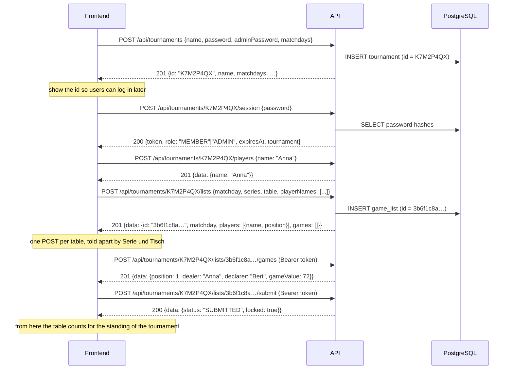

# Skatis – Backend

REST API for the Skatis tournament manager.

A **tournament** is created with a name, a normal password, an admin password and
the weekdays on which it takes place. The API answers with a short
**tournament id** which is shown in the frontend and used for every following
request. A tournament owns its **players** (just names); a **list** exists per
table and matchday and holds the lineup of that table in seating order – 3, 4 or 5
players. An evening can be played at several tables, so one matchday can have
several lists. Every **game** in the list is played by those players and follows the
four steps of the Skat rules in the [README](../README.md) of the repository.
From the games the API derives the **result table** of the evening: what every
player won, lost and is credited with, including the final result. There are no
user accounts – access is granted by the normal or the admin password together
with the tournament id.

## Stack

| Concern    | Choice                                      |
| ---------- | ------------------------------------------- |
| Runtime    | Node.js ≥ 22 (ESM, TypeScript)              |
| HTTP       | Express 5                                   |
| Database   | PostgreSQL via Prisma ORM                   |
| Validation | Zod                                         |
| Auth       | Password login → JWT bearer token (HS256)   |
| Passwords  | scrypt (`node:crypto`), salted per password |
| Logging    | Pino (pretty in development, JSON in prod)  |
| Tests      | Vitest + Supertest                          |

## Requirements

- Node.js ≥ 22.12
- A PostgreSQL 14+ database you can reach with a connection string

## Setup

```bash
cd backend
npm install                       # also runs `prisma generate`

cp .env.example .env              # then edit the values
# DATABASE_URL must point at YOUR PostgreSQL instance,
# JWT_SECRET must be a random string of at least 32 characters

npm run dev                       # migrates the database, then http://localhost:3000/api
```

Generate a proper secret with:

```bash
node -e "console.log(require('crypto').randomBytes(48).toString('base64url'))"
```

Everything is installed locally – no global packages and no root privileges are
required.

### Database migrations

The server **applies pending migrations by itself on startup**: before it starts
listening, it runs `prisma migrate deploy` against `DATABASE_URL`. A fresh
database therefore needs no manual step, and a deployment that ships new
migrations upgrades without a separate job.

- It is retried up to **3 times** (2 s apart) and gives up after **60 s** per
  attempt, because a database in Kubernetes may not be reachable at the very
  first moment.
- If it still fails, the process logs `startup aborted – the database schema
could not be prepared` and exits with code `1` instead of serving requests
  against an incomplete schema.
- Set `AUTO_MIGRATE=false` to skip it, e.g. when migrations are applied by a
  separate pipeline step or the database user is not allowed to change the
  schema. The server then starts against whatever schema it finds.

For manual work the scripts below stay available – `npm run db:migrate -- --name x`
while developing a schema change, `npm run db:deploy` to apply migrations by hand.

## Scripts

| Script                  | Purpose                                        |
| ----------------------- | ---------------------------------------------- |
| `npm run dev`           | Watch mode via `tsx`                           |
| `npm run build`         | Compile to `dist/`                             |
| `npm start`             | Run the compiled server                        |
| `npm test`              | Vitest (unit + HTTP tests, no database needed) |
| `npm run test:coverage` | Coverage report in `coverage/`                 |
| `npm run typecheck`     | `tsc --noEmit`                                 |
| `npm run lint`          | ESLint                                         |
| `npm run format`        | Prettier                                       |
| `npm run db:migrate`    | Create/apply a migration (development)         |
| `npm run db:deploy`     | Apply existing migrations (production)         |
| `npm run db:studio`     | Prisma Studio                                  |

## How it works



### Players and lineups

A **player** is nothing but a name inside a tournament. Players are added to the
tournament once and can then be put on a list:

- `POST /api/tournaments/:tournamentId/players` adds a player. Names are unique
  per tournament, so the same name cannot be added twice.
- A player is addressed **by their name** in every other endpoint – there is no
  player id in the API. The name is the handle, and it is compared **exactly**
  (surrounding whitespace is trimmed, `anna` and `Anna` are different players).
- `PUT /api/tournaments/:tournamentId/lists/:listId/players` sets the lineup of
  a list. Only names of players **of the same tournament** are accepted –
  anything else is rejected with `409` (`unknownPlayers` lists the names).
- A lineup consists of **3, 4 or 5 players** and its order matters: it is the
  seating order of the table. Player 1 deals in round 1, player 2 in round 2
  and so on; after the last player it starts over with player 1. The answers
  therefore contain `players` **in seating order**, each with its `position`.
- Because the lineup decides who deals in which round, it can only be changed
  while the list has **no games** yet – afterwards the request is rejected with
  `409`.
- A player can only be deleted while they are not part of any list.
- `PATCH …/players/:playerName` corrects a name. That is the only way to fix a
  typo, because a player who plays in a list cannot be deleted. The names recorded
  in already entered games are rewritten as well. A rename that touches a
  **submitted** list is reserved for an `ADMIN`, like every other change to a
  submitted list.

### Entering a game

A game follows the four steps of README.md. The API checks every one of them:

1. **Alleinspieler or Eingepasst** – `declarer` plus `passedOut`. When the game
   was passed out (`{"passedOut": true}`) nothing else may be sent – the flow is
   over.

   Skat is played by three people, so a bigger lineup always leaves players at
   the side. Which players sit out a round follows the Geber ("Geber-Regel"):

   | Players on the list | Sit out                               |
   | ------------------- | ------------------------------------- |
   | 3                   | nobody – everyone plays               |
   | 4                   | the Geber                             |
   | 5                   | the player before and after the Geber |

   With five players the Geber **does** play, and only the two seats around them
   sit out – that is the only way to end up with three players, and it is what
   the README of the repository says ("Bei 5 Spielern kann der Spieler vor und
   der Spieler nach dem Geber nicht ausgewählt werden").

2. **Spieltyp** – exactly one of `KARO`, `HERZ`, `PIK`, `KREUZ`, `GRAND`, `NULL`,
   plus the announced levels (`hand`, `schneiderAnnounced`, `schwarzAnnounced`,
   `offen`).
   - suit and grand games: `Schneider Ang.` requires `Hand`, `Schwarz Ang.`
     requires `Schneider Ang.`, `Offen` requires `Schwarz Ang.`
   - null games: `Schneider Ang.` and `Schwarz Ang.` may not be used at all
     (`Hand` and `Offen` are fine, they are part of the fixed values)
3. **Spitzen** – `matadors: {"suit": "WITH"|"WITHOUT", "count": n}`, at most 4
   as grand and at most 11 as suit game. Skipped for a null game, which must not
   send `matadors` at all.
4. **Spielergebnis** – `schneider`, `schwarz` and `won`. `Schwarz` requires
   `Schneider`, and a null game may not be Schneider or Schwarz.

The API derives the remaining properties:

- `position` – the round, counted from 1. Games are appended.
- `dealer` – the next player of the seating order, starting with player 1.
- `players` – the three players of the round: the lineup minus the ones who sit
  out according to the table above. These are exactly the players who may be the
  Alleinspieler, and exactly the players who take part in the round – also in a
  game that was Eingepasst, where nobody actually played.
- `gameValue` – the Spielwert, see below. It is never sent by a client.

#### Spielwert

(`src/modules/lists/game-rules.ts`)

- Null games have fixed values: `Null` 23, `Null Hand` 35, `Null Offen` 46,
  `Null Hand Offen` 59.
- Everything else is `(Spitzen + Gewinnstufen + 1) * Grundwert`, where
  Gewinnstufen counts the chosen levels **and** the results (`Hand`,
  `Schneider Ang.`, `Schwarz Ang.`, `Offen`, `Schneider`, `Schwarz`) and the
  Grundwert is Karo 9, Herz 10, Pik 11, Kreuz 12, Grand 24.

```json
{
  "declarer": "Bert",
  "gameType": "GRAND",
  "hand": true,
  "schneiderAnnounced": true,
  "matadors": { "suit": "WITH", "count": 2 },
  "won": true
}
```

→ `gameValue: (2 + 2 + 1) * 24 = 120`

A game is replaced as a whole (`PUT …/games/:gameId`) – a partial update would
have to satisfy the rules above in combination with the stored values. The round
and the dealer stay, everything else is taken from the request.

### Results (Ergebnistabelle)

(`src/modules/lists/scoring.ts`)

This is the table of **one matchday**, and the parts below are deliberately
per evening: the flat bonuses and the bonus for the losses of the others are
**not** carried over to the next matchday. How the tournament combines the
evenings is described under [Tournament standings](#tournament-standings).

Every game is credited to its Alleinspieler, starting from an account of 0:

- a **won** Alleinspiel credits the Spielwert → `positiveGameValue`
- a **lost** Alleinspiel debits **twice** the Spielwert → `negativeGameValue`
- an Eingepasst game changes nothing; it only increments `passedOutCount`

The final result (`total`) adds two more parts to that account:

| Part            | Rule                                                                                                |
| --------------- | --------------------------------------------------------------------------------------------------- |
| `wonBonus`      | `+50` per won Alleinspiel (`Gew`)                                                                   |
| `lossPenalty`   | `-50` per lost Alleinspiel (`Verl`)                                                                 |
| `opponentBonus` | `+40` / `+30` / `+24` per lost Alleinspiel **of another player**, for a lineup of 3 / 4 / 5 players |

So `total = points + wonBonus + lossPenalty + opponentBonus`, where
`points = wonGameValue - lostGameValue`. Each part is reported separately, so a
frontend can show where a result comes from instead of only the sum.

Worked example – 4 players, three games:

| Round | Dealer | Declarer | Game                   | Spielwert | Effect               |
| ----- | ------ | -------- | ---------------------- | --------- | -------------------- |
| 1     | Anna   | Bert     | Grand Hand, 2 Mit, won | 120       | Bert `+120`, `won 1` |
| 2     | Bert   | Clara    | Null, won              | 23        | Clara `+23`, `won 1` |
| 3     | Clara  | Dora     | Herz Ohne 1, lost      | 20        | Dora `-40`, `lost 1` |
| 4     | Dora   | –        | Eingepasst             | 0         | nothing              |

| Player | points | wonBonus | lossPenalty | opponentBonus | `total` |
| ------ | ------ | -------- | ----------- | ------------- | ------- |
| Anna   | 0      | 0        | 0           | 30            | **30**  |
| Bert   | 120    | 50       | 0           | 30            | **200** |
| Clara  | 23     | 50       | 0           | 30            | **103** |
| Dora   | -40    | 0        | -50         | 0             | **-90** |

`GET …/lists/:listId/results` answers exactly this table, always derived from
the current games – so it is up to date while the list is still being filled.

### Tournament standings

(`src/modules/tournaments/standings.ts`)

The table above belongs to one list, and the parts of it that only make sense for
that one table – the flat **+50** per won and **-50** per lost Alleinspiel – are
not carried over. What a list contributes to the tournament is:

1. **`gamesPlayed`** – how many games of the list the player took part in.
   A player takes part in a game when they are in its `players` array, which is
   decided by the [Geber-Regel](#entering-a-game). So a player collects the games
   of every list they are on, and a player who deals all evening still collects
   them – an Eingepasst round counts too, it was played through to the end of
   step 1.
2. **`points`** – what the player's own Alleinspiele are worth: a won one credits
   its Spielwert, a lost one debits twice of it. A player who is not the
   Alleinspieler changes nothing here.
3. **`opponentBonus`** – the bonus for every Alleinspiel **another** player lost,
   `+40` / `+30` / `+24` for a lineup of 3 / 4 / 5 players. This is how a player
   gains points in a game they did not take part in: like in the table of the
   matchday, the bonus goes to the whole lineup, not only to the three players at
   the table.

Both numbers of a list are added up over all counted lists into `points` and
`opponentBonus`, and `score = points + opponentBonus` is what the tournament
earned the player in total. Several tables of one evening are simply several
lists, so a player who sat at two of them collects both.

The **ranking value** is `averageScore = score / gamesPlayed` – the score per
game played, which makes players comparable who played a different number of
games. The standing sorts by it, best first. The unrounded average decides the
order, so rounding the output to two decimals can never change who is in front.

- Players with the **same average share a rank**, and the next rank skips the
  ones taken (1, 1, 3).
- A player without a single game keeps a row but has `rank: null` and
  `averageScore: null`, and is listed after everyone who played.
- A list that is still `OPEN` does not count, and one that was reopened drops out
  again. Reopening and submitting a corrected list therefore updates the standing
  right away, and deleting a list removes its games from it.

`GET …/tournaments/:tournamentId/standings` answers it. `listsCounted` tells how
many submitted lists went into the numbers and `matchdaysCounted` how many
different dates they were played on – for a tournament of 90 players those are
very different numbers.

Worked example – two matchdays of a 4 player list, so the bonus is 30:

| Matchday | Dealer | Declarer | Result                | Effect                                         |
| -------- | ------ | -------- | --------------------- | ---------------------------------------------- |
| 1        | Anna   | Bert     | Grand Ohne 2, won, 72 | Bert `+72`; Anna sat out, still gets the bonus |
| 1        | Bert   | Clara    | Null, lost, 23        | Clara `-46`; the other three get `+30` each    |
| 2        | Anna   | Dora     | Herz Ohne 1, lost, 20 | Dora `-40`; the other three get `+30` each     |

| Player | gamesPlayed | points | opponentBonus | score | averageScore |
| ------ | ----------- | ------ | ------------- | ----- | ------------ |
| Bert   | 2           | 72     | 60            | 132   | **66**       |
| Anna   | 1           | 0      | 60            | 60    | **60**       |
| Dora   | 3           | -40    | 30            | -10   | **-3.33**    |
| Clara  | 3           | -46    | 30            | -16   | **-5.33**    |

Anna dealt in the first round of both matchdays, so she played a single game –
but she still collected the bonus of both lost Alleinspiele.

### Passwords and roles

A tournament has two passwords:

- **normal password** → role `MEMBER`. May create the list of the _current_
  matchday, enter games and submit that list. Nothing else, and only on matchdays
  of the tournament.
- **admin password** → role `ADMIN`. May change matchdays, rename the tournament,
  reset the normal password, and modify or delete lists – at any time, including
  past matchdays.

Which password was used decides the role inside the returned token. Both
passwords are stored as scrypt hashes; a password can never be read back.

### Tournament id

The id is generated by the API: **8 characters**, digits and upper case letters
without the easily confused ones (`0`, `1`, `I`, `L`, `O`), e.g. `K7M2P4QX`. It is
**case insensitive** on input and is returned by `POST /tournaments` so that the
frontend can display it right away. Only the id identifies a tournament – names
are allowed to be ambiguous.

Together with one of the two passwords the id is the only thing needed to log in,
so it should be treated like a shared secret: every read of tournament data
requires a token, and no endpoint reveals which tournaments exist.

### Tokens

`POST /tournaments/:tournamentId/session` returns a JWT that is valid for
`JWT_EXPIRES_IN` (default 12 h) and is bound to exactly one tournament. Send it
with every protected request:

```http
Authorization: Bearer <token>
```

A token used against another tournament id is rejected with `403`. Whether a
stored token is still valid can be checked with
`GET /api/tournaments/:tournamentId/session`.

### Domain rules

- `matchdays` are ISO weekdays (`1` = Monday … `7` = Sunday). A list only exists
  for a matchday of its tournament.
- There can be **several lists per matchday** – one evening is often played at
  several tables with different players (90 players mean 30 tables of three).
  Each list has its own id and is addressed by it; the matchday is an attribute
  of the list, and the same player may sit at two tables of one evening.
- A `MEMBER` may only create or change a list of _today's_ matchday ("today" is
  decided by the `TZ` environment variable) and only if that weekday is a
  matchday. An `ADMIN` may also create and correct lists of past or future days.
- Reading lists, players and games is allowed for both roles on any day.
- Both roles may manage the players of their tournament at any time – a
  tournament's roster is not tied to a matchday.
- Submitting a list freezes it for members. An admin may keep editing it; with
  `reopen` an admin hands it back to the members.
- A list can only be played by the players of its lineup, so a game is only
  accepted once the lineup is complete (3, 4 or 5 players).
- Games can only be entered for players of the list: the Alleinspieler has to be
  part of the lineup and has to be allowed to play the round (see above).
- Deleting a tournament deletes its players, lists and games (cascade).

### Locked lists

A list is **locked** for the session that asks for it when it may not be changed
any more. Two things lock a list:

- **submitted** – once a list has been handed in (by either role) it can only be
  changed by an admin, who may `reopen` it to give it back to the members:
  `POST /api/tournaments/:tournamentId/lists/:listId/submit` and `…/reopen`.
- **another day** – a member may only work on the list of the current matchday.
  Lists of other days are read-only for them; an admin may also create and
  correct lists of past or future matchdays.

An admin is never locked out – that is what the admin password is for. Every list
tells the frontend where it stands, so it does not have to re-derive the rules:

```json
{
  "matchday": "2026-09-16",
  "status": "SUBMITTED",
  "submittedAt": "2026-09-16T19:42:11.000Z",
  "locked": true,
  "lockReasons": ["SUBMITTED"],
  "players": [{ "name": "Anna", "position": 1 }],
  "gameCount": 24,
  "totalGameValue": 811,
  "games": []
}
```

`lockReasons` is empty while `locked` is false and may otherwise contain
`SUBMITTED`, `NOT_CURRENT_MATCHDAY` and `NOT_A_MATCHDAY` – the last one when the
matchdays of the tournament were changed after the list was created. Reading is
always allowed: only changing a locked list is refused, with `409` for a
submitted list and `403` for another day.

## Quickstart

One Skat evening from an empty database to a submitted list. `BASE` is the API
root; `jq` is only used to pick values out of the answers. `TODAY` has to be a
matchday of the tournament – for the example it is simply derived from today.

```bash
BASE=http://localhost:3000/api
TODAY=$(date +%F)
WD=$(date +%u)                          # ISO weekday of today

# 1. create the tournament – note the id from the answer
curl -s -X POST $BASE/tournaments -H 'Content-Type: application/json' -d '{
  "name": "Mittwochsrunde",
  "password": "member-secret",
  "adminPassword": "admin-secret",
  "matchdays": [$WD]
}'
# => {"data":{"id":"K7M2P4QX","name":"Mittwochsrunde", …}}

# 2. open a session as a member – the id comes from the path, the body is the password
TOKEN=$(curl -s -X POST $BASE/tournaments/K7M2P4QX/session \
  -H 'Content-Type: application/json' -d '{"password":"member-secret"}' | jq -r .data.token)

# 3. add the players of the tournament
for NAME in Anna Bert Clara Dora; do
  curl -s -X POST $BASE/tournaments/K7M2P4QX/players \
    -H "Authorization: Bearer $TOKEN" -H 'Content-Type: application/json' \
    -d "{\"name\":\"$NAME\"}" > /dev/null
done

# the seating order is simply the order of the names
PLAYERS='["Anna","Bert","Clara","Dora"]'

# 4. create the list of the matchday and set the lineup – the answer carries the
#    id of the list, which is what every following step addresses
LIST=$(curl -s -X POST $BASE/tournaments/K7M2P4QX/lists \
  -H "Authorization: Bearer $TOKEN" -H 'Content-Type: application/json' \
  -d "{\"matchday\":\"$TODAY\",\"series\":1,\"table\":1,\"playerNames\":$PLAYERS}" | jq -r .data.id)
# => 3b6f1c8a-9d24-4c31-9a5f-6f5f0f2c1b77
# A second table of the same evening is simply another POST with other players.

# 5. enter the first game: Anna deals, so Bert may play a grand with 2 Spitzen
curl -s -X POST $BASE/tournaments/K7M2P4QX/lists/$LIST/games \
  -H "Authorization: Bearer $TOKEN" -H 'Content-Type: application/json' -d '{
    "passedOut": false,
    "declarer": "Bert",
    "gameType": "GRAND",
    "hand": true,
    "schneiderAnnounced": true,
    "matadors": {"suit": "WITH", "count": 2},
    "won": true
  }'
# => {"data":{"position":1,"dealer":"Anna","gameValue":120, …}}

# 6. look at the table at any time – it is derived from the games
curl -s $BASE/tournaments/K7M2P4QX/lists/$LIST/results -H "Authorization: Bearer $TOKEN" | jq .data.players
# => [ {"name":"Anna","points":0,"wonBonus":0,"lossPenalty":0,"opponentBonus":0,"total":0, …} ]

# 7. hand the list in – from now on members can only read it. Submitting is what
#    makes the matchday count for the tournament standing.
curl -s -X POST $BASE/tournaments/K7M2P4QX/lists/$LIST/submit \
  -H "Authorization: Bearer $TOKEN"

# 8. the standing of the tournament over all submitted lists
curl -s $BASE/tournaments/K7M2P4QX/standings -H "Authorization: Bearer $TOKEN" | jq .data
# => {"tournamentId":"K7M2P4QX","matchdaysCounted":1,"listsCounted":1,"players":[ … ]}

# 9. correct something afterwards, as an admin
ADMIN=$(curl -s -X POST $BASE/tournaments/K7M2P4QX/session \
  -H 'Content-Type: application/json' -d '{"password":"admin-secret"}' | jq -r .data.token)
curl -s -X POST $BASE/tournaments/K7M2P4QX/lists/$LIST/reopen -H "Authorization: Bearer $ADMIN"
```

`date +%F` is only today from the API's point of view when both run in the same
timezone – the server decides the current matchday by its own `TZ`.

## Conventions

The whole API follows the same handful of rules.

**Envelope.** A successful answer is always `{ "data": … }`, a paginated one is
`{ "data": […], "meta": { total, limit, offset } }`. An error is always
`{ "error": { code, message, details?, requestId } }` – never a bare string and
never a different key. The full list of codes is under
[Response format](#response-format).

**Naming.** Paths are lower case and use `:camelCase` parameters. Bodies and
answers use `camelCase` fields. Enumerations are `UPPER_SNAKE_CASE` values
(`GRAND`, `SUBMITTED`, `NOT_CURRENT_MATCHDAY`). Dates in paths and bodies are
`YYYY-MM-DD`, all timestamps in answers are ISO 8601 in UTC.

**Pagination.** Collections that grow over the life of a tournament are
paginated (`/lists`, `/tournaments`); collections that are naturally small are
not (a roster, the games of one evening, the players of a lineup, the
`lockReasons`).

**Two endpoints before the first token.** `POST /tournaments` and
`POST /tournaments/:tournamentId/session` are the only ones without a token, so
they are [rate limited](#rate-limits). Everything else hangs off
`/tournaments/:tournamentId` and needs a bearer token. The tournament id is
always part of the path, never of a body.

**Reads need no role.** Every `GET` is allowed for both roles on any day, also
for a submitted list: the role only decides _changes_. Which changes are refused
is reported per list in `locked`/`lockReasons`, so a frontend can hide buttons
instead of provoking a `409`.

## Endpoints

Base URL: `http://localhost:3000/api`

Legend: **–** = no token required, **any** = token of any role, **ADMIN** = admin
token required. `:tournamentId` is the id returned by `POST /tournaments`;
`:matchday` is always a date in the format `YYYY-MM-DD`.

### Creating a tournament and opening a session

| Method | Path                                 | Auth | Description                                         |
| ------ | ------------------------------------ | ---- | --------------------------------------------------- |
| POST   | `/tournaments`                       | –    | Creates a tournament and returns the generated `id` |
| POST   | `/tournaments/:tournamentId/session` | –    | Opens a session with one of the two passwords       |

Both need no token, so both are [rate limited](#rate-limits) per caller address.

#### `POST /tournaments`

| Field           | Type     | Rules                                                |
| --------------- | -------- | ---------------------------------------------------- |
| `name`          | string   | 3–64 characters: letters, digits, spaces and `. _ -` |
| `password`      | string   | 8–128 characters – the normal password               |
| `adminPassword` | string   | 8–128 characters – the admin password                |
| `matchdays`     | number[] | 1–7 unique ISO weekdays, `1` = Monday … `7` = Sunday |

**Request**

```json
{
  "name": "Mittwochsrunde",
  "password": "member-secret",
  "adminPassword": "admin-secret",
  "matchdays": [3]
}
```

**Response** `201`

```json
{
  "data": {
    "id": "K7M2P4QX",
    "name": "Mittwochsrunde",
    "matchdays": [3],
    "listCount": 0,
    "createdAt": "2026-09-18T17:05:12.431Z",
    "updatedAt": "2026-09-18T17:05:12.431Z"
  }
}
```

**Show the `id` to the user** – it is the only handle for the tournament from now
on, and together with a password the only thing needed to log in. Names may
repeat, so the id is what counts.

**Errors:** `422` invalid payload, `429` too many requests.

#### `POST /tournaments/:tournamentId/session`

The tournament comes from the path, so the body is just the password – the same
body works for both roles.

| Field      | Type   | Rules                                |
| ---------- | ------ | ------------------------------------ |
| `password` | string | the normal **or** the admin password |

**Request**

```http
POST /api/tournaments/k7m2p4qx/session
Content-Type: application/json

{ "password": "member-secret" }
```

**Response** `200`

```json
{
  "data": {
    "tournamentId": "K7M2P4QX",
    "role": "MEMBER",
    "token": "eyJhbGciOiJIUzI1NiIsInR5cCI6IkpXVCJ9.…",
    "expiresAt": "2026-09-19T05:05:12.000Z",
    "tournament": {
      "id": "K7M2P4QX",
      "name": "Mittwochsrunde",
      "matchdays": [3],
      "listCount": 0,
      "createdAt": "2026-09-18T17:05:12.431Z",
      "updatedAt": "2026-09-18T17:05:12.431Z"
    }
  }
}
```

`role` is `ADMIN` when the admin password was used and `MEMBER` for the normal
one – that is the only difference between the two roles. Keep the `token` and send
it with every further request as `Authorization: Bearer <token>`. The `tournament`
is included so a frontend needs no second request after logging in. The id in the
answer is the normalised one, so a client that sent a lower case id gets the
canonical spelling back.

**Errors:** `401` for an unknown id **and** for a wrong password (the endpoint does
not reveal which tournaments exist), `422` invalid payload, `429` too many requests.

### Health and meta

| Method | Path            | Auth | Description                           |
| ------ | --------------- | ---- | ------------------------------------- |
| GET    | `/`             | –    | Discovery document listing all paths  |
| GET    | `/health`       | –    | Liveness; does not touch the database |
| GET    | `/health/ready` | –    | Readiness incl. DB connectivity       |

**`GET /health`** → `200`

```json
{ "data": { "status": "ok", "uptimeSeconds": 412, "timestamp": "2026-09-18T17:05:12.431Z" } }
```

**`GET /health/ready`** → `200` when the database answers, otherwise `503`
(`{"error":{"code":"SERVICE_UNAVAILABLE","message":"Database is not reachable"}}`).

```json
{ "data": { "status": "ready", "database": "up" } }
```

### Tournaments

| Method | Path                                   | Auth  | Description                                             |
| ------ | -------------------------------------- | ----- | ------------------------------------------------------- |
| GET    | `/tournaments`                         | any   | The token's tournament                                  |
| GET    | `/tournaments/:tournamentId`           | any   | Tournament details                                      |
| GET    | `/tournaments/:tournamentId/session`   | any   | Role behind the presented token                         |
| GET    | `/tournaments/:tournamentId/standings` | any   | The standing over all submitted matchdays               |
| PATCH  | `/tournaments/:tournamentId`           | ADMIN | Change `name`, `matchdays`, `password`, `adminPassword` |
| DELETE | `/tournaments/:tournamentId`           | ADMIN | Delete incl. players, lists and games                   |

#### `GET /tournaments`

Query: `?search=` (name contains), `?limit=` (1–100, default 20), `?offset=`
(default 0). Newest first.

**Request**

```http
GET /api/tournaments
Authorization: Bearer <token>
```

**Response** `200`

```json
{
  "data": [
    {
      "id": "K7M2P4QX",
      "name": "Mittwochsrunde",
      "matchdays": [3],
      "listCount": 4,
      "createdAt": "2026-09-18T17:05:12.431Z",
      "updatedAt": "2026-09-18T17:05:12.431Z"
    }
  ],
  "meta": { "total": 1, "limit": 20, "offset": 0 }
}
```

It exists so a frontend that holds a token can fetch its tournament without
knowing the id again. Because a token is bound to one tournament the result never
contains more than that single entry – no endpoint enumerates all tournaments,
and an unauthenticated caller learns nothing about them.

#### `GET /tournaments/:tournamentId/session`

**Response** `200`

```json
{ "data": { "tournamentId": "K7M2P4QX", "role": "ADMIN" } }
```

The cheapest way for a frontend to check a token it has in storage: `401` means
“log in again”.

#### `GET /tournaments/:tournamentId/standings`

The standing of the tournament over all lists that were **submitted**, best
player first. See [Tournament standings](#tournament-standings) for the rules.

**Response** `200`

```json
{
  "data": {
    "tournamentId": "K7M2P4QX",
    "matchdaysCounted": 2,
    "listsCounted": 2,
    "players": [
      {
        "rank": 1,
        "name": "Bert",
        "gamesPlayed": 2,
        "points": 72,
        "opponentBonus": 60,
        "score": 132,
        "averageScore": 66
      },
      {
        "rank": 2,
        "name": "Anna",
        "gamesPlayed": 1,
        "points": 0,
        "opponentBonus": 60,
        "score": 60,
        "averageScore": 60
      },
      {
        "rank": 3,
        "name": "Dora",
        "gamesPlayed": 3,
        "points": -40,
        "opponentBonus": 30,
        "score": -10,
        "averageScore": -3.33
      },
      {
        "rank": 4,
        "name": "Clara",
        "gamesPlayed": 3,
        "points": -46,
        "opponentBonus": 30,
        "score": -16,
        "averageScore": -5.33
      },
      {
        "rank": null,
        "name": "Emil",
        "gamesPlayed": 0,
        "points": 0,
        "opponentBonus": 0,
        "score": 0,
        "averageScore": null
      }
    ]
  }
}
```

This is the worked example of [Tournament standings](#tournament-standings): the
score of a player is `points + opponentBonus`, and the rank comes from
`score / gamesPlayed`.

A list that is still `OPEN` does not count, and one that was reopened drops out
again – the standing always describes what has actually been handed in. Reading
is allowed for both roles.

**Errors:** `404` unknown tournament.

#### `PATCH /tournaments/:tournamentId`

Every field is optional, at least one is required.

| Field           | Type     | Rules                                   |
| --------------- | -------- | --------------------------------------- |
| `name`          | string   | same rules as on creation               |
| `matchdays`     | number[] | 1–7 unique weekdays                     |
| `password`      | string   | 8–128 characters, sets a new normal one |
| `adminPassword` | string   | 8–128 characters, sets a new admin one  |

An admin uses `matchdays` to steer **when** members may work on lists: a member
can only create, change and submit the list of a day that is in `matchdays` _and_
today. `password` is how the normal password is reset.

**Request**

```http
PATCH /api/tournaments/K7M2P4QX
Authorization: Bearer <admin token>
Content-Type: application/json

{ "matchdays": [3, 6], "password": "neues-geheimnis" }
```

**Response** `200` – the updated [tournament object](#tournament).

Tokens that are already out there stay valid until they expire, also after a
password was changed – see [Security notes](#security-notes).

**Errors:** `403` member token, `422` invalid payload.

#### `DELETE /tournaments/:tournamentId`

**Response** `204` – no body. Removes the tournament together with its players,
lists and games (cascade).

**Errors:** `403` member token, `404` unknown tournament.

### Players

| Method | Path                                             | Auth | Description                                                |
| ------ | ------------------------------------------------ | ---- | ---------------------------------------------------------- |
| GET    | `/tournaments/:tournamentId/players`             | any  | All players of the tournament, sorted by name              |
| POST   | `/tournaments/:tournamentId/players`             | any  | `{ name }` – 1–64 characters, unique inside the tournament |
| PATCH  | `/tournaments/:tournamentId/players/:playerName` | any  | `{ name }` – correct the name of a player                  |
| DELETE | `/tournaments/:tournamentId/players/:playerName` | any  | Remove a player (only while not on any list)               |

Players are the roster of the tournament: they are created once and then put on
a list, which is what makes a game possible at all. A player is identified by
their name inside the tournament, so there is no id to remember – the `:playerName`
path parameter is the name itself (URL-encoded, e.g. `players/Anna%20M%C3%BCller`).
Names are compared exactly: `anna` and `Anna` are two different players.

**`GET /tournaments/:tournamentId/players`** → `200`, sorted by name, not paginated.

```json
{ "data": [{ "name": "Anna" }, { "name": "Bert" }, { "name": "Clara" }] }
```

**`POST /tournaments/:tournamentId/players`**

```http
POST /api/tournaments/K7M2P4QX/players
Authorization: Bearer <token>
Content-Type: application/json

{ "name": "Bert" }
```

**Response** `201` → `{ "data": { "name": "Bert" } }`

**Errors:** `409` the name already exists, `422` invalid name.

**`PATCH /tournaments/:tournamentId/players/:playerName`**

```http
PATCH /api/tournaments/K7M2P4QX/players/Betr
Authorization: Bearer <token>
Content-Type: application/json

{ "name": "Bert" }
```

**Response** `200` → `{ "data": { "name": "Bert" } }`

Corrects a typo – the only way to fix one, because a player who plays in a list
cannot be deleted. The names recorded in already entered games are rewritten as
well, and a rename to the same name is a no-op.

**Errors:** `404` unknown player, `409` the new name is already taken, `409` the
player plays in a submitted list and the token is a member token (answer contains
`details.submittedLists`).

**`DELETE /tournaments/:tournamentId/players/:playerName`** → `204`, no body.

**Errors:** `404` unknown player, `409` the player plays in a list (answer
contains the number of lists in `details`).

### Lists

A list is one table's sheet for one matchday: its lineup in seating order, and
every game in it is played by exactly those players. The head of the sheet –
**Datum, Serie und Tisch** – is therefore part of every list: `matchday`,
`series` and `table`, all three required. A matchday may carry as many lists as
there were tables, which is why a list is addressed by its **own id** and not by
the date.

| Method | Path                                               | Auth  | Description                                      |
| ------ | -------------------------------------------------- | ----- | ------------------------------------------------ |
| GET    | `/tournaments/:tournamentId/lists`                 | any   | All lists of the tournament                      |
| POST   | `/tournaments/:tournamentId/lists`                 | any   | Create a list                                    |
| GET    | `/tournaments/:tournamentId/lists/:listId`         | any   | One list incl. lineup and games                  |
| GET    | `/tournaments/:tournamentId/lists/:listId/results` | any   | The result table of the list                     |
| PUT    | `/tournaments/:tournamentId/lists/:listId/players` | any   | Replace the lineup                               |
| DELETE | `/tournaments/:tournamentId/lists/:listId`         | ADMIN | Delete the list incl. its games                  |
| POST   | `/tournaments/:tournamentId/lists/:listId/submit`  | any   | Hand the list in – it becomes locked for members |
| POST   | `/tournaments/:tournamentId/lists/:listId/reopen`  | ADMIN | Give a submitted list back to the members        |

#### `GET /tournaments/:tournamentId/lists`

Query: `?matchday=` (exactly one date – the evening with all its tables),
`?from=` and `?to=` (a range of dates), `?status=OPEN|SUBMITTED`, `?limit=`
(1–100, default 20), `?offset=` (default 0). Newest matchday first, then by
series and table – so the sheets of an evening come in the order of the room.

`?matchday=` is the one to use for "the lists of tonight": it answers every table
of that date in a single request and is what a scoreboard of the evening needs.
`?from=`/`?to=` are ignored while `?matchday=` is given.

**Response** `200` – no `games` in the collection, see the detail endpoint.

```json
{
  "data": [
    {
      "id": "3b6f1c8a-9d24-4c31-9a5f-6f5f0f2c1b77",
      "tournamentId": "K7M2P4QX",
      "matchday": "2026-09-18",
      "series": 1,
      "table": 3,
      "status": "OPEN",
      "submittedAt": null,
      "locked": false,
      "lockReasons": [],
      "players": [
        { "name": "Anna", "position": 1 },
        { "name": "Bert", "position": 2 },
        { "name": "Clara", "position": 3 },
        { "name": "Dora", "position": 4 }
      ],
      "gameCount": 4,
      "totalGameValue": 163,
      "createdAt": "2026-09-18T18:00:00.000Z",
      "updatedAt": "2026-09-18T19:42:11.000Z"
    }
  ],
  "meta": { "total": 1, "limit": 20, "offset": 0 }
}
```

#### `POST /tournaments/:tournamentId/lists`

| Field         | Type     | Rules                                                                      |
| ------------- | -------- | -------------------------------------------------------------------------- |
| `matchday`    | string   | `YYYY-MM-DD`, a matchday of the tournament – several lists may share it    |
| `series`      | number   | "Serie" of the head, an integer ≥ 1 – required                             |
| `table`       | number   | "Tisch" of the head, an integer ≥ 1 – required                             |
| `playerNames` | string[] | optional: 3–5 names of this tournament **in seating order**, no duplicates |
| `games`       | game[]   | optional: entered in order, they become rounds 1…n                         |

A table of a series can only have **one** sheet per evening, so `Serie 1,
Tisch 3` of `2026-09-18` exists once. Several lists still share a matchday – they
differ in series or table.

Lineup and first games may be sent in one request, which saves a round trip when
an evening is entered at once.

**Request**

```json
{
  "matchday": "2026-09-18",
  "series": 1,
  "table": 3,
  "playerNames": ["Anna", "Bert", "Clara", "Dora"],
  "games": [{ "passedOut": false, "declarer": "Bert", "gameType": "NULL", "won": true }]
}
```

**Response** `201` – the list as above, plus `games`.

**Errors:** `403` the day is not a matchday, or the token is a member token and
the day is not today, `409` Serie and Tisch already have a sheet for that day
(`details.listId` is the existing one), `409` a name in `playerNames` is not a
player of this tournament (`details.unknownPlayers`), `422` a missing or invalid
series/table, a lineup of the wrong size, a duplicate name or an invalid game.

#### `GET /tournaments/:tournamentId/lists/:listId`

**Response** `200`

```json
{
  "data": {
    "id": "3b6f1c8a-9d24-4c31-9a5f-6f5f0f2c1b77",
    "tournamentId": "K7M2P4QX",
    "matchday": "2026-09-18",
    "series": 1,
    "table": 3,
    "status": "OPEN",
    "submittedAt": null,
    "locked": false,
    "lockReasons": [],
    "players": [
      { "name": "Anna", "position": 1 },
      { "name": "Bert", "position": 2 },
      { "name": "Clara", "position": 3 },
      { "name": "Dora", "position": 4 }
    ],
    "gameCount": 4,
    "totalGameValue": 163,
    "games": [
      {
        "id": "99815b69-7e3b-4e37-a4a5-eecbadcc6ffe",
        "position": 1,
        "players": ["Bert", "Clara", "Dora"],
        "dealer": "Anna",
        "passedOut": false,
        "declarer": "Bert",
        "gameType": "GRAND",
        "hand": true,
        "schneiderAnnounced": true,
        "schwarzAnnounced": false,
        "offen": false,
        "matadors": { "suit": "WITH", "count": 2 },
        "schneider": false,
        "schwarz": false,
        "won": true,
        "gameValue": 120,
        "positiveGameValue": 120,
        "negativeGameValue": 0,
        "note": null,
        "createdAt": "2026-09-18T18:12:03.114Z",
        "updatedAt": "2026-09-18T18:12:03.114Z"
      },
      {
        "id": "d19f5d5d-90a7-4062-9f82-81eabce45199",
        "position": 2,
        "players": ["Anna", "Clara", "Dora"],
        "dealer": "Bert",
        "passedOut": false,
        "declarer": "Clara",
        "gameType": "NULL",
        "hand": false,
        "schneiderAnnounced": false,
        "schwarzAnnounced": false,
        "offen": false,
        "matadors": null,
        "schneider": false,
        "schwarz": false,
        "won": true,
        "gameValue": 23,
        "positiveGameValue": 23,
        "negativeGameValue": 0,
        "note": null,
        "createdAt": "2026-09-18T18:14:20.031Z",
        "updatedAt": "2026-09-18T18:14:20.031Z"
      },
      {
        "id": "c7038ab0-6620-42fb-ac5f-5fd6f92152b3",
        "position": 3,
        "players": ["Anna", "Bert", "Dora"],
        "dealer": "Clara",
        "passedOut": false,
        "declarer": "Dora",
        "gameType": "HERZ",
        "hand": false,
        "schneiderAnnounced": false,
        "schwarzAnnounced": false,
        "offen": false,
        "matadors": { "suit": "WITHOUT", "count": 1 },
        "schneider": false,
        "schwarz": false,
        "won": false,
        "gameValue": 20,
        "positiveGameValue": 0,
        "negativeGameValue": 40,
        "note": null,
        "createdAt": "2026-09-18T18:20:44.712Z",
        "updatedAt": "2026-09-18T18:20:44.712Z"
      },
      {
        "id": "52197cd3-3d3f-4d27-ab84-1fccc4dcc0f4",
        "position": 4,
        "players": ["Anna", "Bert", "Clara"],
        "dealer": "Dora",
        "passedOut": true,
        "declarer": null,
        "gameType": null,
        "hand": false,
        "schneiderAnnounced": false,
        "schwarzAnnounced": false,
        "offen": false,
        "matadors": null,
        "schneider": false,
        "schwarz": false,
        "won": null,
        "gameValue": 0,
        "positiveGameValue": 0,
        "negativeGameValue": 0,
        "note": "alle eingepasst",
        "createdAt": "2026-09-18T18:26:09.220Z",
        "updatedAt": "2026-09-18T18:26:09.220Z"
      }
    ],
    "createdAt": "2026-09-18T18:00:00.000Z",
    "updatedAt": "2026-09-18T18:26:09.220Z"
  }
}
```

The four games are the worked example of [Results](#results-ergebnistabelle): a
Grand won with 120, a Null won with 23, a Herz lost with 20 and one Eingepasst
game. `locked` and `lockReasons` describe the **requesting** role – see
[Locked lists](#locked-lists).

**Errors:** `404` unknown list, `422` invalid matchday.

#### `GET /tournaments/:tournamentId/lists/:listId/results`

The result table ("Ergebnistabelle") of the list, always derived from the current
games – see [Results](#results-ergebnistabelle). Reading is allowed for both
roles, also after the list was submitted.

**Response** `200`

```json
{
  "data": {
    "matchday": "2026-09-18",
    "playerCount": 4,
    "gameCount": 4,
    "playedCount": 3,
    "passedOutCount": 1,
    "totalGameValue": 163,
    "opponentBonusPerGame": 30,
    "players": [
      {
        "name": "Anna",
        "position": 1,
        "gamesPlayed": 3,
        "won": 0,
        "lost": 0,
        "wonGameValue": 0,
        "lostGameValue": 0,
        "points": 0,
        "wonBonus": 0,
        "lossPenalty": 0,
        "opponentBonus": 30,
        "total": 30
      },
      {
        "name": "Bert",
        "position": 2,
        "gamesPlayed": 3,
        "won": 1,
        "lost": 0,
        "wonGameValue": 120,
        "lostGameValue": 0,
        "points": 120,
        "wonBonus": 50,
        "lossPenalty": 0,
        "opponentBonus": 30,
        "total": 200
      },
      {
        "name": "Clara",
        "position": 3,
        "gamesPlayed": 3,
        "won": 1,
        "lost": 0,
        "wonGameValue": 23,
        "lostGameValue": 0,
        "points": 23,
        "wonBonus": 50,
        "lossPenalty": 0,
        "opponentBonus": 30,
        "total": 103
      },
      {
        "name": "Dora",
        "position": 4,
        "gamesPlayed": 3,
        "won": 0,
        "lost": 1,
        "wonGameValue": 0,
        "lostGameValue": 40,
        "points": -40,
        "wonBonus": 0,
        "lossPenalty": -50,
        "opponentBonus": 0,
        "total": -90
      }
    ]
  }
}
```

**Errors:** `404` unknown list, `422` invalid matchday.

#### `PUT /tournaments/:tournamentId/lists/:listId/players`

Replaces the lineup. `playerNames[0]` deals in round 1.

```json
{ "playerNames": ["Anna", "Bert", "Clara"] }
```

**Response** `200` – the list including its games.

**Errors:** `403` day not allowed for this role, `404` unknown list, `409` the
list is locked or already contains games (the lineup decides who deals in which
round), `409` unknown player, `422` wrong size or duplicate name.

#### `POST …/lists/:listId/submit` and `POST …/lists/:listId/reopen`

`submit` freezes the list for members, `reopen` (admin only) gives it back.

**Response** `200` – the list including its games, with the new `status`. Excerpt:

```json
{
  "data": {
    "matchday": "2026-09-18",
    "status": "SUBMITTED",
    "submittedAt": "2026-09-18T19:42:11.008Z",
    "locked": true,
    "lockReasons": ["SUBMITTED"]
  }
}
```

**Errors:** `404` unknown list, `403` day not allowed / member token on
`reopen`, `409` already submitted (`submit`) or not submitted (`reopen`).

#### `DELETE /tournaments/:tournamentId/lists/:listId`

**Response** `204` – no body, removes the list and all its games.

**Errors:** `403` member token, `404` unknown list.

### Games

| Method | Path                                                     | Auth | Description                 |
| ------ | -------------------------------------------------------- | ---- | --------------------------- |
| GET    | `/tournaments/:tournamentId/lists/:listId/games`         | any  | All games, ordered by round |
| POST   | `/tournaments/:tournamentId/lists/:listId/games`         | any  | Enter a game                |
| GET    | `/tournaments/:tournamentId/lists/:listId/games/:gameId` | any  | One game                    |
| PUT    | `/tournaments/:tournamentId/lists/:listId/games/:gameId` | any  | Replace a game              |
| DELETE | `/tournaments/:tournamentId/lists/:listId/games/:gameId` | any  | Delete a game               |

Send exactly the fields of the four steps – the rules are described under
[Entering a game](#entering-a-game), the fields under [Game](#game). Games are
appended: `position` (the round), `dealer`, `players` and `gameValue` are
answered by the API and never sent by a client.

A game that was played (`POST` or `PUT`):

**Request**

```json
{
  "passedOut": false,
  "declarer": "Bert",
  "gameType": "GRAND",
  "hand": true,
  "schneiderAnnounced": true,
  "schwarzAnnounced": false,
  "offen": false,
  "matadors": { "suit": "WITH", "count": 2 },
  "schneider": false,
  "schwarz": false,
  "won": true,
  "note": null
}
```

**Response** `201`

```json
{
  "data": {
    "id": "99815b69-7e3b-4e37-a4a5-eecbadcc6ffe",
    "position": 1,
    "players": ["Bert", "Clara", "Dora"],
    "dealer": "Anna",
    "passedOut": false,
    "declarer": "Bert",
    "gameType": "GRAND",
    "hand": true,
    "schneiderAnnounced": true,
    "schwarzAnnounced": false,
    "offen": false,
    "matadors": { "suit": "WITH", "count": 2 },
    "schneider": false,
    "schwarz": false,
    "won": true,
    "gameValue": 120,
    "positiveGameValue": 120,
    "negativeGameValue": 0,
    "note": null,
    "createdAt": "2026-09-18T18:12:03.114Z",
    "updatedAt": "2026-09-18T18:12:03.114Z"
  }
}
```

`(2 Spitzen + Hand + Schneider Ang. + 1) * 24 = 120`.

A game that was passed out needs nothing else – the flow ends after step 1:

```json
{ "passedOut": true, "note": "alle eingepasst" }
```

→ `201` with `declarer: null`, `gameType: null`, `won: null`, `gameValue: 0`,
`positiveGameValue: 0`, `negativeGameValue: 0`.

**Errors:** `403` day not allowed for this role, `404` unknown list, `409` the
list is locked, the lineup is not complete yet, or the declarer does not play this
round (`details.dealer`, `details.sittingOutPlayers`, `details.playingPlayers`),
`422` the game breaks the
rules of the steps above (`details.issues` names the field).

`GET …/games` answers `{ "data": [ …game… ] }` ordered by `position`;
`GET …/games/:gameId` answers a single game. `PUT …/games/:gameId` replaces the
game completely (the round and the dealer stay), which is why there is no `PATCH`
– a partial update would have to satisfy all the rules in combination with the
stored values. The answer of a `GET` can be sent back as it is: fields the API
derives itself are ignored. `DELETE …/games/:gameId` → `204`.

**Errors (single game):** `404` unknown game in that list, `422` invalid
`:gameId` or payload.

Errors: `422` a property is missing or contradicts another one – `details.issues`
names the field; `409` a rule that depends on the list (the lineup is incomplete,
or the declarer may not play this round because of the dealer); `409` the list is
locked; `403` another matchday (members only); `404` unknown game.

## Response format

Success:

```json
{ "data": {}, "meta": { "total": 12, "limit": 20, "offset": 0 } }
```

`meta` is only present on paginated collections. Errors:

```json
{
  "error": {
    "code": "VALIDATION_ERROR",
    "message": "Request validation failed",
    "details": { "issues": [{ "path": "matchday", "code": "custom", "message": "…" }] },
    "requestId": "9f0f0f0e-…"
  }
}
```

| Status | Code                  | Meaning                                                                              |
| ------ | --------------------- | ------------------------------------------------------------------------------------ |
| 400    | `BAD_REQUEST`         | Malformed JSON body                                                                  |
| 401    | `UNAUTHORIZED`        | Missing/invalid token, wrong id or password                                          |
| 403    | `FORBIDDEN`           | Wrong role, wrong tournament, not a matchday                                         |
| 404    | `NOT_FOUND`           | Unknown tournament, list or game                                                     |
| 409    | `CONFLICT`            | Duplicate matchday, frozen list, unknown player, a game that violates the Skat rules |
| 413    | `PAYLOAD_TOO_LARGE`   | Body larger than 100 kb                                                              |
| 422    | `VALIDATION_ERROR`    | Payload or path/query validation failed                                              |
| 429    | `TOO_MANY_REQUESTS`   | Rate limit of the endpoints without a token                                          |
| 500    | `INTERNAL_ERROR`      | Unexpected server error                                                              |
| 503    | `SERVICE_UNAVAILABLE` | Database not reachable                                                               |

Every response carries an `X-Request-Id` header (echoing a caller-provided
`X-Request-Id` when it is a sane value) that also appears in the logs. Quote it
when you report a problem.

## Object reference

### Tournament

| Field                    | Type     | Notes                                     |
| ------------------------ | -------- | ----------------------------------------- |
| `id`                     | string   | 8 characters, the public identifier       |
| `name`                   | string   | display name, not unique                  |
| `matchdays`              | number[] | ISO weekdays, `1` = Monday … `7` = Sunday |
| `listCount`              | number   | how many lists exist                      |
| `createdAt`, `updatedAt` | string   | ISO 8601                                  |

### Player

| Field  | Type   | Notes                                                               |
| ------ | ------ | ------------------------------------------------------------------- |
| `name` | string | unique inside the tournament and the only way a player is addressed |

There is no player id in the API. A player is identified by their name inside
the tournament, which is exactly what the game rules need anyway – `declarer`
and `players` of a game are names, too. Only the database uses an internal
surrogate key for the join table of a lineup; it is never returned.

### List

| Field                    | Type                  | Notes                                                   |
| ------------------------ | --------------------- | ------------------------------------------------------- |
| `id`                     | string                | uuid                                                    |
| `tournamentId`           | string                |                                                         |
| `matchday`               | string                | `YYYY-MM-DD`                                            |
| `status`                 | `OPEN` \| `SUBMITTED` |                                                         |
| `submittedAt`            | string \| null        |                                                         |
| `locked`                 | boolean               | relative to the requesting role                         |
| `lockReasons`            | string[]              | empty while unlocked, see [Locked lists](#locked-lists) |
| `players`                | object[]              | `{ name, position }` in seating order                   |
| `gameCount`              | number                |                                                         |
| `totalGameValue`         | number                | sum of the `gameValue` of all its games                 |
| `games`                  | Game[]                | only on the detail endpoint                             |
| `createdAt`, `updatedAt` | string                | ISO 8601                                                |

### Game

| Field                                                     | Type                                                              | Who sets it                                   |
| --------------------------------------------------------- | ----------------------------------------------------------------- | --------------------------------------------- |
| `id`                                                      | string                                                            | API                                           |
| `position`                                                | number                                                            | API – the round, counted from 1               |
| `dealer`                                                  | string                                                            | API – follows the seating order               |
| `players`                                                 | string[]                                                          | API – the three players of the round          |
| `passedOut`                                               | boolean                                                           | client – step 1                               |
| `declarer`                                                | string \| null                                                    | client – step 1, `null` when passed out       |
| `gameType`                                                | `KARO` \| `HERZ` \| `PIK` \| `KREUZ` \| `GRAND` \| `NULL` \| null | client – step 2, `null` when passed out       |
| `hand`, `schneiderAnnounced`, `schwarzAnnounced`, `offen` | boolean                                                           | client – step 2                               |
| `matadors`                                                | `{ suit: WITH \| WITHOUT, count }` \| null                        | client – step 3                               |
| `schneider`, `schwarz`                                    | boolean                                                           | client – step 4                               |
| `won`                                                     | boolean \| null                                                   | client – step 4, `null` when passed out       |
| `gameValue`                                               | number                                                            | API – the Spielwert, `0` when passed out      |
| `positiveGameValue`                                       | number                                                            | API – `gameValue` if won, else `0`            |
| `negativeGameValue`                                       | number                                                            | API – **twice** `gameValue` if lost, else `0` |
| `note`                                                    | string \| null                                                    | client, free text, max 500 characters         |

`dealer`, `position`, `players`, `gameValue` and the two result columns are not
part of a request – sending them is ignored, so the answer of a `GET` can be sent
back unchanged. `players` always has exactly **three** entries: the lineup minus
the players who sit out this round (see [Entering a game](#entering-a-game)),
which is also what the [standings](#tournament-standings) counts as a played
game. `positiveGameValue` and `negativeGameValue` are the
"Positiver/Negativer Spielwert" columns of the result table; exactly one of them
is non-zero for a game that was played. A game that was passed out is a complete
record with `declarer: null` and nothing else – `players` still names the three
who were dealt in.

### Results

The result table of one list, as answered by
`GET …/lists/:listId/results`.

| Field                  | Type     | Notes                                              |
| ---------------------- | -------- | -------------------------------------------------- |
| `matchday`             | string   | `YYYY-MM-DD`                                       |
| `playerCount`          | number   | size of the lineup, decides `opponentBonusPerGame` |
| `gameCount`            | number   | all games of the list                              |
| `playedCount`          | number   | games that were played                             |
| `passedOutCount`       | number   | Eingepasst games                                   |
| `totalGameValue`       | number   | sum of the `gameValue` of all games                |
| `opponentBonusPerGame` | number   | `40` / `30` / `24` for 3 / 4 / 5 players           |
| `players`              | Result[] | one row per player, in seating order               |

A `Result` row:

| Field              | Type   | Notes                                                             |
| ------------------ | ------ | ----------------------------------------------------------------- |
| `name`, `position` | –      | as on the list                                                    |
| `gamesPlayed`      | number | games of the list the player took part in (the Geber rule)        |
| `won`              | number | `Gew` – Alleinspiele the player won                               |
| `lost`             | number | `Verl` – Alleinspiele the player lost                             |
| `wonGameValue`     | number | Σ Spielwerte of the won Alleinspiele                              |
| `lostGameValue`    | number | Σ **doubled** Spielwerte of the lost Alleinspiele                 |
| `points`           | number | `wonGameValue - lostGameValue`                                    |
| `wonBonus`         | number | `+50` per win                                                     |
| `lossPenalty`      | number | `-50` per loss                                                    |
| `opponentBonus`    | number | `opponentBonusPerGame` per lost Alleinspiel of **another** player |
| `total`            | number | `points + wonBonus + lossPenalty + opponentBonus`                 |

See [Results](#results-ergebnistabelle) for the rules and a worked example.
`points + opponentBonus` of a row is what a matchday contributes to the
[standing](#tournament-standings) of the player.

### Standing

The tournament standing of one player, as an entry of the `players` array of
`GET …/tournaments/:tournamentId/standings`. It is the sum of the rows above over
all submitted matchdays.

| Field           | Type           | Notes                                                             |
| --------------- | -------------- | ----------------------------------------------------------------- |
| `rank`          | number \| null | `1` is the best; `null` while the player has no game              |
| `name`          | string         |                                                                   |
| `gamesPlayed`   | number         | Σ `gamesPlayed` of the counted matchdays                          |
| `points`        | number         | Σ `points` – the Spielwerte of the player's own Alleinspiele      |
| `opponentBonus` | number         | Σ `opponentBonus` – for the Alleinspiele the others lost          |
| `score`         | number         | `points + opponentBonus`                                          |
| `averageScore`  | number \| null | `score / gamesPlayed`, rounded to two decimals; the ranking value |

## Rate limits

The two endpoints that need no token are limited per caller address:

| Setting                | Default | Meaning                                     |
| ---------------------- | ------- | ------------------------------------------- |
| `RATE_LIMIT_MAX`       | `20`    | requests per window, `0` disables the limit |
| `RATE_LIMIT_WINDOW_MS` | `60000` | length of the window in milliseconds        |

Exceeding it answers `429` with `Retry-After` (in seconds) and the usual error
envelope. The counter lives in the process, so with several instances the
effective limit is multiplied by their number.

Authenticated endpoints are not rate limited – they require a token, and the only
way to get one is the login endpoint, which is limited.

## Security notes

What the API already does:

- Passwords are stored as salted scrypt hashes, are never logged and never appear
  in a response.
- Sessions are JWTs signed with `HS256`; the algorithm is pinned while verifying,
  so a token can never be accepted with `alg: none` or any other algorithm.
- A token is bound to one tournament: using it against another id answers `403`.
- An unknown id and a wrong password both answer `401`, so login does not reveal
  which tournaments exist.
- The endpoints without a token are rate limited, which slows password guessing.
- No endpoint enumerates tournaments and every read requires a token.
- `x-powered-by` is disabled and request bodies are capped at 100 kb.

What you have to do:

- Serve the API over **HTTPS** – tokens and passwords travel inside the request.
  Terminating TLS at a reverse proxy is fine, the API trusts `loopback`.
- Keep `JWT_SECRET` secret and random (at least 32 characters): whoever knows it
  can mint tokens for any tournament.
- Send the token only to your own API and keep it out of URLs, Referer headers
  and logs.

Known limitations:

- Tokens stay valid until they expire (`JWT_EXPIRES_IN`, default 12 h) – also
  after a password was changed, and deleting a tournament does not revoke them.
  Shorten the lifetime if that matters; revoking needs a token version that is
  checked against the tournament on every request.
- The rate limiter counts per process, not across instances.
- The tournament id is not a secret: it is shown in the frontend and acts as the
  user name. The passwords are what protects a tournament.
- `CORS_ORIGIN` defaults to `*`, which is fine for a browser app that sends a
  bearer token (no cookies). Set it to your own origin in production.
- Any role may add and remove players as long as they are not on a list. Say so
  if roster changes should be an admin-only action.

## Troubleshooting

| Symptom                                                                 | Cause                                                                                                                   |
| ----------------------------------------------------------------------- | ----------------------------------------------------------------------------------------------------------------------- |
| `401 Missing bearer token`                                              | header missing or not `Authorization: Bearer <token>`                                                                   |
| `401 Invalid or expired session token`                                  | the token expired (`JWT_EXPIRES_IN`) – log in again                                                                     |
| `403 The session token does not grant access to this tournament`        | the token belongs to another tournament id                                                                              |
| `403 … is not a matchday of …`                                          | the weekday of that date is not in `matchdays`                                                                          |
| `403 Lists can only be created or changed on the current matchday`      | members may only touch today's list – use the admin password                                                            |
| `409 This list has already been submitted`                              | reopen it as an admin before changing or submitting it again                                                            |
| `409 The players of the matchday cannot be changed any more`            | the list already contains games                                                                                         |
| `409 … does not play this round because … deals`                        | step 1: that player sits out – check `dealer`                                                                           |
| `409 Every player of a list has to be part of the tournament`           | a name in `playerNames` was typed differently – see `unknownPlayers`                                                    |
| `409 … plays in a submitted list, so the name can no longer be changed` | correct the name with the admin password, or reopen the list first                                                      |
| `409 A list consists of 3, 4 or 5 players`                              | the lineup has the wrong size                                                                                           |
| `404 List … does not exist in this tournament`                          | the `:listId` is wrong or the list was deleted – fetch the lists of the evening with `GET /lists?matchday=…`            |
| `422` with `details.issues[].path`                                      | the field named in `path` is wrong                                                                                      |
| `429 Too many requests`                                                 | wait for `Retry-After` seconds                                                                                          |
| `503 Database is unavailable`                                           | check `DATABASE_URL` and `GET /api/health/ready`                                                                        |
| startup aborts with `database schema could not be prepared`             | the database was unreachable or the user may not migrate: fix it, apply migrations manually or set `AUTO_MIGRATE=false` |

## Configuration

All settings come from the environment – see `.env.example`:

| Variable               | Default            | Description                                                            |
| ---------------------- | ------------------ | ---------------------------------------------------------------------- |
| `NODE_ENV`             | `development`      | `development`, `test` or `production`                                  |
| `PORT` / `HOST`        | `3000` / `0.0.0.0` | HTTP bind address                                                      |
| `DATABASE_URL`         | –                  | PostgreSQL connection string (required)                                |
| `JWT_SECRET`           | –                  | ≥ 32 characters (required)                                             |
| `JWT_EXPIRES_IN`       | `12h`              | Token lifetime                                                         |
| `LOG_LEVEL`            | `info`             | `fatal`…`trace` or `silent`                                            |
| `CORS_ORIGIN`          | `*`                | Comma separated origins or `*`                                         |
| `RATE_LIMIT_MAX`       | `20`               | Requests per window for the endpoints without a token, `0` disables it |
| `RATE_LIMIT_WINDOW_MS` | `60000`            | Length of that window in milliseconds                                  |
| `TZ`                   | system             | Timezone that decides the current matchday                             |
| `AUTO_MIGRATE`         | `true`             | Apply pending migrations on startup (`false` skips it)                 |

Invalid configuration aborts startup with a list of the offending variables.

## Project structure

```
backend/
├── prisma/schema.prisma        # data model (Tournament, Player, GameList, Game)
├── src/
│   ├── app.ts                  # express app factory
│   ├── server.ts               # bootstrap + graceful shutdown
│   ├── config/env.ts           # validated environment
│   ├── lib/                    # dates, errors, logger, migrations, passwords,
│   │                           # prisma, tokens, tournament id generation
│   ├── middleware/             # auth, cors, error handler, request context
│   ├── modules/
│   │   ├── tournaments/        # schemas, service, routes
│   │   │   ├── tournament.routes.ts   # /tournaments, /tournaments/:id
│   │   │   └── standings.ts           # the standing over all matchdays
│   │   ├── players/            # players of a tournament
│   │   ├── lists/              # lists + games
│   │   │   ├── game-rules.ts     # pure Skat rules: dealer, Spielwert, Spitzen
│   │   │   ├── game-entry.ts     # rules of the entry flow that need a list
│   │   │   ├── scoring.ts        # the result table of a sheet
│   │   │   ├── params.ts         # the route parameters of lists and games
│   │   │   ├── game.schemas.ts   # the properties of a game
│   │   │   └── game.mapper.ts    # request -> stored game -> DTO
│   │   └── health/
│   └── routes/index.ts         # mounts /api
└── tests/                      # vitest + supertest
```

Layering: `routes` (HTTP, validation) → `service` (business rules, Prisma) →
`mapper` (DTOs). Exceptions are `HttpError`s that the central error handler maps
to the envelope above; Express 5 forwards rejected promises automatically.

## Tests

`npm test` runs without a database – the suite covers password hashing, token
handling, every Zod schema and the HTTP layer (routing, auth, CORS, error
envelope). Business logic that needs PostgreSQL has to be exercised against a
real instance.

## Deployment notes

- Build with `npm run build`, then run `npm start`.
- Migrations are applied on startup (see
  [Database migrations](#database-migrations)), so no separate step is required.
  To keep schema changes out of the application container, run `npm run db:deploy`
  beforehand and start with `AUTO_MIGRATE=false`.
- The database user needs `CREATE`/`ALTER` rights on the schema for automatic
  migrations; without them start with `AUTO_MIGRATE=false`.
- `SIGINT`/`SIGTERM` trigger a graceful shutdown (stop accepting requests, close
  the Prisma pool, force exit after 10 s).
- Run behind a TLS terminating proxy; tokens are sent as bearer headers.
